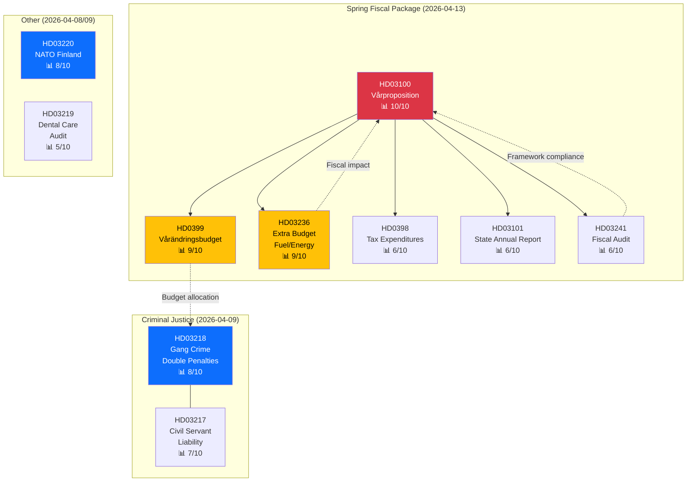

# Cross-Reference Map — Government Propositions — 2026-04-13

**Generated**: 2026-04-13 11:17 UTC | **Confidence**: HIGH | **Riksmöte**: 2025/26
**Documents Analyzed**: 10

---

## Cross-Document Relationships

## Key Relationships

| Source | Target | Relationship | Strength |
|--------|--------|-------------|----------|
| HD03100 → HD0399 | Vårproposition → Vårändringsbudget | Framework guides spending adjustments | STRONG |
| HD03100 → HD03236 | Vårproposition → Extra budget | Economic outlook justifies emergency relief | STRONG |
| HD03100 → HD03241 | Vårproposition → Fiscal audit | Audit validates/challenges fiscal framework | MODERATE |
| HD0399 → HD03218 | Budget → Gang crime | Budget must fund prison capacity expansion | MODERATE |
| HD03100 → HD0398 | Vårproposition → Tax expenditures | Tax policy coherence | MODERATE |
| HD03241 → HD03100 | Audit → Vårproposition | Audit findings inform fiscal policy guidelines | MODERATE |
