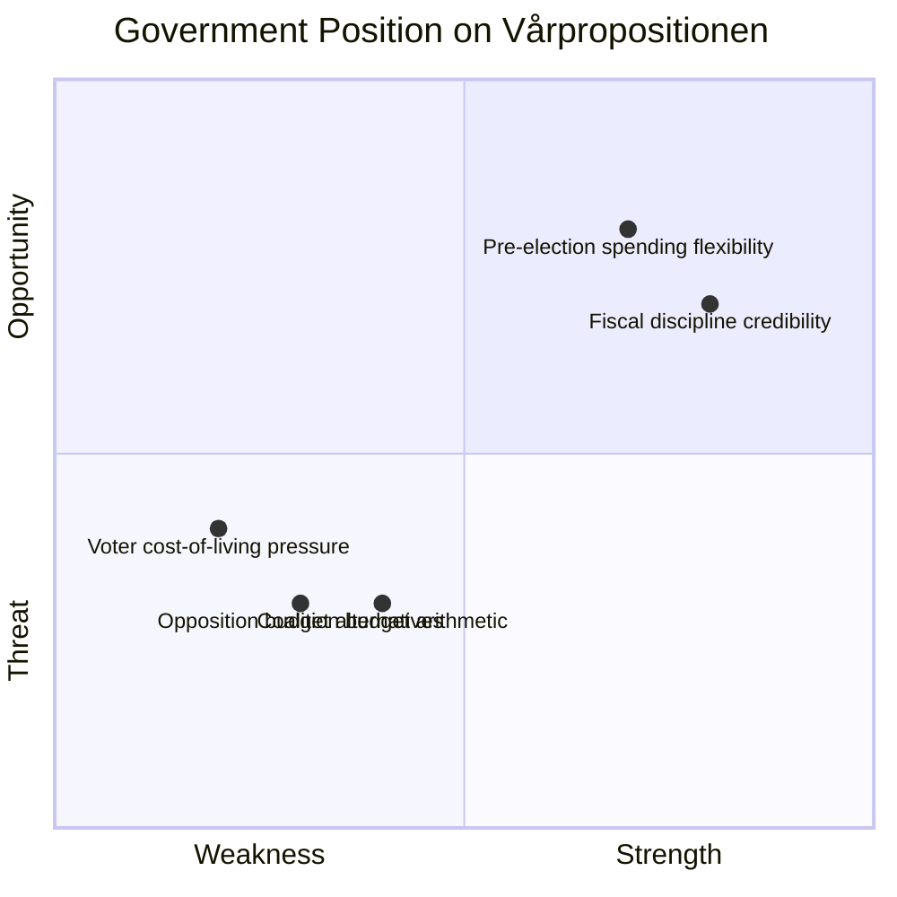

# Per-File Political Intelligence Analysis: HD03100

**Document**: 2026 års ekonomiska vårproposition (Prop. 2025/26:100)
**dok_id**: HD03100 | **Date**: 2026-04-13 | **Riksmöte**: 2025/26
**Organ**: Finansdepartementet | **Authors**: PM Ulf Kristersson, Finance Minister Elisabeth Svantesson
**Significance**: 10/10 | **Confidence**: HIGH | **Classification**: PUBLIC — CRITICAL NATIONAL SIGNIFICANCE

---

## 1. Document Classification

| Dimension | Assessment | Confidence |
|-----------|-----------|------------|
| **Policy Domain** | Fiscal Policy / Macroeconomic Framework | [HIGH] |
| **Political Temperature** | 🔴 HIGH — sets fiscal guidelines pre-election | [HIGH] |
| **Strategic Significance** | CRITICAL — annual spring economic roadmap | [HIGH] |
| **Urgency** | IMMEDIATE — defines 2027 budget direction | [HIGH] |
| **Committee Referral** | FiU (Finansutskottet) | [HIGH] |

## 2. SWOT Analysis

### Strengths (Government — Kristersson/Svantesson)
- **Fiscal framework compliance** [HIGH]: Vårpropositionen demonstrates government's commitment to the fiscal policy framework, strengthening credibility with markets and EU institutions
- **Coordinated package** [HIGH]: Released simultaneously with Vårändringsbudget (HD0399) and Extra ändringsbudget (HD03236), showing strategic legislative coordination
- **Incumbency advantage** [MEDIUM]: Controls timing and framing of economic narrative ahead of 2026 election

### Weaknesses (Government)
- **Cost-of-living critique exposure** [HIGH]: Any admission of inflation/recession risk feeds opposition narrative that government failed on household economy
- **SD dependency** [HIGH]: Budget arithmetic relies on Sverigedemokraterna (SD) confidence-and-supply, constraining fiscal policy options
- **Pre-election credibility** [MEDIUM]: Opposition can frame spring proposition as election budget rather than sound fiscal policy

### Opportunities
- **Economic narrative control** [HIGH]: Vårpropositionen allows government to set the economic agenda and define Election 2026 fiscal debate terms
- **Growth projection messaging** [MEDIUM]: If GDP growth projections are positive, government can claim economic recovery under its watch

### Threats
- **External economic shocks** [HIGH]: Global trade tensions, energy price volatility could invalidate economic forecasts within months
- **Opposition fiscal alternatives** [MEDIUM]: S-led opposition may present more expansive spending proposals that poll better with voters
- **Riksbanken divergence** [MEDIUM]: If monetary policy signals differ from fiscal assumptions, credibility of economic narrative suffers

## 3. Risk Assessment (5×5 Matrix)

| Risk | Likelihood | Impact | Score | Mitigation |
|------|-----------|--------|-------|-----------|
| GDP forecast deviation | 3 | 4 | 12 | Hedged language in proposition; multiple scenarios |
| Opposition counter-budget | 4 | 3 | 12 | Pre-empt with popular spending items in Vårändringsbudget |
| SD confidence crisis | 2 | 5 | 10 | Maintain migration policy alignment |
| Inflation resurgence | 2 | 4 | 8 | Riksbank coordination, fiscal prudence messaging |
| Voter fatigue with austerity | 3 | 3 | 9 | Extra ändringsbudget fuel tax cut as relief valve |

## 4. Stakeholder Impact (6-Lens)

| Stakeholder | Impact | Direction | Evidence |
|-------------|--------|-----------|----------|
| **Government** (Kristersson cabinet) | HIGH | ↑ Positive | Sets fiscal narrative for Election 2026 campaign |
| **Opposition** (S, V, MP, C) | MEDIUM | ↕ Mixed | Provides material for fiscal critique but also constrains counter-proposals |
| **Sverigedemokraterna** | HIGH | ↑ Positive | Budget framework validates SD influence on fiscal priorities |
| **Swedish households** | HIGH | ↕ Mixed | Depends on specific growth/inflation forecasts and spending decisions |
| **Financial markets** | MEDIUM | ↑ Positive | Demonstrates fiscal discipline and framework adherence |
| **EU/International** | LOW | → Neutral | Confirms Sweden's continued compliance with stability targets |

## 5. Election 2026 Implications

| Factor | Assessment | Confidence |
|--------|-----------|------------|
| **Electoral Impact** | 🟩 HIGH — defines economic debate terrain | [HIGH] |
| **Coalition Scenarios** | 🟧 MEDIUM — tests SD cooperation durability | [MEDIUM] |
| **Voter Salience** | 🟦 VERY HIGH — economy is top-2 voter concern | [HIGH] |
| **Campaign Vulnerability** | 🟧 MEDIUM — forecasts can be attacked by opposition | [MEDIUM] |
| **Policy Legacy** | 🟩 HIGH — sets fiscal framework for next government | [HIGH] |

## 6. Forward Indicators

- **Watch**: FiU committee hearings on Vårpropositionen (expected May 2026)
- **Watch**: Riksbanken interest rate decision alignment with growth assumptions
- **Trigger**: If GDP growth comes in below forecast → government economic credibility at risk
- **Trigger**: Opposition spring motion with alternative economic framework
- **Timeline**: FiU report expected before parliamentary summer recess (June 2026)
