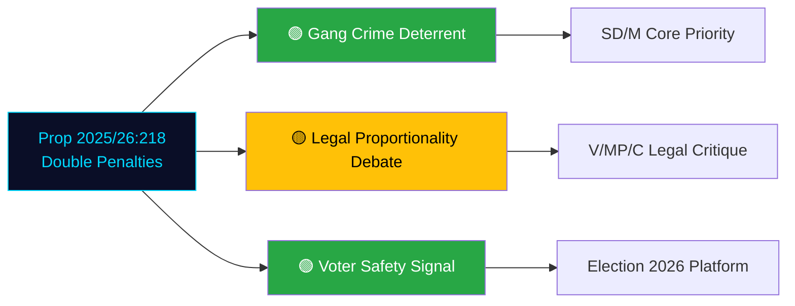

# Per-File Political Intelligence Analysis: HD03218

**Document**: Dubbla straff för brott i kriminella nätverk och skärpta straffskalor (Prop. 2025/26:218)
**dok_id**: HD03218 | **Date**: 2026-04-09 | **Riksmöte**: 2025/26
**Organ**: Justitiedepartementet | **Authors**: PM Ulf Kristersson, Justice Minister Gunnar Strömmer
**Significance**: 8/10 | **Confidence**: HIGH | **Classification**: PUBLIC — HIGH POLITICAL SIGNIFICANCE

---

## 1. Document Classification

| Dimension | Assessment | Confidence |
|-----------|-----------|------------|
| **Policy Domain** | Criminal Justice / Organized Crime | [HIGH] |
| **Political Temperature** | 🔴 HIGH — core election issue | [HIGH] |
| **Strategic Significance** | HIGH — flagship law-and-order policy | [HIGH] |
| **Committee Referral** | JuU (Justitieutskottet) | [HIGH] |

## 2. SWOT Analysis

### Strengths (Government)
- **Core electoral promise delivery** [HIGH]: Doubling penalties for gang-related crimes fulfills Tidö Agreement commitment and M/SD campaign promise (dok_id: HD03218)
- **Broad voter support** [HIGH]: Anti-gang measures enjoy strong public support across demographics
- **SD cooperation showcase** [HIGH]: Demonstrates functional right-bloc cooperation on priority issue

### Weaknesses
- **Proportionality challenge** [MEDIUM]: Legal scholars and human rights organizations may challenge proportionality
- **Effectiveness questions** [MEDIUM]: Research evidence on deterrent effect of harsher sentences is mixed
- **Prison capacity** [HIGH]: Longer sentences require expanded prison capacity — government must demonstrate readiness

### Election 2026 Implications

| Factor | Assessment | Confidence |
|--------|-----------|------------|
| **Electoral Impact** | 🟦 VERY HIGH — crime is #1-#2 voter concern | [HIGH] |
| **Coalition Scenarios** | 🟩 HIGH — validates Tidö Agreement cooperation | [HIGH] |
| **Voter Salience** | 🟦 VERY HIGH — gang violence in daily news | [HIGH] |
| **Campaign Vulnerability** | 🟥 LOW — popular across political spectrum | [HIGH] |

## 3. Forward Indicators

- **Watch**: JuU committee hearings and legal expert testimony
- **Watch**: Prison and Probation Service (Kriminalvården) capacity planning
- **Trigger**: Constitutional Council (Lagrådet) proportionality objections
- **Timeline**: Committee report expected by late spring 2026; entry into force likely 2027
