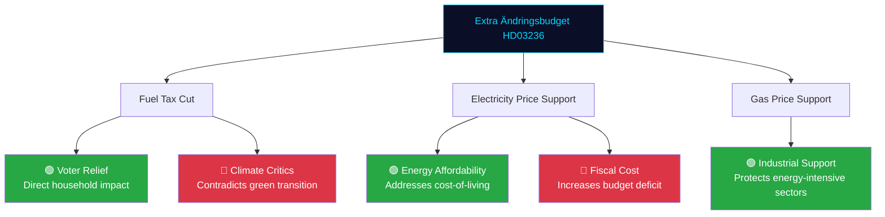

# Per-File Political Intelligence Analysis: HD03236

**Document**: Extra ändringsbudget för 2026 – Sänkt skatt på drivmedel samt el- och gasprisstöd (Prop. 2025/26:236)
**dok_id**: HD03236 | **Date**: 2026-04-13 | **Riksmöte**: 2025/26
**Organ**: Finansdepartementet | **Authors**: Deputy PM Lotta Edholm, State Secretary Niklas Wykman
**Significance**: 9/10 | **Confidence**: HIGH | **Classification**: PUBLIC — HIGH POLITICAL SIGNIFICANCE

---

## 1. Document Classification

| Dimension | Assessment | Confidence |
|-----------|-----------|------------|
| **Policy Domain** | Energy / Consumer Relief / Taxation | [HIGH] |
| **Political Temperature** | 🔴 VERY HIGH — cost-of-living election issue | [HIGH] |
| **Strategic Significance** | CRITICAL — direct voter pocketbook impact | [HIGH] |
| **Urgency** | IMMEDIATE — emergency energy response | [HIGH] |
| **Committee Referral** | FiU / SkU (Skatteutskottet) | [HIGH] |

## 2. SWOT Analysis

### Strengths (Government)
- **Direct voter impact** [HIGH]: Fuel tax cuts and energy price support are immediately felt by households — powerful pre-election signal (dok_id: HD03236)
- **Cross-party appeal** [HIGH]: Cost-of-living relief transcends traditional left-right divide
- **Crisis response framing** [HIGH]: Positions government as acting decisively on energy costs
- **SD alignment** [HIGH]: Fuel tax reduction aligns with SD's long-standing policy priorities

### Weaknesses (Government)
- **Climate contradiction** [HIGH]: Cutting fuel taxes contradicts Sweden's climate commitments and green transition goals — MP and environmental organizations will attack
- **Fiscal discipline tension** [HIGH]: Extra supplementary budget on top of regular Vårändringsbudget signals fiscal loosening
- **Temporary measure risk** [MEDIUM]: If supports expire post-election, opponents frame as election bribe

### Opportunities
- **Rural vote mobilization** [HIGH]: Fuel costs disproportionately affect rural voters — key demographic for M, SD, KD, C
- **SD cooperation demonstration** [HIGH]: Shows functional government-SD cooperation on popular policy
- **Economic stimulus** [MEDIUM]: Lower energy costs can boost consumer spending and economic activity

### Threats
- **Environmental backlash** [HIGH]: Sweden's climate reputation internationally; domestic green movement opposition
- **EU fiscal scrutiny** [MEDIUM]: Additional spending may raise EU stability pact questions
- **Opposition "too little too late"** [MEDIUM]: S may argue support is insufficient or poorly targeted

## 3. Risk Assessment

| Risk | Likelihood | Impact | Score |
|------|-----------|--------|-------|
| Climate policy contradiction attacks | 5 | 3 | 15 |
| "Election bribe" framing by opposition | 4 | 3 | 12 |
| Fiscal deficit widening concerns | 3 | 3 | 9 |
| Energy prices stabilize (making support unnecessary) | 2 | 2 | 4 |
| EU Commission fiscal warnings | 2 | 3 | 6 |

## 4. Stakeholder Impact (6-Lens)

| Stakeholder | Impact | Direction | Evidence |
|-------------|--------|-----------|----------|
| **Swedish households** | VERY HIGH | ↑ Positive | Direct fuel and energy cost reduction |
| **Environmental movement** | HIGH | ↓ Negative | Undermines fossil fuel phase-out |
| **Rural communities** | HIGH | ↑ Positive | Disproportionate benefit from fuel tax cuts |
| **Industrial sector** | MEDIUM | ↑ Positive | Lower energy input costs |
| **Sverigedemokraterna** | HIGH | ↑ Positive | Validates long-standing fuel tax reduction demand |
| **EU/Climate institutions** | MEDIUM | ↓ Negative | Counter to Paris Agreement commitments |

## 5. Election 2026 Implications

| Factor | Assessment | Confidence |
|--------|-----------|------------|
| **Electoral Impact** | 🟦 VERY HIGH — pocketbook issue | [HIGH] |
| **Coalition Scenarios** | 🟩 HIGH — demonstrates right-bloc cooperation | [HIGH] |
| **Voter Salience** | 🟦 VERY HIGH — energy costs = #1 concern | [HIGH] |
| **Campaign Vulnerability** | 🟧 MEDIUM — "election bribe" criticism | [MEDIUM] |
| **Policy Legacy** | 🟧 MEDIUM — temporary measures unlikely to persist | [MEDIUM] |

## 6. Forward Indicators

- **Watch**: Specific SEK amounts for fuel tax reduction and energy support levels
- **Watch**: MP/V/Green movement public response and protest actions
- **Watch**: Energy market price trends May-September 2026
- **Trigger**: If energy prices drop significantly, support becomes politically awkward
- **Timeline**: Emergency debate likely within 2 weeks; Riksdag vote May 2026
