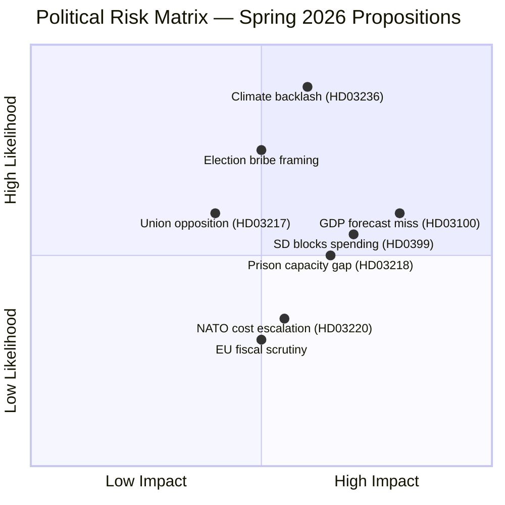
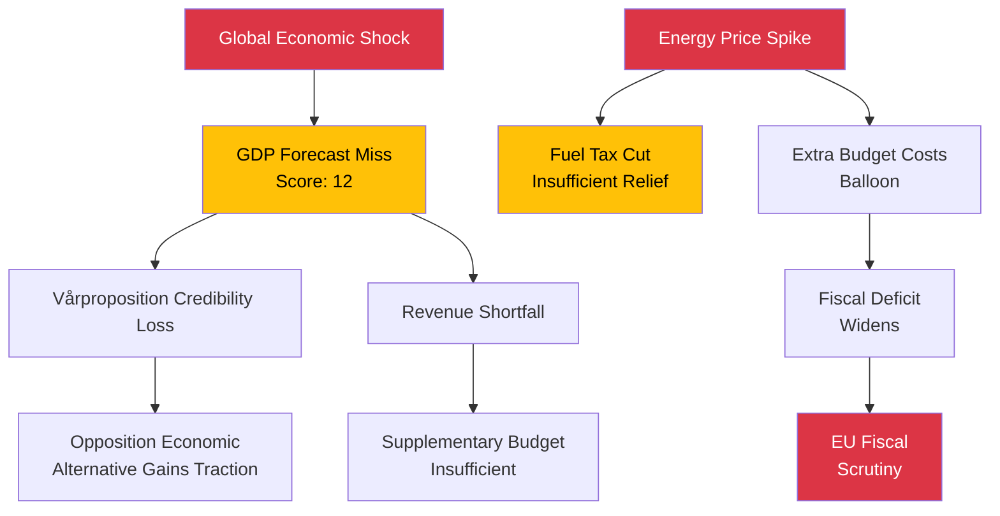

# Risk Assessment — Government Propositions — 2026-04-13

**Generated**: 2026-04-13 11:16 UTC | **Confidence**: HIGH | **Riksmöte**: 2025/26
**Documents Analyzed**: 10 | **Analysis Depth**: deep

---

## Risk Heat Map

## Top Risks by Composite Score

| Rank | Risk | Likelihood (1-5) | Impact (1-5) | Score | Primary Document |
|------|------|------------------|-------------|-------|-----------------|
| 1 | Climate contradiction from fuel tax cuts | 5 | 3 | **15** | HD03236 |
| 2 | GDP growth forecast deviation | 3 | 4 | **12** | HD03100 |
| 3 | SD blocks specific spending proposals | 3 | 4 | **12** | HD0399 |
| 4 | "Election bribe" framing by S/V | 4 | 3 | **12** | HD03236 |
| 5 | Prison capacity insufficiency | 3 | 3 | **9** | HD03218 |
| 6 | Voter fatigue with austerity messaging | 3 | 3 | **9** | HD03100 |
| 7 | Public sector union opposition | 3 | 2 | **6** | HD03217 |
| 8 | NATO deployment cost escalation | 2 | 3 | **6** | HD03220 |
| 9 | EU stability pact compliance questions | 2 | 3 | **6** | HD0399, HD03236 |
| 10 | Dental care access disparities revealed | 2 | 2 | **4** | HD03219 |

## Risk Cascading Analysis

## Overall Risk Level: MODERATE-HIGH

The government's spring package is strategically strong but carries concentrated fiscal risk. Six of the top 10 risks relate to economic/fiscal vulnerabilities (HD03100, HD0399, HD03236). The climate-vs-cost-of-living tension in HD03236 is the single highest-scored risk at 15/25.

## Mitigation Recommendations

1. **Climate narrative**: Government should pair fuel tax cut with green investment announcement
2. **Fiscal credibility**: Emphasize Riksrevisionen framework compliance (HD03241)
3. **SD management**: Early consultation on Vårändringsbudget spending priorities
4. **Prison planning**: Announce Kriminalvården capacity expansion plan alongside HD03218
