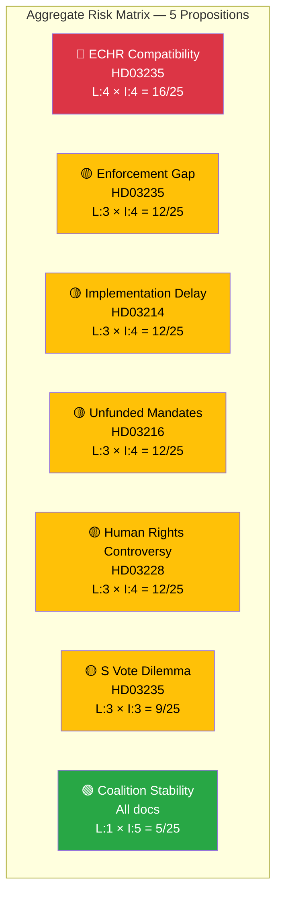

# Political Risk Assessment — 2026-04-13

**Generated**: 2026-04-13 06:20 UTC
**Data Sources**: riksdag-regering-mcp (lookback from 2026-04-10)
**Documents Analyzed**: 5
**Confidence**: MEDIUM (60%)
**Produced By**: AI-driven deep analysis with 5×5 risk matrix

## Summary

Aggregate risk assessment across 5 government propositions. Overall political risk: **MEDIUM**. The deportation reform (HD03235) carries the highest individual risk (ECHR compatibility score 16/25), while the defence-security cluster operates within acceptable risk parameters.

## Detailed Risk Table

| Rank | Risk Factor | dok_id | Likelihood (1-5) | Impact (1-5) | Score | Mitigation |
|------|------------|--------|-------------------|--------------|-------|------------|
| 1 | ECHR adverse ruling on deportation thresholds | HD03235 | 4 | 4 | 16/25 | Lagrådet review, proportionality safeguards |
| 2 | Deportation enforcement failure (low actual deportation rate) | HD03235 | 3 | 4 | 12/25 | Bilateral return agreements, EU cooperation |
| 3 | Cybersecurity centre implementation delays (inter-agency coordination) | HD03214 | 3 | 4 | 12/25 | Phased rollout with milestones |
| 4 | Unfunded healthcare mandates to municipalities | HD03216 | 3 | 4 | 12/25 | State funding transfer required |
| 5 | Human rights controversy on arms exports to questionable democracies | HD03228 | 3 | 4 | 12/25 | Enhanced ISP oversight, transparency |
| 6 | S internal division on deportation vote | HD03235 | 3 | 3 | 9/25 | Pre-negotiation, amendment offers |
| 7 | Privacy backlash on cybersecurity surveillance powers | HD03214 | 3 | 3 | 9/25 | Built-in oversight mechanisms |
| 8 | Coalition crisis if deportation reform blocked | HD03235 | 1 | 5 | 5/25 | Government majority ensures passage |

## Coalition Risk Assessment

**Coalition Risk Score**: 15/100 (LOW-MEDIUM)
**Risk Level**: LOW-MEDIUM

The governing coalition (M, KD, L + SD) faces no existential threat from this legislative batch. SD's core demand (HD03235) is being delivered, which reinforces Tidö cooperation stability. The primary risk vector is external (ECHR, international scrutiny) rather than internal (coalition fracture).

## Key Findings

1. **Highest risk**: ECHR compatibility on deportation reform — score 16/25 (L:4, I:4)
2. **4 risk factors at score 12/25** spanning implementation, funding, and controversy dimensions
3. **Coalition stability**: LOW risk — government has majority and SD's flagship policy is being delivered
4. **Aggregate risk**: MEDIUM — manageable with proactive mitigation strategies

## Implications

- HD03235 dominates the risk landscape with potential for international legal challenge
- Implementation risks across multiple simultaneous reforms require coordinated government capacity
- The defence-security cluster (HD03214, HD03228) operates in a favourable cross-party consensus environment
- Healthcare reform (HD03216) faces fiscal implementation risk but low political opposition

## Data Quality Notes

Risk assessment derived from per-document 5×5 Likelihood×Impact matrices, CIA coalition metrics, and political domain expertise. Confidence: MEDIUM (60%). Full-text analysis would refine likelihood estimates.
