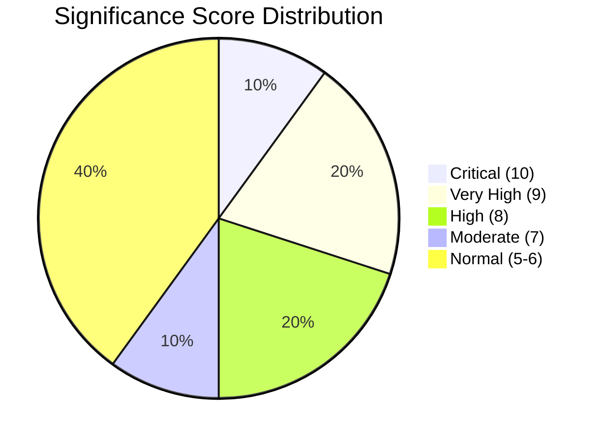

# Significance Scoring — Government Propositions — 2026-04-13

**Generated**: 2026-04-13 11:17 UTC | **Confidence**: HIGH | **Riksmöte**: 2025/26
**Documents Analyzed**: 10 | **Analysis Depth**: deep

---

## Significance Scores

| Rank | dok_id | Title | Score | Domain | Urgency |
|------|--------|-------|-------|--------|---------|
| 1 | HD03100 | 2026 års ekonomiska vårproposition | **10/10** | Fiscal Policy | CRITICAL |
| 2 | HD0399 | Vårändringsbudget för 2026 | **9/10** | Budget | IMMEDIATE |
| 3 | HD03236 | Extra ändringsbudget – Sänkt skatt på drivmedel | **9/10** | Energy/Tax | IMMEDIATE |
| 4 | HD03218 | Dubbla straff för brott i kriminella nätverk | **8/10** | Criminal Justice | HIGH |
| 5 | HD03220 | Svenskt bidrag till Natos framskjutna närvaro | **8/10** | Defense/NATO | HIGH |
| 6 | HD03217 | Ett utökat straffrättsligt tjänstemannaansvar | **7/10** | Public Admin | MODERATE |
| 7 | HD0398 | Redovisning av skatteutgifter 2026 | **6/10** | Taxation | ROUTINE |
| 8 | HD03101 | Årsredovisning för staten 2025 | **6/10** | Public Finance | ROUTINE |
| 9 | HD03241 | Riksrevisionens rapport om finanspolitiska ramverket | **6/10** | Fiscal Audit | ROUTINE |
| 10 | HD03219 | Riksrevisionens rapport om tandvårdsstödet | **5/10** | Healthcare | LOW |

## Scoring Methodology

Scores based on: (1) Electoral impact weight, (2) Policy scope breadth, (3) Budget magnitude, (4) Cross-party controversy potential, (5) Voter salience alignment.

## Distribution

## Key Pattern

**Concentration in Finansdepartementet**: 6 of 10 documents originate from Finance Ministry — this is the government's spring fiscal offensive. The mean significance score (7.4/10) is well above the typical weekly average (~5.5), reflecting the political weight of the Spring Fiscal Policy Bill package.
