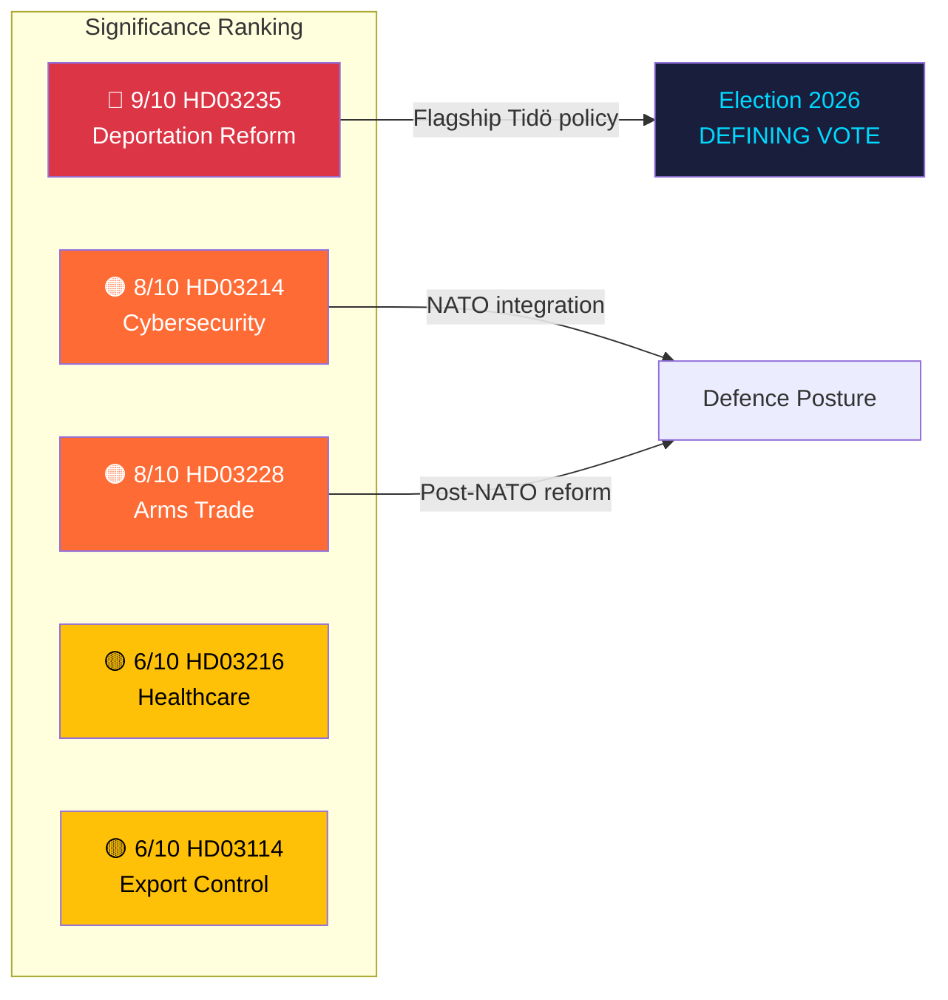

# Document Significance Scoring — 2026-04-13

**Generated**: 2026-04-13 06:19 UTC
**Data Sources**: riksdag-regering-mcp (lookback from 2026-04-10)
**Documents Analyzed**: 5
**Confidence**: MEDIUM (60%)
**Produced By**: AI-driven deep analysis

## Summary

Scored **5** documents for political significance (0–10 scale). Average significance: **7.4/10**.

## Detailed Scoring

| Score | Level | Type | dok_id | Title | Key Factor |
|-------|-------|------|--------|-------|-----------|
| 🔴 9/10 | VERY HIGH | Proposition | HD03235 | Skärpta regler om utvisning på grund av brott | SD flagship, Tidö Agreement core, ECHR risk |
| 🟠 8/10 | HIGH | Proposition | HD03214 | Lagändringar för ett stärkt nationellt cybersäkerhetscenter | NATO obligation, NIS2 compliance, national security |
| 🟠 8/10 | HIGH | Proposition | HD03228 | Ett modernt och anpassat regelverk för krigsmateriel | Post-NATO regulatory reform, defence industry impact |
| 🟡 6/10 | MEDIUM | Proposition | HD03216 | Stärkt medicinsk kompetens i kommunal hälso- och sjukvård | COVID legacy, eldercare quality, welfare credibility |
| 🟡 6/10 | MEDIUM | Skrivelse | HD03114 | Strategisk exportkontroll 2025 | First post-NATO annual report, transparency document |

## Key Findings

1. **2** document(s) rated Critical (score ≥ 8): HD03235, HD03214
2. **1** document rated High (score 8): HD03228
3. **2** document(s) rated Medium (score 6): HD03216, HD03114
4. Average batch significance **7.4/10** — above normal legislative activity threshold

## Scoring Methodology

Significance scores combine: document type weight (proposition=high, skrivelse=medium), committee tier (JuU/FöU=Tier 1, UU/SoU=Tier 2), policy domain breadth, coalition sensitivity, election proximity factor (+1 for propositions tabled within 12 months of election), and media salience potential.

## Implications

High-significance documents (HD03235, HD03214, HD03228) should be prioritised for deep-inspection article generation with expanded analytical sections. The 7.4/10 average indicates an above-normal legislative batch warranting comprehensive coverage.

## Data Quality Notes

Significance scores use document type, committee tier, domain breadth, coalition context, election proximity, and media salience. Confidence: MEDIUM — metadata-based scoring supplemented by political domain expertise.
