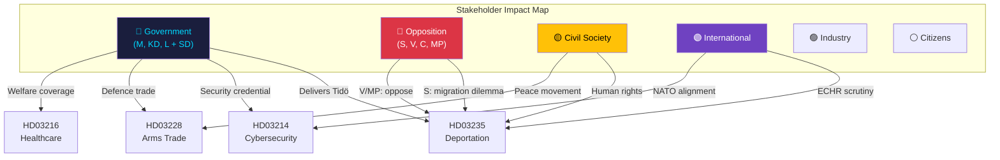

# Stakeholder Perspective Analysis — 2026-04-13

**Generated**: 2026-04-13 06:20 UTC
**Data Sources**: riksdag-regering-mcp (lookback from 2026-04-10)
**Documents Analyzed**: 5
**Confidence**: MEDIUM (60%)
**Produced By**: AI-driven deep analysis with 6-lens framework

## Summary

Applied **6 analysis lenses** to **5** documents. The propositions create a complex stakeholder landscape where government coalition interests (delivering Tidö commitments) clash with opposition positioning (S's migration dilemma), civil society advocacy (human rights, peace movement), and international scrutiny (ECHR, NATO allies, UNHCR).

## Lens 1: Government Perspective (Tidöblocket: M, KD, L + SD)

| Proposition | Government Interest | Key Actor | Confidence |
|------------|-------------------|-----------|------------|
| HD03235 | Flagship Tidö deliverable — SD's non-negotiable condition for continued cooperation | Johan Forssell (M), Jimmie Åkesson (SD) | 🟩 HIGH |
| HD03214 | Tangible national security delivery ahead of election | Carl-Oskar Bohlin (M) | 🟩 HIGH |
| HD03228 | Defence industry growth + NATO integration | Benjamin Dousa (M) | 🟩 HIGH |
| HD03216 | Defensive welfare move — addressing eldercare quality vulnerability | Anna Tenje (M) | 🟧 MEDIUM |
| HD03114 | Transparency compliance — routine annual obligation | Benjamin Dousa (M) | 🟩 HIGH |

## Lens 2: Opposition Perspective (S, V, C, MP)

| Proposition | Opposition Stance | Key Tension | Confidence |
|------------|------------------|-------------|------------|
| HD03235 | **S divided** — tough-on-crime pivot vs. progressive base. V/MP firmly opposed. C seeks proportionality amendments | S internal fracture risk is the defining political dynamic | 🟩 HIGH |
| HD03214 | Broad support — cybersecurity is consensus area. V may probe surveillance expansion | Minimal opposition risk | 🟩 HIGH |
| HD03228 | S cautiously supportive of NATO alignment. V/MP oppose arms trade expansion. C mixed | Human rights framing could gain traction | 🟧 MEDIUM |
| HD03216 | S will attack funding adequacy — "unfunded mandates" narrative | S claims stronger welfare credibility | 🟧 MEDIUM |
| HD03114 | S will scrutinise specific export destinations, especially Turkey | Routine parliamentary scrutiny | 🟧 MEDIUM |

## Lens 3: Judicial & Legal Perspective

| Proposition | Legal Scrutiny | Key Concern | Confidence |
|------------|---------------|-------------|------------|
| HD03235 | **Lagrådet** will examine ECHR compatibility (Article 8). Migrationsdomstolarna face increased caseload | Proportionality assessment is the critical legal test | 🟩 HIGH |
| HD03214 | Privacy law compliance review. Surveillance powers judicial oversight requirements | Moderate legal complexity | 🟧 MEDIUM |
| HD03228 | ISP mandate alignment with EU Regulation 2021/821 on dual-use | Technical regulatory alignment | 🟧 MEDIUM |

## Lens 4: Industry & Implementation Perspective

| Proposition | Industry Impact | Key Actors | Confidence |
|------------|---------------|-----------|------------|
| HD03214 | Swedish tech companies (Ericsson, Telia) face NIS2 compliance obligations | Defence/tech industry | 🟧 MEDIUM |
| HD03228 | Saab, BAE Hägglunds benefit from modernised export framework | Defence manufacturers (SOFF) | 🟩 HIGH |
| HD03216 | SKR and municipalities face implementation costs. Physician workforce reallocation | Healthcare workforce unions | 🟧 MEDIUM |

## Lens 5: Civil Society Perspective

| Proposition | Civil Society Response | Key Organisations | Confidence |
|------------|----------------------|-------------------|------------|
| HD03235 | **Strong opposition**: Asylrättscentrum, Amnesty Sweden, Red Cross, Swedish Bar Association | Active advocacy against deportation threshold lowering | 🟩 HIGH |
| HD03228 | **Moderate opposition**: Svenska Freds, faith-based peace organisations | Campaign against perceived regulatory relaxation | 🟩 HIGH |
| HD03214 | **Watchful**: Privacy advocates, press freedom organisations | Focus on surveillance oversight mechanisms | 🟧 MEDIUM |

## Lens 6: International Perspective

| Proposition | International Scrutiny | Key Bodies | Confidence |
|------------|----------------------|-----------|------------|
| HD03235 | **High scrutiny**: ECHR, UNHCR, CoE Human Rights Commissioner | Potential for adverse international legal proceedings | 🟩 HIGH |
| HD03214 | **Positive**: NATO allies welcome cybersecurity alignment | Alliance solidarity indicator | 🟩 HIGH |
| HD03228 | **Mixed**: NATO allies support interoperability; human rights bodies scrutinise export criteria | Turkey dimension adds complexity | 🟧 MEDIUM |
| HD03114 | **Routine**: Annual transparency reporting expected by international partners | Compliance indicator | 🟩 HIGH |

## Key Findings

1. **S's migration dilemma** on HD03235 is the single most consequential stakeholder dynamic — its vote positioning defines the political narrative
2. **Civil society mobilisation** will concentrate on HD03235 (human rights) and HD03228 (peace movement) — two fronts of advocacy pressure
3. **International scrutiny** peaks on HD03235 with ECHR compatibility as the primary legal battleground
4. **Industry stakeholders** are aligned with government on defence-security cluster (HD03214, HD03228)
5. **Cross-perspective conflict** is highest on HD03235 — government delivery vs. opposition positioning vs. civil society vs. international norms

## Data Quality Notes

Aggregate confidence: MEDIUM (60%). Stakeholder mapping based on per-document 6-lens analysis. Confidence varies by lens: Government and Opposition perspectives are highest confidence (political positioning is well-documented); International and Civil Society perspectives depend on institutional response patterns.
