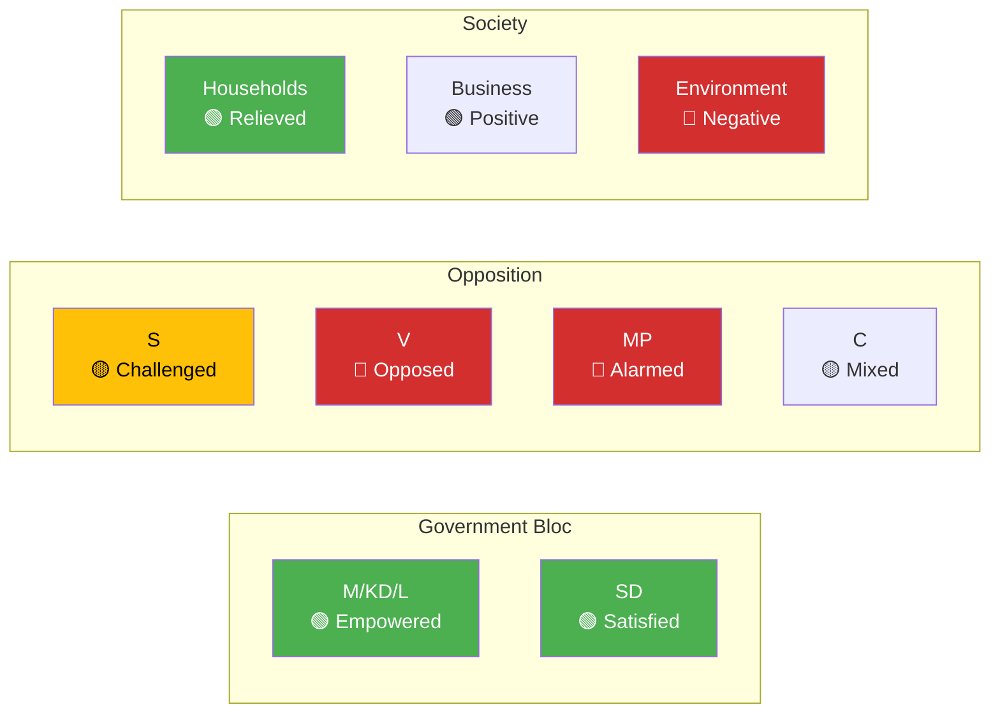

# Stakeholder Perspectives — Government Propositions — 2026-04-13

**Generated**: 2026-04-13 11:17 UTC | **Confidence**: HIGH | **Riksmöte**: 2025/26
**Documents Analyzed**: 10 | **Analysis Depth**: deep

---

## 6-Lens Stakeholder Impact Matrix

## Detailed Stakeholder Analysis

### 1. Government Parties (M, KD, L) — EMPOWERED

| Document | Impact | Assessment |
|----------|--------|-----------|
| HD03100 Vårproposition | HIGH ↑ | Sets election economic narrative |
| HD0399 Vårändringsbudget | HIGH ↑ | Demonstrates governing capacity |
| HD03236 Extra budget | VERY HIGH ↑ | Direct voter relief before election |
| HD03218 Gang crime | HIGH ↑ | Fulfills core campaign promise |
| HD03220 NATO | MEDIUM ↑ | Defense credibility as NATO member |

### 2. Sverigedemokraterna (SD) — SATISFIED

| Document | Impact | Assessment |
|----------|--------|-----------|
| HD03236 Fuel tax cuts | VERY HIGH ↑ | Long-standing SD priority achieved |
| HD03218 Double penalties | HIGH ↑ | Core SD law-and-order demand |
| HD03217 Civil servant liability | MEDIUM ↑ | Aligns with SD anti-establishment position |

### 3. Socialdemokraterna (S) — CHALLENGED

| Document | Impact | Assessment |
|----------|--------|-----------|
| HD03100 Vårproposition | HIGH ↓ | Must present credible alternative |
| HD03236 Fuel tax cut | MEDIUM ↕ | Popular policy difficult to oppose |
| HD03218 Gang crime | MEDIUM ↕ | Must balance justice with civil liberties |

### 4. Vänsterpartiet (V) — OPPOSED

| Document | Impact | Assessment |
|----------|--------|-----------|
| HD03236 Fuel tax | HIGH ↓ | Opposes fossil fuel subsidies |
| HD03218 Double penalties | HIGH ↓ | Opposes disproportionate sentencing |
| HD03220 NATO deployment | HIGH ↓ | Opposes military escalation |

### 5. Miljöpartiet (MP) — ALARMED

| Document | Impact | Assessment |
|----------|--------|-----------|
| HD03236 Fuel tax cut | VERY HIGH ↓ | Core green policy reversal |
| HD03100 Vårproposition | MEDIUM ↓ | Insufficient climate investment |

### 6. Swedish Households — MIXED RELIEF

| Document | Impact | Assessment |
|----------|--------|-----------|
| HD03236 Energy support | VERY HIGH ↑ | Direct cost-of-living relief |
| HD03100 Economic outlook | HIGH ↕ | Depends on GDP/inflation forecasts |
| HD03218 Gang crime | MEDIUM ↑ | Public safety improvement hope |
