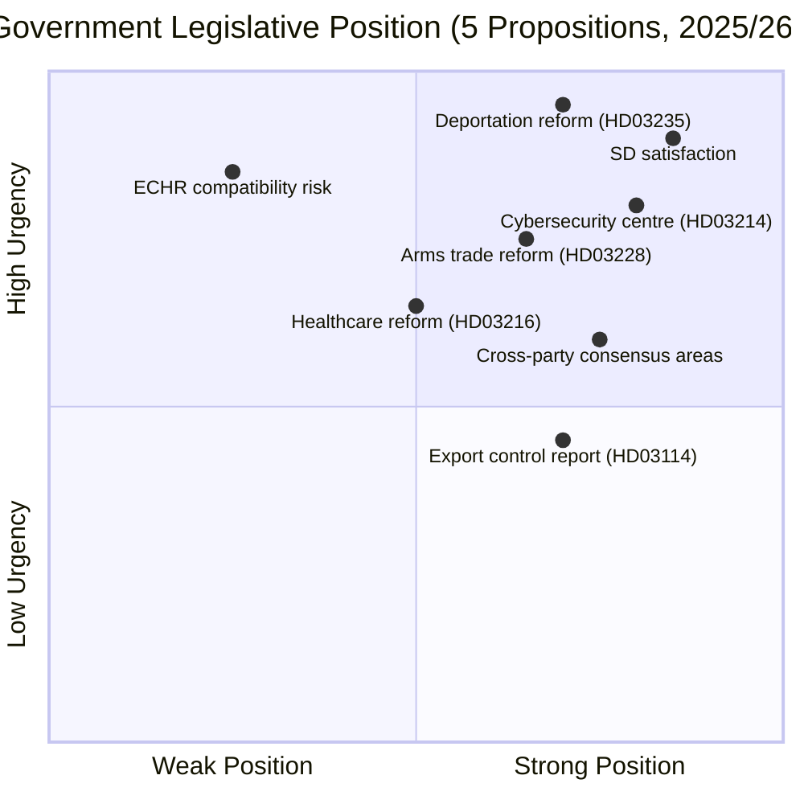

# Political SWOT Analysis — 2026-04-13

**Generated**: 2026-04-13 06:20 UTC
**Data Sources**: riksdag-regering-mcp (lookback from 2026-04-10)
**Documents Analyzed**: 5
**Confidence**: MEDIUM (60%)
**Produced By**: AI-driven deep analysis with evidence tables

## Summary

Cross-document SWOT analysis of 5 government propositions reveals a **strategically positioned pre-election legislative package** with high delivery potential but significant vulnerability on ECHR compatibility (HD03235) and implementation capacity across multiple simultaneous reforms.

## Strengths

| # | Evidence | Source (dok_id) | Confidence |
|---|----------|----------------|------------|
| S1 | Core Tidö Agreement commitment delivery — SD cooperation depends on HD03235 passage | HD03235 | 🟩 HIGH |
| S2 | Strong public support for stricter deportation rules (consistent polling majority) | HD03235 | 🟩 HIGH |
| S3 | Cross-party consensus on cybersecurity — all parties support strengthened cyber defence | HD03214 | 🟩 HIGH |
| S4 | NATO membership provides strategic rationale for defence-security package (HD03214, HD03228, HD03114) | HD03214, HD03228, HD03114 | 🟩 HIGH |
| S5 | Swedish defence industry (Saab, BAE Hägglunds) generates export revenue — economic argument supports HD03228 | HD03228 | 🟩 HIGH |
| S6 | Healthcare reform addresses COVID-19 Coronakommission findings on municipal care failures | HD03216 | 🟩 HIGH |
| S7 | Coordinated legislative tabling (all on 2026-04-01) demonstrates governing competence and strategic timing | All documents | 🟧 MEDIUM |

## Weaknesses

| # | Evidence | Source (dok_id) | Confidence |
|---|----------|----------------|------------|
| W1 | ECHR compatibility risk — lowered deportation thresholds may violate Article 8 (right to family life) | HD03235 | 🟩 HIGH |
| W2 | Previous deportation orders have low enforcement rate — legislation may not change outcomes | HD03235 | 🟩 HIGH |
| W3 | Physician shortage nationwide — mandating more municipal care may deplete regional hospitals | HD03216 | 🟩 HIGH |
| W4 | Municipal autonomy limits central government enforcement of healthcare mandates | HD03216 | 🟩 HIGH |
| W5 | "Modernised and adapted" arms language may signal relaxation of strict export criteria | HD03228 | 🟧 MEDIUM |
| W6 | Implementation of all 4 propositions simultaneously strains government coordination capacity | All documents | 🟧 MEDIUM |

## Opportunities

| # | Evidence | Source (dok_id) | Confidence |
|---|----------|----------------|------------|
| O1 | Election 2026 positioning — "tough on crime" + "national security" narrative resonates with swing voters | HD03235, HD03214 | 🟩 HIGH |
| O2 | SD satisfied as flagship deportation policy delivered — stabilises Tidö cooperation through election | HD03235 | 🟩 HIGH |
| O3 | NATO joint procurement programs create new market access for Swedish defence firms | HD03228 | 🟩 HIGH |
| O4 | EU NIS2 directive creates legal imperative shielding cybersecurity reform from political opposition | HD03214 | 🟩 HIGH |
| O5 | Healthcare reform could integrate with digital health transformation initiatives | HD03216 | 🟧 MEDIUM |

## Threats

| # | Evidence | Source (dok_id) | Confidence |
|---|----------|----------------|------------|
| T1 | V and MP will frame deportation reform as authoritarian — mobilises progressive base | HD03235 | 🟩 HIGH |
| T2 | International criticism from UNHCR, CoE Human Rights Commissioner on deportation rules | HD03235 | 🟩 HIGH |
| T3 | Civil society (Svenska Freds) will campaign against arms regulatory relaxation | HD03228 | 🟩 HIGH |
| T4 | S internal division — progressive wing may revolt against supporting tougher deportation | HD03235 | 🟧 MEDIUM |
| T5 | Implementation costs burden smaller municipalities disproportionately | HD03216 | 🟧 MEDIUM |
| T6 | Privacy concerns around expanded surveillance powers in cyber legislation | HD03214 | 🟧 MEDIUM |

## Cross-SWOT Interference Patterns

| Pattern | Description |
|---------|------------|
| S1+T1 | SD satisfaction (strength) directly generates V/MP opposition (threat) — zero-sum dynamic on migration |
| S4+W5 | NATO rationale (strength) enables arms trade relaxation criticism (weakness) |
| O1+T4 | Election positioning opportunity requires S to navigate internal tensions on deportation vote |
| S3+O4 | Cybersecurity consensus + EU mandate = lowest political risk proposition in batch |

## Data Quality Notes

SWOT confidence: MEDIUM (60%). Evidence-based analysis from 5 per-document assessments with citation chains. Full-text analysis would strengthen confidence scores and enable deeper interference pattern detection.
