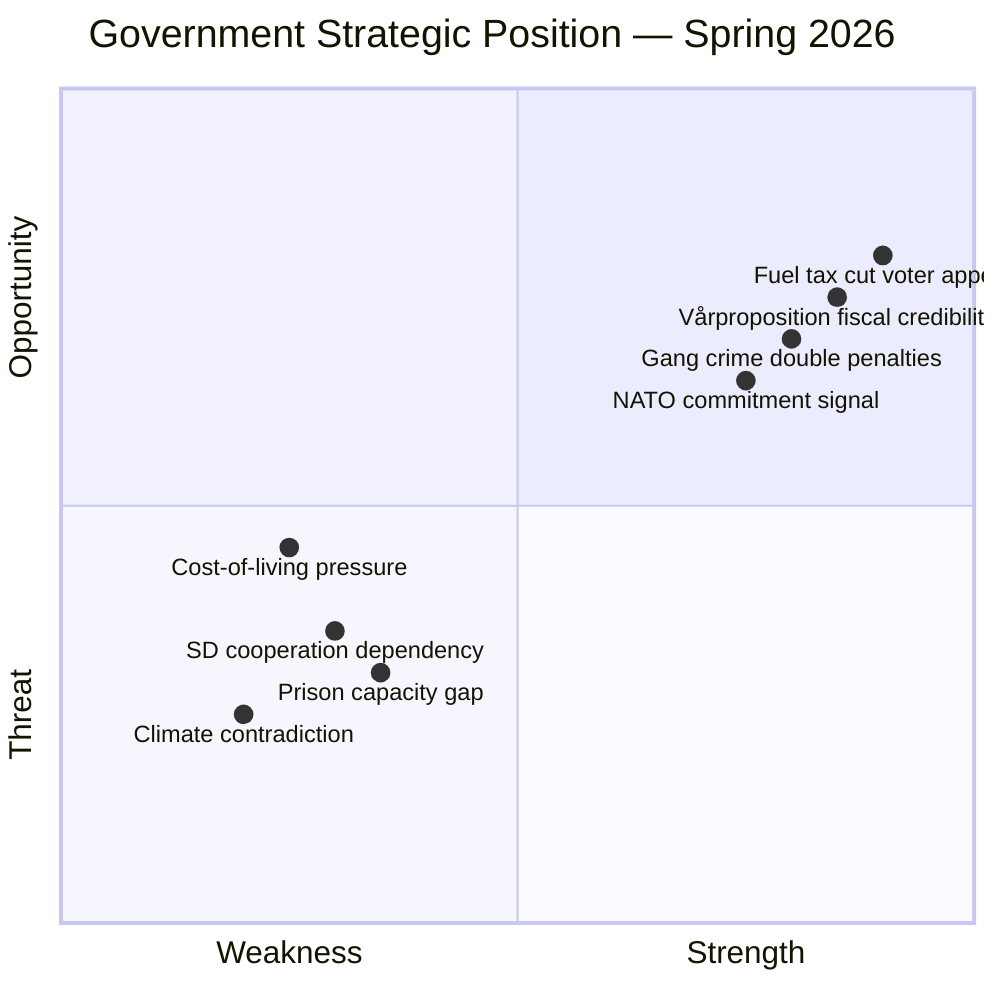

# SWOT Analysis — Government Propositions — 2026-04-13

**Generated**: 2026-04-13 11:15 UTC | **Confidence**: HIGH | **Riksmöte**: 2025/26
**Documents Analyzed**: 10 | **Analysis Depth**: deep

---

## Government SWOT — Spring 2026 Legislative Package

## Strengths

| # | Strength | Evidence | Confidence |
|---|----------|----------|------------|
| S1 | **Coordinated fiscal package** — 6 documents from Finansdepartementet on same day | HD03100, HD0399, HD03236, HD0398, HD03101, HD03241 | [HIGH] |
| S2 | **Direct voter relief** — fuel tax cuts and energy price support | HD03236 (Prop. 2025/26:236) | [HIGH] |
| S3 | **Tidö Agreement delivery** — gang crime penalties and civil servant liability | HD03218, HD03217 | [HIGH] |
| S4 | **NATO credibility** — forward presence deployment to Finland | HD03220 (Prop. 2025/26:220) | [HIGH] |
| S5 | **Fiscal transparency** — annual report, tax expenditures, audit response | HD03101, HD0398, HD03241 | [MEDIUM] |

## Weaknesses

| # | Weakness | Evidence | Confidence |
|---|----------|----------|------------|
| W1 | **SD dependency** — budget arithmetic requires SD support | All fiscal proposals require Riksdag majority | [HIGH] |
| W2 | **Climate contradiction** — fuel tax cuts undermine climate commitments | HD03236 contradicts Paris Agreement goals | [HIGH] |
| W3 | **Pre-election spending criticism** — multiple supplementary budgets signal fiscal loosening | HD0399 + HD03236 = 2 supplementary budgets | [MEDIUM] |
| W4 | **Prison capacity** — double penalties require expanded prison system | HD03218 implementation challenge | [MEDIUM] |
| W5 | **Public sector recruitment** — expanded liability may deter civil servants | HD03217 unintended consequences | [MEDIUM] |

## Opportunities

| # | Opportunity | Evidence | Confidence |
|---|-----------|----------|------------|
| O1 | **Economic narrative control** for Election 2026 | Vårproposition sets debate terms (HD03100) | [HIGH] |
| O2 | **Rural vote mobilization** via fuel tax relief | HD03236 disproportionately benefits rural areas | [HIGH] |
| O3 | **Law-and-order leadership** in election campaign | HD03218, HD03217 core voter priorities | [HIGH] |
| O4 | **Defense credibility** as new NATO member | HD03220 tangible commitment | [MEDIUM] |
| O5 | **SD satisfaction** reduces coalition tension risk | Fuel + crime priorities addressed | [MEDIUM] |

## Threats

| # | Threat | Evidence | Confidence |
|---|--------|----------|------------|
| T1 | **Global economic shocks** invalidate growth forecasts | HD03100 GDP assumptions vulnerable | [HIGH] |
| T2 | **Environmental backlash** from fuel tax cuts | HD03236 contradicts green transition | [HIGH] |
| T3 | **Opposition counter-budget** with more popular spending | S may present expansive alternative | [MEDIUM] |
| T4 | **Riksbanken divergence** from fiscal assumptions | Monetary-fiscal policy tension | [MEDIUM] |
| T5 | **EU fiscal scrutiny** of multiple supplementary budgets | Stability pact compliance questions | [LOW] |

## 5 Stakeholder Perspectives

### 1. Government (Kristersson/M/KD/L) — **EMPOWERED**
Coordinated package demonstrates governing capacity and agenda control. Fuel tax cuts + gang crime penalties deliver on core voter priorities.

### 2. Sverigedemokraterna (SD) — **SATISFIED**
Both fuel tax reduction (HD03236) and double gang crime penalties (HD03218) are long-standing SD priorities. This package validates their influence without formal cabinet participation.

### 3. Opposition (S/V/MP/C) — **CHALLENGED**
Must craft credible alternative to comprehensive fiscal package. Environmental concerns (HD03236) provide attack vector but risk appearing out of touch on cost-of-living.

### 4. Swedish Households — **MIXED RELIEF**
Direct benefit from fuel tax cuts and energy support (HD03236). But economic forecasts (HD03100) will determine medium-term outlook for jobs, wages, and interest rates.

### 5. International Community (EU/NATO) — **CAUTIOUSLY POSITIVE**
NATO deployment (HD03220) builds credibility. But fuel tax cuts (HD03236) and potential fiscal loosening may raise EU concerns about climate commitments and fiscal discipline.
