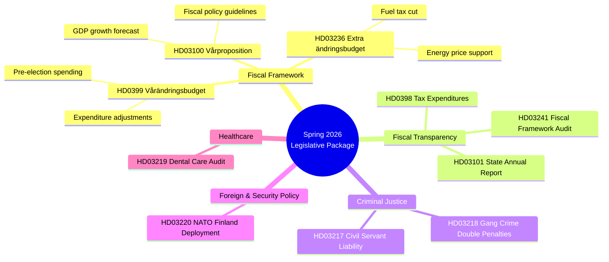

# Synthesis Summary — Government Propositions — 2026-04-13

**Generated**: 2026-04-13 11:15 UTC | **Confidence**: HIGH | **Riksmöte**: 2025/26
**Documents Analyzed**: 10 | **Analysis Depth**: deep | **AI Iterations**: 2

---

## Executive Summary

The Kristersson government has unleashed its most significant legislative package of the 2025/26 parliamentary session — a coordinated **Spring Financial Offensive** centered on the 2026 Economic Spring Proposition (Prop. 2025/26:100), the Spring Supplementary Budget (Prop. 2025/26:99), and a politically charged Extra Supplementary Budget cutting fuel taxes and providing energy price support (Prop. 2025/26:236). All six documents from today originate from Finansdepartementet, signed by PM Ulf Kristersson and Finance Minister Elisabeth Svantesson, signaling a pre-election fiscal strategy designed to control the economic narrative ahead of Election 2026.

Complementing the fiscal package, the government simultaneously advanced its law-and-order agenda with double penalties for gang crimes (HD03218), expanded civil servant criminal liability (HD03217), and a Swedish NATO deployment to Finland (HD03220).

## AI-Recommended Article Metadata

- **Recommended Title (EN)**: "Kristersson Government Launches Spring Budget Offensive with Fuel Tax Cuts and Energy Price Support"
- **Recommended Title (SV)**: "Kristerssons regering lanserar vårbudgetoffensiv med sänkt bränsleskatt och energiprisstöd"
- **Meta Description (EN)**: "Sweden's government unveils Spring Fiscal Policy Bill, supplementary budget and emergency energy relief in coordinated pre-election economic package — 10 propositions analyzed."
- **Meta Description (SV)**: "Regeringen presenterar den ekonomiska vårpropositionen, vårändringsbudget och extra energistöd i samordnat förvalspaketet — 10 propositioner analyserade."
- **Key Highlights**: Spring Fiscal Policy Bill (Prop. 100), fuel tax cuts (Prop. 236), gang crime double penalties (Prop. 218)
- **Article Decision**: PUBLISH — significance 10/10, coordinated government package
- **Article Priority**: CRITICAL

## Thematic Clusters

## Top 3 Significance-Ranked Findings

1. **HD03100 — Vårproposition (10/10)**: The annual Spring Fiscal Policy Bill sets the economic framework for the upcoming budget and election campaign. PM Kristersson and Finance Minister Svantesson signed it — this is the government's economic platform.

2. **HD03236 — Extra Ändringsbudget for Fuel/Energy (9/10)**: Emergency fuel tax cuts and energy price support represent the government's most direct pre-election voter relief measure. Signed by Deputy PM Lotta Edholm and State Secretary Niklas Wykman — politically explosive given climate vs. cost-of-living tension.

3. **HD0399 — Vårändringsbudget (9/10)**: The Spring Supplementary Budget adjusts 2026 spending, completing the fiscal package. Together with Vårpropositionen and the Extra budget, this creates a comprehensive government economic narrative.

## Key Risk Scores

| Document | Risk Score | Key Risk |
|----------|-----------|----------|
| HD03236 | 15 | Climate contradiction attacks (fuel tax cut) |
| HD03100 | 12 | GDP forecast deviation from reality |
| HD0399 | 12 | SD blocks specific spending items |
| HD03218 | 10 | Prison capacity insufficiency |
| HD03220 | 6 | Deployment cost escalation |

## Cross-Document Pattern: Coordinated Pre-Election Strategy

The simultaneous release of 6 Finansdepartementet documents on a single day is not routine — it represents a **coordinated legislative offensive** designed to:
1. Control the economic narrative for Election 2026
2. Demonstrate fiscal competence through transparency (annual report, tax expenditures, audit response)
3. Deliver tangible voter relief (fuel tax cuts, energy support)
4. Lock in policy direction before parliamentary summer recess

This pattern mirrors the 2022 pre-election fiscal strategy of the previous S-led government — both sides use the Vårproposition as a de facto campaign platform.

## Overall Assessment

- **Government Position**: STRONG — controls fiscal narrative, delivers on Tidö Agreement priorities
- **Opposition Challenge**: Must offer credible alternative economic framework
- **SD Position**: REINFORCED — fuel tax cuts and gang crime penalties align with their agenda
- **Key Risk**: Global economic shocks invalidating Vårproposition forecasts before election day
