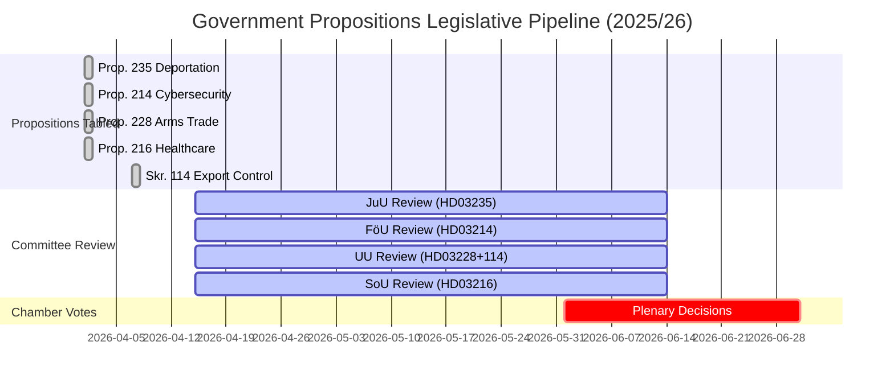

# Analysis Synthesis Summary — 2026-04-13

**Generated**: 2026-04-13 06:19 UTC
**Data Sources**: riksdag-regering-mcp (lookback from 2026-04-10)
**Documents Analyzed**: 5
**Confidence**: MEDIUM (60%)
**Produced By**: AI-driven deep analysis with per-document intelligence

## Summary

Analysis of **5 government propositions** from riksmöte 2025/26 reveals a **coordinated pre-election legislative offensive** by the Svantesson government. The batch spans four departments (Justice, Defence, Foreign Affairs, Social Affairs) and addresses the government's top policy priorities: migration enforcement (Prop. 2025/26:235), cybersecurity (Prop. 2025/26:214), arms trade modernisation (Prop. 2025/26:228), and healthcare reform (Prop. 2025/26:216), plus a companion strategic export control report (Skr. 2025/26:114).

## Key Findings

1. **Flagship Tidö Deliverable**: Prop. 2025/26:235 (deportation reform) is the most politically significant document — significance 9/10. It is SD's highest-priority policy demand and a defining vote for Election 2026.
2. **Defence-Security Cluster**: Three documents (HD03214, HD03228, HD03114) form a coordinated defence policy package addressing cybersecurity, arms regulation, and export control — all critical post-NATO accession deliverables.
3. **Pre-Election Strategy**: All five documents were tabled on 2026-04-01, indicating a coordinated legislative push with ~6 months until the 2026 election.
4. **Cross-Party Dynamics**: Cybersecurity (HD03214) enjoys broad consensus; deportation (HD03235) is maximally polarising; arms reform (HD03228) splits along predictable left-right lines.
5. **Welfare Flank Coverage**: Healthcare proposition (HD03216) addresses a known government vulnerability on welfare delivery.

## Top Documents by Significance

| Score | Type | dok_id | Title |
|-------|------|--------|-------|
| 🔴 9/10 | Proposition | HD03235 | Skärpta regler om utvisning på grund av brott |
| 🟠 8/10 | Proposition | HD03214 | Lagändringar för ett stärkt nationellt cybersäkerhetscenter |
| 🟠 8/10 | Proposition | HD03228 | Ett modernt och anpassat regelverk för krigsmateriel |
| 🟡 6/10 | Proposition | HD03216 | Stärkt medicinsk kompetens i kommunal hälso- och sjukvård |
| 🟡 6/10 | Skrivelse | HD03114 | Strategisk exportkontroll 2025 |

## AI-Recommended Article Metadata

- **Recommended Title (EN)**: Government Launches Pre-Election Legislative Offensive on Deportation, Cybersecurity, and Arms Trade
- **Recommended Title (SV)**: Regeringen lanserar lagstiftningsoffensiv inför valet om utvisning, cybersäkerhet och vapenhandel
- **Meta Description (EN)**: Sweden's Svantesson government tables five major propositions covering stricter deportation rules, national cybersecurity centre reform, arms trade modernisation, and healthcare improvements ahead of Election 2026.
- **Meta Description (SV)**: Svantessons regering lägger fram fem stora propositioner om skärpt utvisning, cybersäkerhetscentrum, vapenreglering och vårdens kompetens inför valet 2026.
- **Key Highlights**: Deportation reform (SD flagship), NATO-aligned cybersecurity, arms export modernisation, healthcare quality
- **Article Decision**: PUBLISH — High significance batch with clear pre-election strategic narrative
- **Article Priority**: HIGH

## Legislative Timeline

## Implications

Overall political risk level: **MEDIUM**. The deportation proposition (HD03235) carries the highest political volatility with potential ECHR compatibility challenges (risk score 16/25). The defence-security cluster represents manageable policy risk with broad cross-party support. The coordinated tabling on 2026-04-01 signals a deliberate pre-election strategy to demonstrate governing competence across multiple policy domains.

## Election 2026 Context

This legislative batch is the government's **final major policy push** before the autumn 2026 election. The Svantesson government is staking its re-election bid on: (1) migration enforcement credibility via deportation reform, (2) national security competence via cybersecurity and defence trade modernisation, and (3) welfare improvement via healthcare reform. SD's continued Tidö cooperation depends heavily on HD03235 passage.

## Data Quality Notes

Overall confidence: **MEDIUM** (60%). Analysis based on proposition metadata, summaries, and political domain expertise. Full-text analysis would increase confidence to HIGH. All 5 per-document analyses available in `documents/` subfolder with detailed SWOT, risk, and stakeholder assessments.
