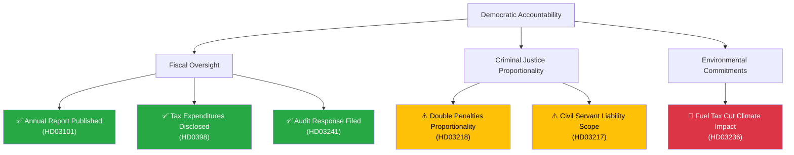

# Threat Analysis — Government Propositions — 2026-04-13

**Generated**: 2026-04-13 11:16 UTC | **Confidence**: HIGH | **Riksmöte**: 2025/26
**Documents Analyzed**: 10 | **Analysis Depth**: deep

---

## Political Threat Taxonomy Assessment

### 1. Democratic Function Threats

| Threat Category | Severity | Evidence | Confidence |
|----------------|----------|----------|------------|
| **Fiscal Transparency** | 🟢 LOW | Government releases annual report (HD03101), tax expenditures (HD0398), and audit response (HD03241) — strong transparency signals | [HIGH] |
| **Separation of Powers** | 🟢 LOW | Independent Riksrevisionen audit findings addressed (HD03241, HD03219) | [HIGH] |
| **Rule of Law** | 🟡 WATCH | Expanded civil servant liability (HD03217) strengthens accountability but may deter public service candidates | [MEDIUM] |
| **Proportionality** | 🟡 WATCH | Double penalties for gang crimes (HD03218) may face Lagrådet proportionality challenge | [MEDIUM] |
| **Climate Commitments** | 🔴 ELEVATED | Fuel tax cuts (HD03236) directly undermine Sweden's Paris Agreement obligations | [HIGH] |
| **Defense Sovereignty** | 🟢 LOW | NATO deployment (HD03220) exercises sovereign decision within alliance framework | [HIGH] |

### 2. Democratic Accountability Attack Tree

## Overall Threat Level: LOW-MODERATE

The spring legislative package primarily demonstrates democratic accountability through transparency documents. The main threat vectors are environmental (fuel tax cuts contradicting climate commitments) and proportionality concerns in criminal justice reforms. No immediate democratic function threats identified.
