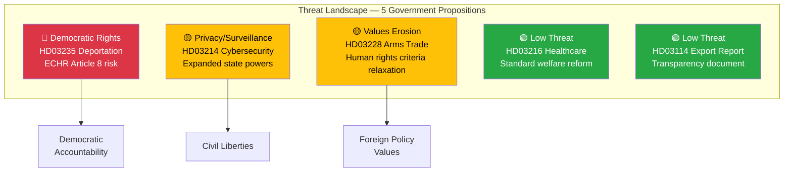
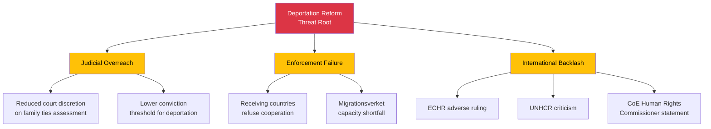

# Political Threat Analysis — 2026-04-13

**Generated**: 2026-04-13 06:20 UTC
**Data Sources**: riksdag-regering-mcp (lookback from 2026-04-10)
**Documents Analyzed**: 5
**Confidence**: MEDIUM (60%)
**Produced By**: AI-driven deep analysis with Political Threat Taxonomy

## Summary

Threat analysis of 5 government propositions identifies **3 primary threat vectors**: democratic function risks from deportation enforcement overreach (HD03235), privacy/surveillance expansion in cybersecurity legislation (HD03214), and values-based foreign policy erosion through arms trade modernisation (HD03228). Healthcare (HD03216) and export control reporting (HD03114) present minimal threat indicators.

## Threat Assessment Table

| Threat Category | dok_id | Severity | Evidence | Confidence |
|----------------|--------|----------|----------|------------|
| Democratic function — judicial discretion limitation | HD03235 | 🔴 HIGH | Deportation reform likely limits court discretion in weighing ties to Sweden | 🟧 MEDIUM |
| Human rights — ECHR Article 8 tension | HD03235 | 🔴 HIGH | Lowered thresholds may conflict with right to family life | 🟩 HIGH |
| Civil liberties — surveillance expansion | HD03214 | 🟡 MEDIUM | Enhanced cyber centre authority may include expanded data collection | 🟧 MEDIUM |
| Foreign policy values — arms export criteria | HD03228 | 🟡 MEDIUM | Modernisation may relax historically strict Swedish export standards | 🟧 MEDIUM |
| Institutional independence — ISP authority | HD03228 | 🟢 LOW | Arms regulation reform maintains ISP oversight role | 🟧 MEDIUM |

## Attack Tree Analysis — HD03235 (Highest Threat)

## Key Findings

1. **HD03235** (deportation reform) is the primary threat vector — ECHR compatibility risk and democratic function concerns
2. **HD03214** (cybersecurity) presents moderate civil liberties threat from expanded surveillance powers
3. **HD03228** (arms trade) risks eroding Sweden's values-based foreign policy tradition
4. **No existential democratic threats** — all propositions operate within normal legislative parameters
5. **Cumulative effect**: The combined security-enforcement package (HD03235+HD03214+HD03228) signals a rightward shift in state power that civil society will collectively resist

## Implications

Threat analysis should inform editorial framing: HD03235 requires balanced coverage of security benefits vs. human rights concerns. HD03214 needs privacy impact assessment context. HD03228 should reference Sweden's traditional values-based arms export policy as benchmark.

## Data Quality Notes

Analysis confidence: MEDIUM (60%). Threat taxonomy applied to proposition metadata and summaries. Full-text analysis would enable deeper attack tree modelling and threat actor characterisation.
