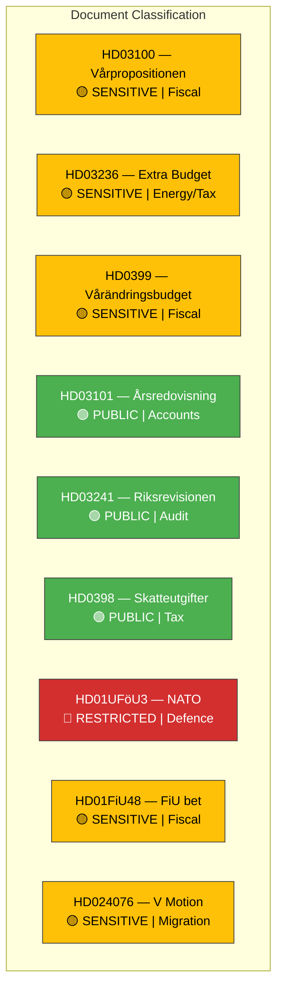

# 🏷️ Political Classification Results — 2026-04-13 Realtime Monitor

**Generated**: 2026-04-13 14:33 UTC | **Documents**: 9

| dok_id | Type | Domain | Sensitivity | Urgency |
|--------|------|--------|-------------|---------|
| HD03100 | prop | Fiscal/Economic | 🟡 SENSITIVE | 🔴 CRITICAL |
| HD03236 | prop | Energy/Taxation | 🟡 SENSITIVE | 🟠 URGENT |
| HD0399 | prop | Fiscal/Economic | 🟡 SENSITIVE | 🟠 URGENT |
| HD03101 | prop | Public Finance | 🟢 PUBLIC | 🔵 ELEVATED |
| HD03241 | prop | Fiscal Governance | 🟢 PUBLIC | 🔵 ELEVATED |
| HD0398 | prop | Tax Policy | 🟢 PUBLIC | ⚪ ROUTINE |
| HD01UFöU3 | bet | Defence/Security | 🔴 RESTRICTED | 🟠 URGENT |
| HD01FiU48 | bet | Energy/Tax | 🟡 SENSITIVE | 🟠 URGENT |
| HD024076 | mot | Migration/Asylum | 🟡 SENSITIVE | 🟠 URGENT |
