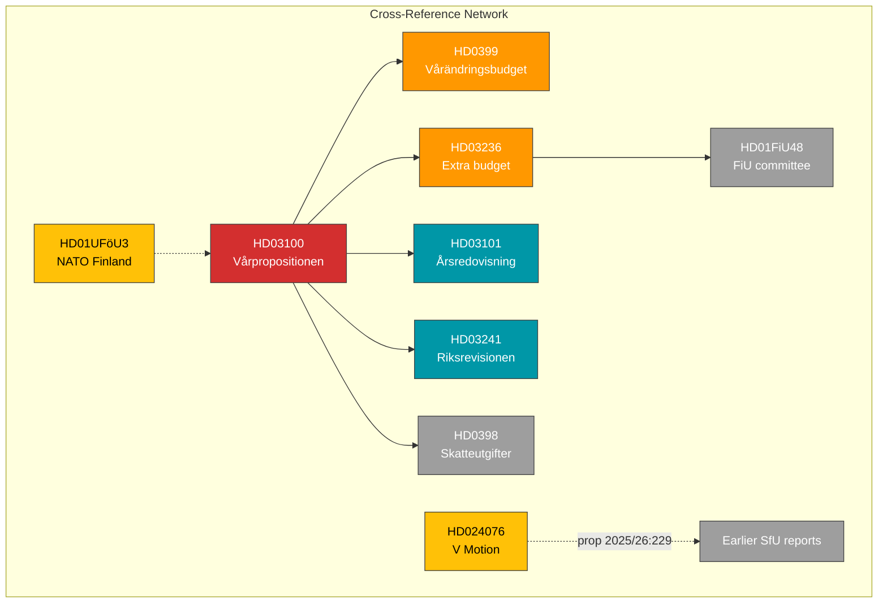

# 🔗 Cross-Reference Map — 2026-04-13 Realtime Monitor

**Generated**: 2026-04-13 14:33 UTC | **Documents**: 9

## Key Relationships

| Source | Target | Relationship |
|--------|--------|-------------|
| HD03100 → HD0399 | VP sets fiscal framework → VÄB implements specific changes |
| HD03100 → HD03236 | VP provides context → Extra budget addresses energy emergency |
| HD03100 → HD03101 | VP builds on → Actual 2025 state accounts |
| HD03100 → HD03241 | VP responds to → Riksrevisionens fiscal framework audit |
| HD03100 → HD0398 | VP references → Tax expenditure accounting |
| HD03236 → HD01FiU48 | Extra budget proposition → Committee report processing |
| HD01UFöU3 → HD03100 | NATO commitment → Defence spending in fiscal framework |
| HD024076 → prop. 2025/26:229 | V motion opposes → Government reception law proposition |
| HD024076 → HD01SfU31/32/36 | V motion relates to → Earlier migration committee reports (today's earlier run) |
