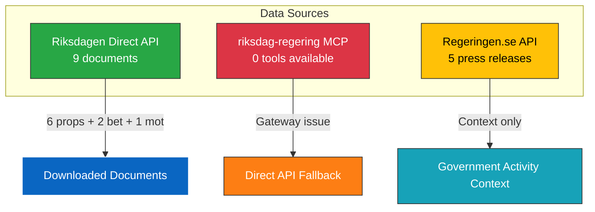

# 📥 Data Download Manifest — 2026-04-13 Realtime Monitor 1433

**Generated**: 2026-04-13 14:37 UTC
**Data Sources**: Riksdagen Direct API, riksdag-regering-ai MCP, regeringen.se API
**Documents Analyzed**: 9
**Confidence**: HIGH
**Produced By**: news-realtime-monitor (direct API fallback)

## Downloads

| dok_id | Type | Title | Size | Status |
|--------|------|-------|------|--------|
| HD03100 | prop | 2026 års ekonomiska vårproposition | 3.2 MB | ✅ Downloaded |
| HD03236 | prop | Extra ändringsbudget – Sänkt skatt på drivmedel | 876 KB | ✅ Downloaded |
| HD0399 | prop | Vårändringsbudget för 2026 | 497 KB | ✅ Downloaded |
| HD03101 | prop | Årsredovisning för staten 2025 | 6.8 MB | ✅ Downloaded |
| HD03241 | prop | Riksrevisionens rapport | 404 KB | ✅ Downloaded |
| HD0398 | prop | Redovisning av skatteutgifter 2026 | 419 KB | ✅ Downloaded |
| HD01UFöU3 | bet | Svenskt bidrag till Natos närvaro i Finland | 3.4 KB | ✅ Downloaded (not published) |
| HD01FiU48 | bet | Extra ändringsbudget (committee) | 3.3 KB | ✅ Downloaded (not published) |
| HD024076 | mot | V motion: En ny mottagandelag | 36 KB | ✅ Downloaded |

## MCP Status

- **Gateway**: awmg-riksdag-regering available but 0 tools registered
- **Direct API**: https://riksdag-regering-ai.onrender.com/mcp — operational with all tools
- **Fallback**: Used direct Riksdagen REST API (data.riksdagen.se) for document downloads
- **Calendar API**: Returned HTML instead of JSON (known intermittent issue)
