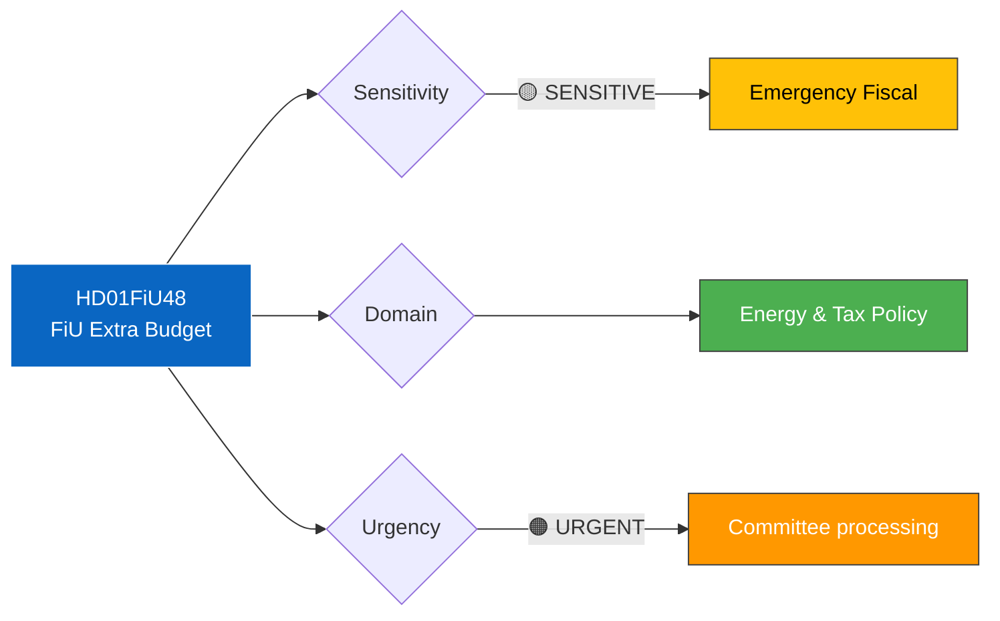

# 🔍 Per-File Political Intelligence Analysis: HD01FiU48

| Field | Value |
|-------|-------|
| **Document ID** | HD01FiU48 |
| **Document Type** | Betänkande (committee report) |
| **Title** | Extra ändringsbudget för 2026 – Sänkt skatt på drivmedel samt el- och gasprisstöd |
| **Date** | 2026-04-13 |
| **Riksmöte** | 2025/26 |
| **Source** | Riksdagen Direct API |
| **Analysis Timestamp** | 2026-04-13 14:33 UTC |
| **Analyst** | news-realtime-monitor |

## 🎯 Executive Summary

Finansutskottet (FiU) processes the government's extra amendment budget for fuel tax cuts and energy price support. This committee report is the parliamentary mechanism through which the Riksdag will approve or modify the emergency fiscal measure (HD03236). The committee's assessment and any reservations will reveal party positions on energy taxation and climate policy trade-offs. Document not yet fully published. **[MEDIUM confidence]**

## 📊 Political Classification

## 📈 SWOT Analysis

| Quadrant | Finding | Evidence | Confidence |
|----------|---------|----------|------------|
| **Strength** | FiU provides structured parliamentary scrutiny of emergency spending | HD01FiU48 committee report on HD03236 | HIGH |
| **Weakness** | Fast-track committee processing may limit debate depth | Extra budgets typically processed rapidly | MEDIUM |
| **Opportunity** | Committee reservations will reveal opposition policy alternatives | S, V, MP, C reservations expected | HIGH |
| **Threat** | Committee vote may reveal coalition fragility on energy/climate trade-offs | Potential SD demands for larger fuel tax cuts | MEDIUM |

## 🔴 Risk Assessment

| Risk | Likelihood | Impact | Score (L×I) |
|------|-----------|--------|-------------|
| Committee splits along non-standard lines | 2 | 4 | 8 |
| MP files strong reservation on climate grounds | 4 | 2 | 8 |

## 🔗 Cross-References

- **HD03236** — The proposition this committee report processes
- **HD03100** — Fiscal framework context
