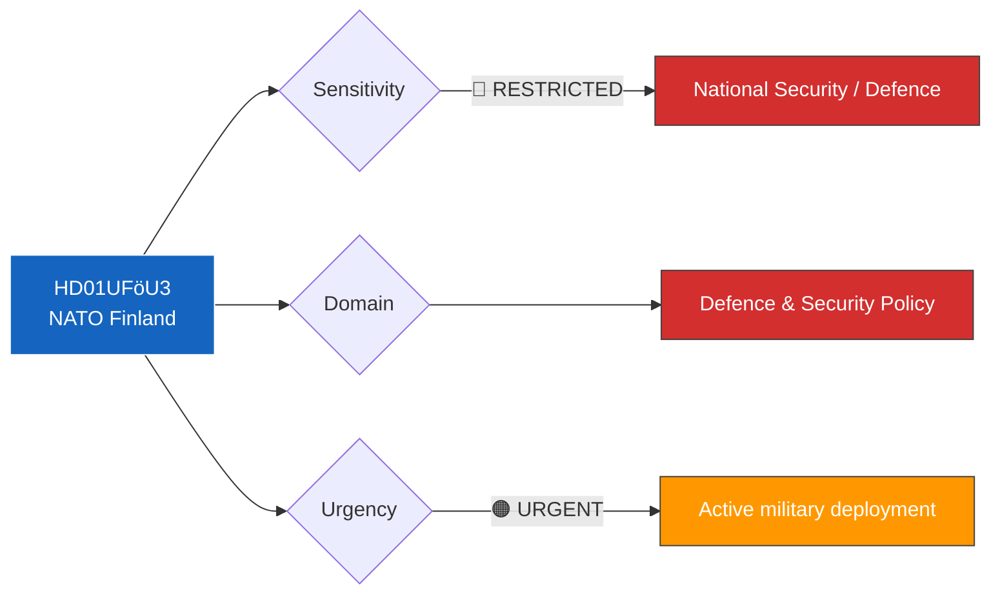

# 🔍 Per-File Political Intelligence Analysis: HD01UFöU3

| Field | Value |
|-------|-------|
| **Document ID** | HD01UFöU3 |
| **Document Type** | Betänkande (committee report) |
| **Title** | Svenskt bidrag till Natos framskjutna närvaro i Finland |
| **Date** | 2026-04-13 |
| **Riksmöte** | 2025/26 |
| **Source** | Riksdagen Direct API |
| **Analysis Timestamp** | 2026-04-13 14:33 UTC |
| **Analyst** | news-realtime-monitor |

## 🎯 Executive Summary

The Joint Foreign Affairs and Defence Committee (UFöU) reports on Sweden's contribution to NATO's forward presence in Finland. This represents a milestone in Swedish NATO membership implementation — Sweden is now deploying military forces to another Nordic NATO member's territory as part of collective defence. The report signals strong cross-party consensus on NATO integration and Nordic defence cooperation. Document not yet fully published, analysis based on title and committee context. **[MEDIUM confidence]**

## 📊 Political Classification

## 📈 SWOT Analysis

| Quadrant | Finding | Evidence | Confidence |
|----------|---------|----------|------------|
| **Strength** | Demonstrates Sweden's active NATO contribution and Nordic solidarity | HD01UFöU3 approved by UFöU | HIGH |
| **Strength** | Broad parliamentary support for NATO forward presence | UFöU typically operates with cross-party consensus on defence | HIGH |
| **Weakness** | Military deployment details may face operational security constraints | Limited public disclosure of force composition | MEDIUM |
| **Opportunity** | Strengthens Sweden-Finland bilateral defence relationship within NATO framework | Joint Nordic defence posture enhances deterrence | HIGH |
| **Threat** | V (and potentially MP) may oppose specific deployment scope | Anti-militarization voices in parliament | MEDIUM |

## 🔴 Risk Assessment

| Risk | Likelihood | Impact | Score (L×I) |
|------|-----------|--------|-------------|
| Deployment escalation concerns from Russia | 3 | 4 | 12 |
| Cost overruns in military deployment | 2 | 3 | 6 |
| Public opposition to NATO military commitments | 2 | 3 | 6 |

## 👥 Stakeholder Impact

| Stakeholder | Impact | Assessment |
|-------------|--------|------------|
| **Citizens** | Security — enhanced collective defence benefits Swedish citizens | National security posture strengthened |
| **Government Coalition** | Positive — demonstrates NATO membership delivering concrete results | M, KD, L all pro-NATO; SD supports defence spending |
| **Opposition** | Split — S pro-NATO; V critical of military deployments; MP ambivalent | Committee vote pattern will be revealing |
| **International/EU** | Strong signal — Sweden demonstrates reliable NATO ally status | Strengthens Nordic-Baltic security architecture |

## 🔗 Cross-References

- **HD03100** (Vårpropositionen) — Defence spending framework for NATO contributions
- **HD0399** (Vårändringsbudget) — May include defence appropriation adjustments
