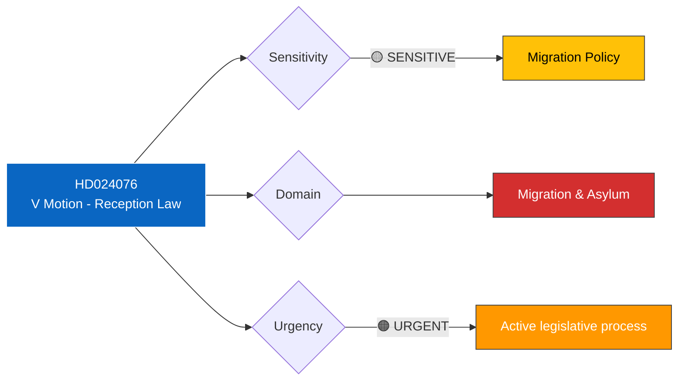

# 🔍 Per-File Political Intelligence Analysis: HD024076

| Field | Value |
|-------|-------|
| **Document ID** | HD024076 |
| **Document Type** | Motion |
| **Title** | med anledning av prop. 2025/26:229 En ny mottagandelag |
| **Date** | 2026-04-13 |
| **Riksmöte** | 2025/26 |
| **Source** | Riksdagen Direct API |
| **Analysis Timestamp** | 2026-04-13 14:33 UTC |
| **Analyst** | news-realtime-monitor |

## 🎯 Executive Summary

Vänsterpartiet (V), led by Tony Haddou, files a motion rejecting the government's new reception law (prop. 2025/26:229 - En ny mottagandelag). The motion calls for rejection of the entire proposition and demands the government return with a reformed reception system. V argues the new law — which requires asylum seekers to reside in Migrationsverket facilities, restricts geographic movement, conditions benefits, and increases surveillance — is disproportionate, violates human rights, and criminalizes vulnerable populations. The motion explicitly references forced housing, geographic restrictions with criminal penalties, and expanded control measures. **[VERY HIGH confidence]**

## 📊 Political Classification

## 📈 SWOT Analysis

| Quadrant | Finding | Evidence | Confidence |
|----------|---------|----------|------------|
| **Strength** | V provides principled human rights opposition to restrictive migration policy | Motion cites proportionality, dignity, rights-based arguments | HIGH |
| **Strength** | V acknowledges LMA is outdated, agrees reform is needed — offers constructive alternative | "Vänsterpartiet delar regeringens bedömning att nuvarande lagstiftning...är föråldrad" | VERY HIGH |
| **Weakness** | V motion likely to be rejected given M+KD+L+SD majority on migration | Coalition + SD have commanding majority on restrictive migration policy | HIGH |
| **Weakness** | V's alternative proposal ("reformed reception system") lacks specific legislative detail | Motion demands government "return with a proposal" rather than specifying reforms | MEDIUM |
| **Opportunity** | Motion creates parliamentary record of rights-based objections for future legal challenges | Constitutional and EU human rights framework may be invoked | MEDIUM |
| **Threat** | New reception law implementation (1 Oct 2026) fundamentally changes asylum seeker conditions | Forced housing, geographic restrictions, criminal penalties for non-compliance | HIGH |

## 🔴 Risk Assessment

| Risk | Likelihood | Impact | Score (L×I) |
|------|-----------|--------|-------------|
| Reception law passes with coalition+SD majority | 5 | 4 | 20 |
| EU legal challenge to restrictive measures | 3 | 4 | 12 |
| Implementation difficulties in forced housing | 3 | 3 | 9 |
| Public opinion backlash against draconian measures | 2 | 3 | 6 |

## 👥 Stakeholder Impact

| Stakeholder | Impact | Assessment |
|-------------|--------|------------|
| **Citizens** (asylum seekers) | Severe — forced housing, geographic restrictions, benefit conditions, criminal penalties | Most directly affected population |
| **Government Coalition** | Positive — delivers on restrictive migration agenda | M, KD, SD core policy priority |
| **Opposition** | Fragmented — V opposes strongly; S position nuanced; MP likely opposes | Left-green bloc united against but outnumbered |
| **Civil Society** | High mobilization — asylum rights organizations will challenge | UNHCR, Red Cross, civil liberties groups expected to comment |
| **Judiciary/Constitutional** | Review likely — proportionality of criminal penalties for geographic restriction violations | Lagrådet and potential European Court review |
| **International/EU** | Scrutiny — EU Reception Conditions Directive compatibility assessment | European Commission monitoring |

## 🔗 Cross-References

- **Prop. 2025/26:229** — The government proposition this motion opposes
- Earlier migration committee reports: HD01SfU31, HD01SfU32, HD01SfU36 (covered in today's earlier run)
