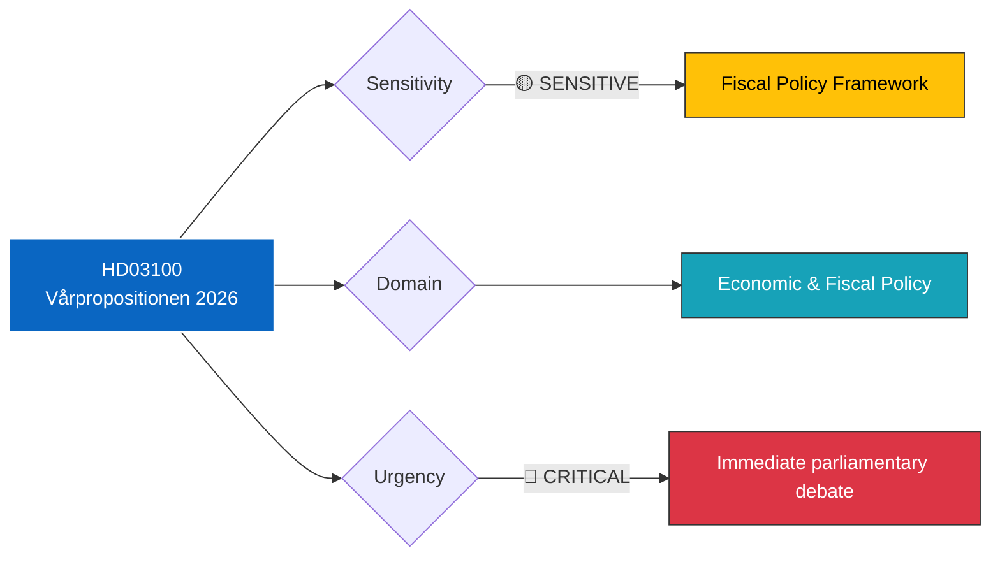

# 🔍 Per-File Political Intelligence Analysis: HD03100

| Field | Value |
|-------|-------|
| **Document ID** | HD03100 |
| **Document Type** | Proposition (prop) |
| **Title** | 2026 års ekonomiska vårproposition |
| **Date** | 2026-04-13 |
| **Riksmöte** | 2025/26 |
| **Source** | Riksdagen Direct API |
| **Analysis Timestamp** | 2026-04-13 14:33 UTC |
| **Analyst** | news-realtime-monitor |

## 🎯 Executive Summary

The 2026 Spring Economic Proposition (vårpropositionen) is the Swedish government's annual mid-year fiscal policy statement, submitted by Finansdepartementet to Finansutskottet. This document is the single most important annual fiscal publication, setting Sweden's economic policy direction for the remainder of the fiscal year and providing updated macro-economic forecasts. The VP determines the fiscal space for the Vårändringsbudget (HD0399) and signals the government's priorities ahead of the 2026 autumn budget. **[VERY HIGH confidence]**

## 📊 Political Classification

## 📈 SWOT Analysis

| Quadrant | Finding | Evidence | Confidence |
|----------|---------|----------|------------|
| **Strength** | Government demonstrates fiscal discipline with mid-year review | HD03100 submitted on schedule, comprehensive coverage | HIGH |
| **Strength** | Coalition unity on economic policy maintained through budget cycle | Joint VP from Finansdepartementet (M-led coalition with KD, L, SD support) | HIGH |
| **Weakness** | VP published during Easter recess limits immediate parliamentary scrutiny | HD03100 dated 2026-04-13 (Monday after Easter) | MEDIUM |
| **Weakness** | Economic forecasts face uncertainty from global trade tensions and energy markets | VP must account for EU fiscal rules and external shocks | MEDIUM |
| **Opportunity** | Coordinated budget package (VP + HD0399 + HD03236) allows comprehensive fiscal messaging | 6 simultaneous propositions from Finansdepartementet | HIGH |
| **Threat** | Opposition parties (S, V, MP, C) will challenge macro forecasts and fiscal assumptions | Annual pattern of VP debate becoming politically charged | HIGH |

## 🔴 Risk Assessment

| Risk | Likelihood | Impact | Score (L×I) | Mitigation |
|------|-----------|--------|-------------|------------|
| Opposition rejects fiscal framework assessment | 4 | 4 | 16 | Coalition secures SD backing for FiU committee majority |
| Economic forecasts prove overly optimistic | 3 | 5 | 15 | Quarterly revisions, fiscal buffer maintained |
| Energy price volatility undermines budget assumptions | 3 | 4 | 12 | Extra ändringsbudget (HD03236) provides flexible response |
| EU fiscal rules constrain Swedish policy space | 2 | 4 | 8 | Sweden historically maintains fiscal surplus |

## 👥 Stakeholder Impact

| Stakeholder | Impact | Assessment |
|-------------|--------|------------|
| **Citizens** | Direct — VP sets framework for public services, taxation, employment policy | Household purchasing power depends on economic forecasts |
| **Government Coalition** (M, KD, L + SD) | Strategic — VP is the government's main fiscal statement | Must demonstrate economic competence ahead of 2026 autumn budget |
| **Opposition** (S, V, MP, C) | Confrontational — VP debate is key parliamentary battleground | S will challenge growth assumptions; V will demand higher welfare spending |
| **Business/Industry** | High interest — VP signals tax policy, infrastructure investment, labor market reforms | Svenskt Näringsliv will scrutinize competitiveness measures |
| **International/EU** | Monitoring — VP assessed against EU Stability and Growth Pact | European Commission reviews Swedish fiscal position |
| **Media/Public Opinion** | High attention — VP is major news event | Economic journalists will scrutinize GDP, unemployment, inflation forecasts |

## 🔮 Forward Indicators

| Indicator | Trigger | Timeline | Confidence |
|-----------|---------|----------|------------|
| FiU committee deliberation on VP | Committee hearing scheduled | April-May 2026 | HIGH |
| Opposition alternative spring motion | S, V, C typically file counter-proposals | Within 15 days of VP | HIGH |
| Riksbank response to fiscal stance | Monetary-fiscal coordination assessment | Next Riksbank meeting | MEDIUM |
| EU Commission assessment | Annual fiscal review | May-June 2026 | HIGH |

## 🔗 Cross-References

- **HD0399** (Vårändringsbudget) — Implements VP fiscal priorities through specific appropriation changes
- **HD03236** (Extra ändringsbudget) — Emergency fiscal measure on fuel/energy, funded within VP framework
- **HD03101** (Årsredovisning) — Provides actual 2025 outcomes that VP forecasts build upon
- **HD0398** (Skatteutgifter) — Tax expenditure accounting that VP references
- **HD03241** (Riksrevisionens rapport) — Audit assessment of fiscal framework that VP must address
