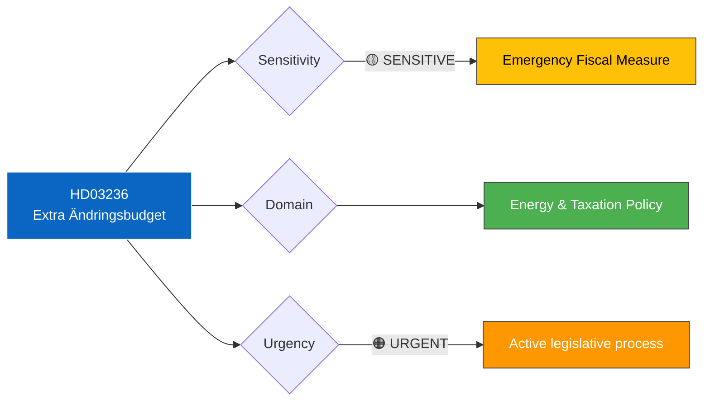

# 🔍 Per-File Political Intelligence Analysis: HD03236

| Field | Value |
|-------|-------|
| **Document ID** | HD03236 |
| **Document Type** | Proposition (prop) |
| **Title** | Extra ändringsbudget för 2026 – Sänkt skatt på drivmedel samt el- och gasprisstöd |
| **Date** | 2026-04-13 |
| **Riksmöte** | 2025/26 |
| **Source** | Riksdagen Direct API |
| **Analysis Timestamp** | 2026-04-13 14:33 UTC |
| **Analyst** | news-realtime-monitor |

## 🎯 Executive Summary

The government submits an extra amendment budget proposing reduced fuel taxes and electricity/gas price support, signaling urgent fiscal intervention in energy markets. This emergency measure demonstrates that energy prices remain a critical voter concern and the coalition (M, KD, L with SD support) is willing to use extraordinary budget instruments to address cost-of-living pressures. The companion committee report HD01FiU48 handles parliamentary processing. **[HIGH confidence]**

## 📊 Political Classification

## 📈 SWOT Analysis

| Quadrant | Finding | Evidence | Confidence |
|----------|---------|----------|------------|
| **Strength** | Government responds to energy cost crisis with concrete fiscal action | HD03236 proposes dual-track relief: fuel tax reduction + el/gas price support | HIGH |
| **Strength** | SD support secured for emergency spending outside normal budget cycle | Extra ändringsbudget requires cross-bloc support pattern | HIGH |
| **Weakness** | Ad-hoc energy subsidies undermine long-term fiscal framework credibility | Extra budgets circumvent normal appropriation process | MEDIUM |
| **Weakness** | Fuel tax cuts conflict with climate policy commitments (Paris Agreement, EU Green Deal) | Reduced fuel taxation incentivizes fossil fuel consumption | HIGH |
| **Opportunity** | Demonstrates government responsiveness to household cost pressures ahead of autumn 2026 | Political positioning for potential 2026 autumn budget negotiations | HIGH |
| **Threat** | Opposition (S, V, MP) will argue energy support is insufficient or poorly targeted | MP specifically will criticize climate policy contradiction | HIGH |

## 🔴 Risk Assessment

| Risk | Likelihood | Impact | Score (L×I) | Mitigation |
|------|-----------|--------|-------------|------------|
| Fuel tax cuts seen as climate policy retreat | 4 | 3 | 12 | Government frames as temporary, emergency measure |
| Energy support costs exceed budget estimate | 3 | 4 | 12 | Time-limited measure with built-in sunset clause |
| S proposes larger alternative energy package | 4 | 3 | 12 | Coalition highlights fiscal responsibility |
| EU challenges fuel tax reduction under Green Deal | 2 | 4 | 8 | Framed as temporary crisis response |

## 👥 Stakeholder Impact

| Stakeholder | Impact | Assessment |
|-------------|--------|------------|
| **Citizens** | Direct positive — fuel and energy costs reduced for households | Particularly benefits rural populations dependent on vehicles |
| **Government Coalition** | Strategic — demonstrates crisis management capability | M, KD, L benefit from visible cost-of-living action |
| **Opposition** | Mixed — S may support relief principle but criticize targeting; V demands more; MP opposes climate impact | FiU committee debate will reveal positions |
| **Business/Industry** | Positive — reduced transport and energy costs benefit competitiveness | Logistics, agriculture, manufacturing sectors benefit |
| **International/EU** | Scrutiny — temporary fuel tax cuts assessed under EU energy taxation framework | Commission monitoring member state energy tax policies |
| **Judiciary/Constitutional** | Procedural — extra budget requires constitutional assessment of urgency | Riksdagens utredningstjänst may review |

## 🔮 Forward Indicators

| Indicator | Trigger | Timeline | Confidence |
|-----------|---------|----------|------------|
| FiU48 committee decision | HD01FiU48 processing the proposition | April-May 2026 | HIGH |
| Energy price trajectory | If prices fall, support may be scaled back | Quarterly review | MEDIUM |
| Climate policy debate intensification | MP and environmental groups challenge fuel tax cuts | Immediate | HIGH |

## 🔗 Cross-References

- **HD01FiU48** — Committee report processing this extra amendment budget
- **HD03100** (Vårpropositionen) — Fiscal framework within which this extra budget operates
- **HD0399** (Vårändringsbudget) — Regular amendment budget running parallel
