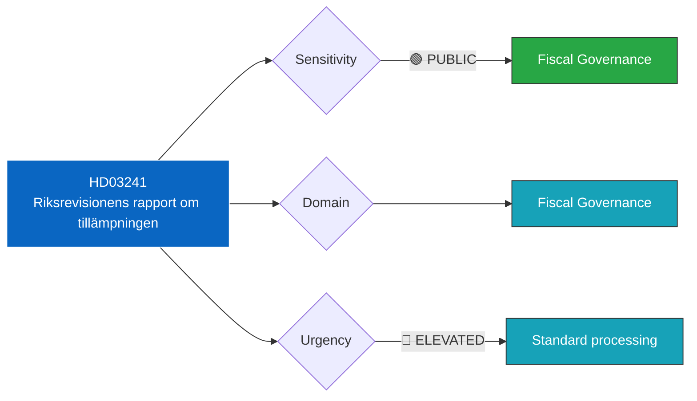

# 🔍 Per-File Political Intelligence Analysis: HD03241

| Field | Value |
|-------|-------|
| **Document ID** | HD03241 |
| **Document Type** | Proposition (prop) |
| **Title** | Riksrevisionens rapport om tillämpningen av det finanspolitiska ramverket 2025 |
| **Date** | 2026-04-13 |
| **Riksmöte** | 2025/26 |
| **Source** | Riksdagen Direct API |
| **Analysis Timestamp** | 2026-04-13 14:33 UTC |
| **Analyst** | news-realtime-monitor |

## 🎯 Executive Summary

The National Audit Office (Riksrevisionen) assesses how the government applied the fiscal policy framework in 2025. This independent review evaluates compliance with the surplus target, expenditure ceiling, and debt anchor. Riksrevisionens findings directly influence FiU's assessment of the VP and government fiscal credibility. **[HIGH confidence]**

## 📊 Political Classification

## 📈 SWOT Analysis

| Quadrant | Finding | Evidence | Confidence |
|----------|---------|----------|------------|
| **Strength** | Enhances transparency and parliamentary oversight of fiscal policy | HD03241 submitted alongside VP package | HIGH |
| **Strength** | Provides factual basis for budget debate | Official government publication with audited/verified data | HIGH |
| **Weakness** | Complex technical content may limit public accessibility | Requires specialist knowledge to interpret | MEDIUM |
| **Opportunity** | Opposition can use findings to challenge government fiscal narrative | FiU committee hearings provide scrutiny mechanism | HIGH |
| **Threat** | Negative findings could undermine government fiscal credibility | Media coverage of unfavorable audit/accounting results | MEDIUM |

## 🔴 Risk Assessment

| Risk | Likelihood | Impact | Score (L×I) |
|------|-----------|--------|-------------|
| Findings reveal fiscal framework non-compliance | 2 | 5 | 10 |
| Opposition uses data to challenge economic narrative | 4 | 3 | 12 |
| Media focus on negative metrics overshadows VP message | 3 | 3 | 9 |

## 👥 Stakeholder Impact

| Stakeholder | Impact | Assessment |
|-------------|--------|------------|
| **Citizens** | Indirect — accountability mechanism for public funds | Ensures government fiscal transparency |
| **Government Coalition** | Defensive — must address any negative findings | VP messaging strategy must account for audit results |
| **Opposition** | Analytical ammunition — provides data for fiscal critiques | S, V will scrutinize for unfavorable trends |
| **Media/Public Opinion** | Moderate interest — fiscal accountability reporting | Economic journalists review key metrics |

## 🔗 Cross-References

- **HD03100** (Vårpropositionen) — Primary fiscal policy document this report supports
- **HD0399** (Vårändringsbudget) — Budget adjustments informed by this report's findings
