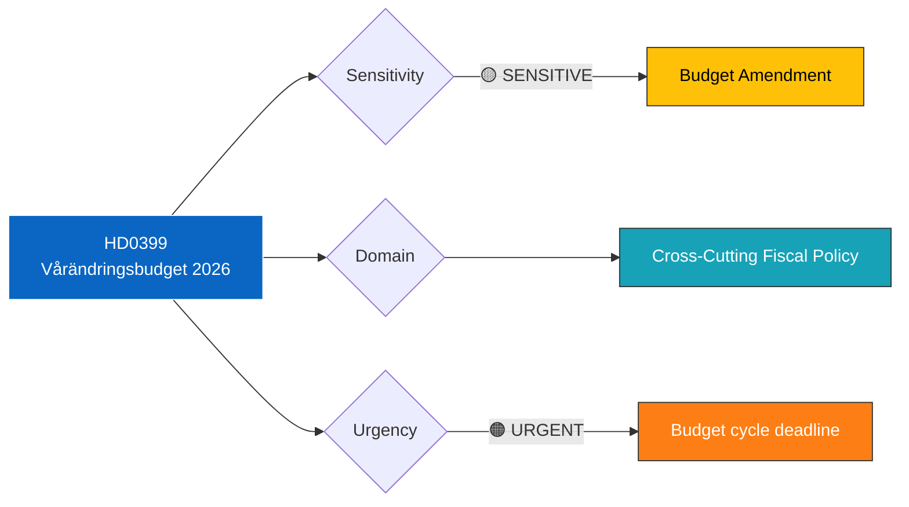

# 🔍 Per-File Political Intelligence Analysis: HD0399

| Field | Value |
|-------|-------|
| **Document ID** | HD0399 |
| **Document Type** | Proposition (prop) |
| **Title** | Vårändringsbudget för 2026 |
| **Date** | 2026-04-13 |
| **Riksmöte** | 2025/26 |
| **Source** | Riksdagen Direct API |
| **Analysis Timestamp** | 2026-04-13 14:33 UTC |
| **Analyst** | news-realtime-monitor |

## 🎯 Executive Summary

The Spring Amendment Budget (Vårändringsbudget) adjusts the 2026 state budget based on updated economic conditions and policy needs identified since the autumn budget was passed. Submitted by Finansdepartementet alongside the Vårpropositionen (HD03100), this document contains the concrete appropriation changes that implement the government's mid-year fiscal strategy. The VÄB reveals which policy areas the government is prioritizing or deprioritizing relative to the autumn budget baseline. **[HIGH confidence]**

## 📊 Political Classification

## 📈 SWOT Analysis

| Quadrant | Finding | Evidence | Confidence |
|----------|---------|----------|------------|
| **Strength** | Comprehensive mid-year budget adjustment demonstrates active fiscal management | HD0399 provides line-item changes across expenditure areas | HIGH |
| **Strength** | Coalition agreement on spending priorities maintained through spring cycle | Joint submission from Finansdepartementet | HIGH |
| **Weakness** | VÄB typically has limited fiscal space relative to autumn budget | Spring amendments constrained by fiscal framework targets | MEDIUM |
| **Opportunity** | VÄB can address emerging policy needs (security, migration, infrastructure) | Flexibility to respond to changed conditions since autumn 2025 | HIGH |
| **Threat** | Opposition will propose alternative amendments showing different priorities | S, V alternative budgets traditionally challenge coalition priorities | HIGH |

## 🔴 Risk Assessment

| Risk | Likelihood | Impact | Score (L×I) |
|------|-----------|--------|-------------|
| FiU committee rejects specific appropriation changes | 2 | 4 | 8 |
| Total spending exceeds fiscal framework ceiling | 2 | 5 | 10 |
| Key policy areas underfunded relative to needs | 3 | 3 | 9 |

## 👥 Stakeholder Impact

| Stakeholder | Impact | Assessment |
|-------------|--------|------------|
| **Citizens** | Indirect — VÄB adjustments affect public service delivery and transfer payments | Priority shifts become visible in H2 2026 |
| **Government Coalition** | Central — VÄB operationalizes coalition compromise on spending | Must satisfy M fiscal restraint AND SD policy demands |
| **Opposition** | Key battleground — FiU debates VÄB alongside VP | S will present alternative budget priorities |
| **Business/Industry** | Monitored — VÄB may adjust business-relevant appropriations | Infrastructure and innovation spending tracked closely |

## 🔗 Cross-References

- **HD03100** (Vårpropositionen) — Sets fiscal framework that VÄB operates within
- **HD03236** (Extra ändringsbudget) — Parallel emergency fiscal measure
- **HD0398** (Skatteutgifter) — Tax expenditure report informing VÄB analysis
