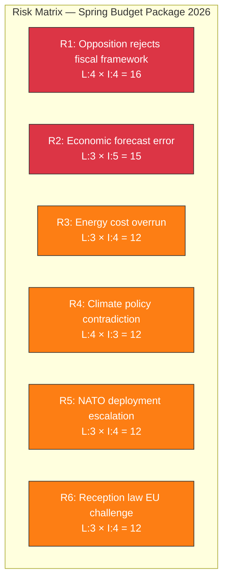

# 🔴 Political Risk Assessment — 2026-04-13 Realtime Monitor

**Generated**: 2026-04-13 14:33 UTC | **Documents**: 9 | **Confidence**: HIGH

## Risk Matrix (5×5)

| ID | Risk | Likelihood | Impact | Score | dok_id | Mitigation |
|----|------|-----------|--------|-------|--------|------------|
| R1 | Opposition rejects VP fiscal framework assessment | 4 | 4 | 16 | HD03100 | Coalition secures SD support in FiU |
| R2 | VP economic forecasts prove overly optimistic | 3 | 5 | 15 | HD03100, HD03241 | Quarterly revisions, fiscal buffer |
| R3 | Energy support costs exceed budget allocation | 3 | 4 | 12 | HD03236 | Time-limited measure, sunset clause |
| R4 | Fuel tax cuts contradict EU Green Deal commitments | 4 | 3 | 12 | HD03236 | Framed as temporary crisis response |
| R5 | NATO deployment draws Russian countermeasures | 3 | 4 | 12 | HD01UFöU3 | NATO collective defence framework |
| R6 | New reception law challenged under EU law | 3 | 4 | 12 | HD024076 | Government legal review (Lagrådet) |

## Aggregate Risk Profile

- **Overall Risk Level**: MEDIUM-HIGH
- **Primary Risk Cluster**: Fiscal policy credibility (R1, R2, R3)
- **Secondary Risk Cluster**: Policy coherence (R4, R6)
- **Emerging Risk**: Geopolitical (R5)
