# 📈 Significance Scoring — 2026-04-13 Realtime Monitor

**Generated**: 2026-04-13 14:33 UTC | **Documents**: 9

```mermaid
graph LR
    subgraph "Significance Scoring"
        HD03100["HD03100: 9/10<br/>🔴 CRITICAL"]
        HD03236["HD03236: 8/10<br/>🟠 HIGH"]
        HD0399["HD0399: 7/10<br/>🟠 HIGH"]
        UFoU3["HD01UFöU3: 6/10<br/>🟡 MEDIUM"]
        HD024076["HD024076: 5/10<br/>🟡 MEDIUM"]
        HD03101["HD03101: 4/10<br/>🔵 STANDARD"]
        HD03241["HD03241: 4/10<br/>🔵 STANDARD"]
        HD0398["HD0398: 3/10<br/>⚪ LOW"]
        FiU48["HD01FiU48: 3/10<br/>⚪ LOW"]
    end
    style HD03100 fill:#dc3545,stroke:#333,color:#fff
    style HD03236 fill:#fd7e14,stroke:#333,color:#fff
    style HD0399 fill:#fd7e14,stroke:#333,color:#fff
    style UFoU3 fill:#ffc107,stroke:#333,color:#000
    style HD024076 fill:#ffc107,stroke:#333,color:#000
    style HD03101 fill:#17a2b8,stroke:#333,color:#fff
    style HD03241 fill:#17a2b8,stroke:#333,color:#fff
    style HD0398 fill:#6c757d,stroke:#333,color:#fff
    style FiU48 fill:#6c757d,stroke:#333,color:#fff
```

| Rank | dok_id | Score | Level | Scoring Rationale |
|------|--------|-------|-------|-------------------|
| 1 | HD03100 | 9/10 | CRITICAL | +3 (coalition fiscal test) +2 (all parties) +2 (budget/fiscal) +2 (economic policy) = 9 |
| 2 | HD03236 | 8/10 | HIGH | +3 (coalition policy) +2 (budget/fiscal) +2 (energy/cost-of-living) +1 (minister) = 8 |
| 3 | HD0399 | 7/10 | HIGH | +2 (budget/fiscal) +2 (multiple parties) +2 (spending amendments) +1 (minister) = 7 |
| 4 | HD01UFöU3 | 6/10 | MEDIUM | +2 (defence/security) +2 (NATO/international) +2 (military deployment) = 6 |
| 5 | HD024076 | 5/10 | MEDIUM | +2 (social welfare) +2 (criminal justice reform) +1 (V opposition motion) = 5 |
| 6 | HD03101 | 4/10 | STANDARD | +2 (budget/fiscal) +2 (accountability mechanism) = 4 |
| 7 | HD03241 | 4/10 | STANDARD | +2 (fiscal governance) +2 (audit institution) = 4 |
| 8 | HD0398 | 3/10 | LOW | +2 (tax policy) +1 (transparency) = 3 |
| 9 | HD01FiU48 | 3/10 | LOW | +2 (fiscal) +1 (committee processing) = 3 |

**Overall Significance**: 9/10 (CRITICAL) — The Spring Budget Package is the most significant annual fiscal event, combined with NATO deployment and migration policy developments.
