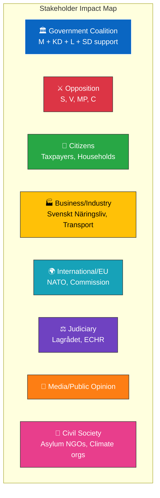

# 👥 Stakeholder Impact Analysis — 2026-04-13 Realtime Monitor

**Generated**: 2026-04-13 14:33 UTC | **Documents**: 9 | **Confidence**: HIGH

## Stakeholder Mapping

| Stakeholder | Primary Impact | Key dok_ids | Position | Confidence |
|-------------|---------------|-------------|----------|------------|
| **Citizens** | Fuel tax reduction + energy price support directly benefits households; reception law affects asylum seekers | HD03236, HD024076 | Benefit from energy relief; asylum seekers harmed by reception law | HIGH |
| **Government Coalition** (M, KD, L) | VP demonstrates fiscal competence; energy relief shows responsiveness; NATO shows alliance credibility | HD03100, HD03236, HD01UFöU3 | Positive — coordinated policy delivery | HIGH |
| **SD** (support party) | Migration policy delivery (reception law); fuel tax cuts align with voter base; defence spending | HD024076, HD03236, HD01UFöU3 | Strongly supportive — core agenda delivered | HIGH |
| **S** (opposition) | Must present alternative fiscal framework; will challenge economic forecasts | HD03100, HD0399 | Confrontational — fiscal credibility contest | HIGH |
| **V** (opposition) | Filed motion rejecting reception law; will demand larger welfare spending in VÄB alternative | HD024076, HD03100 | Strongly opposed — rights and welfare focus | VERY HIGH |
| **MP** (opposition) | Will criticize fuel tax cuts as climate betrayal; oppose reception law | HD03236, HD024076 | Opposed — environmental and rights arguments | HIGH |
| **C** (opposition) | Fiscal conservatism may align with some VP measures; migration stance more nuanced | HD03100 | Selective — may support fiscal framework elements | MEDIUM |
| **Business/Industry** | VP signals on competitiveness, infrastructure, labour market reforms; energy cost reduction benefits industry | HD03100, HD03236, HD0399 | Generally supportive of cost reduction | HIGH |
| **International/EU** | NATO deployment assessed positively; fiscal stance monitored under EU rules; reception law scrutinized | HD01UFöU3, HD03100, HD024076 | Mixed — positive on NATO, monitoring on fiscal/migration | HIGH |
| **Judiciary/Constitutional** | Lagrådet review of reception law proportionality; fiscal framework constitutional assessment | HD024076, HD03241 | Neutral — institutional review function | MEDIUM |
| **Media/Public Opinion** | VP is major news event; energy relief popular; NATO deployment significant; reception law controversial | All | High attention — multiple news angles | HIGH |
| **Civil Society** | Asylum rights organizations mobilize against reception law; climate organizations challenge fuel tax cuts | HD024076, HD03236 | Active opposition on rights and climate | HIGH |
