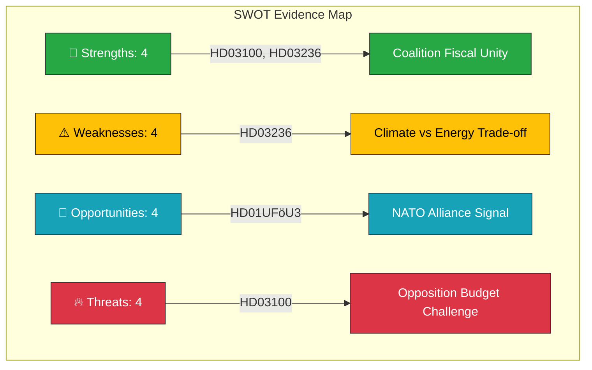

# 📊 SWOT Analysis — 2026-04-13 Realtime Monitor

**Generated**: 2026-04-13 14:33 UTC | **Documents**: 9 | **Confidence**: HIGH

## Context

| Field | Value |
|-------|-------|
| **Event** | Spring Budget Package 2026 + NATO + Migration |
| **Key Actors** | Finansdepartementet, FiU, UFöU, SfU, V (Tony Haddou) |
| **Coalition** | M + KD + L (government) + SD (support) |
| **Opposition** | S, V, MP, C |

## SWOT Quadrant Evidence

### 💪 Strengths

| Evidence | dok_id | Confidence | Impact |
|----------|--------|------------|--------|
| 6 coordinated fiscal propositions demonstrate coalition unity on economic policy | HD03100, HD0399, HD03236, HD03101, HD0398, HD03241 | HIGH | Strategic |
| Government delivers concrete energy price relief via extra budget mechanism | HD03236 | HIGH | Direct household impact |
| NATO forward presence shows Sweden as reliable alliance member | HD01UFöU3 | HIGH | International credibility |
| VP submitted on schedule, maintaining fiscal framework compliance | HD03100 | HIGH | Institutional |

### ⚠️ Weaknesses

| Evidence | dok_id | Confidence | Impact |
|----------|--------|------------|--------|
| VP released during Easter recess (Apr 13) — reduced immediate parliamentary scrutiny | HD03100 | HIGH | Procedural |
| Fuel tax cuts contradict climate policy commitments under EU Green Deal | HD03236 | HIGH | Policy coherence |
| Extra budget mechanism bypasses normal appropriation scrutiny | HD03236, HD01FiU48 | MEDIUM | Institutional |
| VP economic forecasts face exceptional global uncertainty (trade tensions, energy) | HD03100 | MEDIUM | Forecast reliability |

### 🎯 Opportunities

| Evidence | dok_id | Confidence | Impact |
|----------|--------|------------|--------|
| VP debate will expose opposition fiscal alternatives before autumn budget | HD03100, HD0399 | HIGH | Political positioning |
| Nordic NATO deployment strengthens Sweden-Finland bilateral defence | HD01UFöU3 | HIGH | Geopolitical |
| Energy support package demonstrates government responsiveness to cost-of-living | HD03236 | HIGH | Electoral |
| V's reception law opposition creates rights-based parliamentary record | HD024076 | MEDIUM | Constitutional |

### 🔥 Threats

| Evidence | dok_id | Confidence | Impact |
|----------|--------|------------|--------|
| S will present comprehensive alternative spring budget challenging government priorities | HD03100, HD0399 | HIGH | Political |
| Economic forecast errors could undermine fiscal framework credibility | HD03100, HD03241 | MEDIUM | Institutional |
| EU scrutiny of fuel tax cuts under Green Deal commitments | HD03236 | MEDIUM | International |
| New reception law faces potential EU human rights legal challenges | HD024076 | MEDIUM | Legal |

