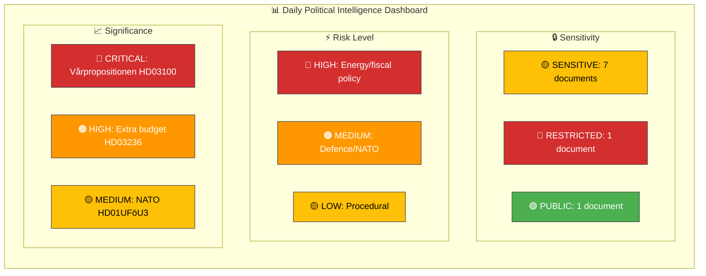
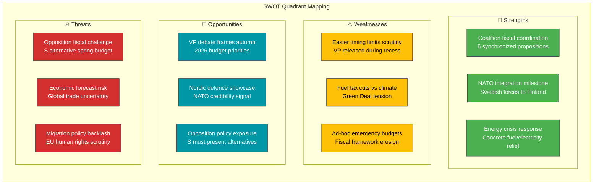

# 🧩 Political Intelligence Synthesis Summary — 2026-04-13

| Field | Value |
|-------|-------|
| **Synthesis ID** | SYN-2026-04-13-1433 |
| **Analysis Date** | 2026-04-13 14:33 UTC |
| **Documents Analyzed** | 9 |
| **Analysis Period** | 2026-04-12 00:00–2026-04-13 14:33 UTC |
| **Produced By** | news-realtime-monitor |
| **Overall Confidence** | HIGH |

## 📊 Intelligence Dashboard

### Daily Political Landscape

## 🔑 Key Findings (Ranked by Significance)

### 1. 🔴 Spring Budget Package Released (Severity: 9/10 — CRITICAL)

The government released the complete Spring Budget Package on April 13, comprising 6 propositions from Finansdepartementet. The **2026 Vårproposition** (HD03100) sets the fiscal framework, the **Vårändringsbudget** (HD0399) adjusts appropriations, and the **Extra ändringsbudget** (HD03236) proposes emergency fuel tax cuts and energy price support. Supporting documents include the 2025 State Accounts (HD03101), Tax Expenditure Report (HD0398), and Riksrevisionen's fiscal framework assessment (HD03241).

**Cross-Document Pattern**: All 6 fiscal documents form a coordinated package — the VP sets direction, VÄB implements, and the extra budget addresses acute energy price crisis. This coordinated release maximizes political messaging impact.

### 2. 🟠 NATO Forward Presence in Finland (Severity: 6/10 — HIGH)

UFöU committee report HD01UFöU3 processes Sweden's military contribution to NATO's forward presence in Finland. This represents concrete NATO membership implementation — Swedish forces deployed to another Nordic ally's territory for collective defence.

### 3. 🟡 V Opposition to New Reception Law (Severity: 5/10 — MEDIUM)

Vänsterpartiet (Tony Haddou et al.) filed motion HD024076 rejecting the government's new reception law (prop. 2025/26:229), which imposes forced housing, geographic restrictions with criminal penalties, and expanded surveillance on asylum seekers. V calls for complete rejection and alternative reform.

## 📊 Aggregate SWOT

## 🔮 Forward Intelligence

| Indicator | Trigger | Timeline | Confidence |
|-----------|---------|----------|------------|
| FiU hearings on VP/VÄB | Committee scheduling post-Easter | Week of Apr 20, 2026 | HIGH |
| S alternative spring budget | Opposition counter-proposal | Within 15 days | HIGH |
| Riksdag plenary debate on VP | VP debate is major annual event | Late April/May 2026 | HIGH |
| NATO deployment details published | UFöU3 full text released | Within days | HIGH |
| V motion vote on reception law | SfU committee processes HD024076 | May 2026 | HIGH |
| Economic spring forecast update | Konjunkturinstitutet assessment | April-May 2026 | HIGH |

## 📋 Document Significance Ranking

| Rank | dok_id | Type | Title | Score |
|------|--------|------|-------|-------|
| 1 | HD03100 | prop | 2026 års ekonomiska vårproposition | 9/10 |
| 2 | HD03236 | prop | Extra ändringsbudget – Sänkt skatt på drivmedel samt el- och gasprisstöd | 8/10 |
| 3 | HD0399 | prop | Vårändringsbudget för 2026 | 7/10 |
| 4 | HD01UFöU3 | bet | Svenskt bidrag till Natos framskjutna närvaro i Finland | 6/10 |
| 5 | HD024076 | mot | V motion: En ny mottagandelag | 5/10 |
| 6 | HD03101 | prop | Årsredovisning för staten 2025 | 4/10 |
| 7 | HD03241 | prop | Riksrevisionens rapport om finanspolitiska ramverket | 4/10 |
| 8 | HD0398 | prop | Redovisning av skatteutgifter 2026 | 3/10 |
| 9 | HD01FiU48 | bet | FiU betänkande – Extra ändringsbudget | 3/10 |
