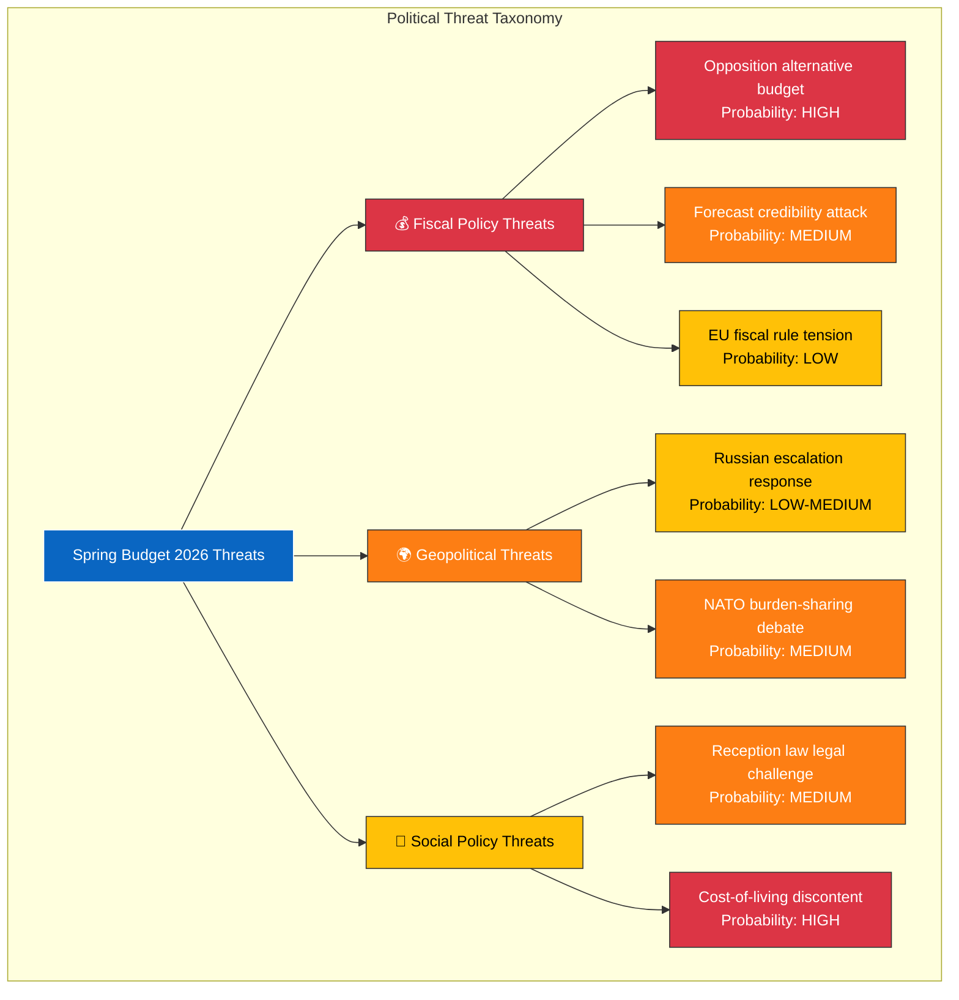

# 🔴 Political Threat Analysis — 2026-04-13 Realtime Monitor

**Generated**: 2026-04-13 14:33 UTC | **Documents**: 9 | **Confidence**: HIGH

## Threat Taxonomy

| Threat | Category | Actor | Probability | Impact | dok_id |
|--------|----------|-------|-------------|--------|--------|
| S alternative spring budget | Fiscal | Socialdemokraterna | HIGH | Strategic | HD03100 |
| Cost-of-living discontent despite relief | Social | Citizens | HIGH | Electoral | HD03236 |
| VP forecast credibility challenged | Fiscal | Opposition + Media | MEDIUM | Institutional | HD03100, HD03241 |
| NATO deployment escalation | Geopolitical | Russia | LOW-MEDIUM | Security | HD01UFöU3 |
| Reception law EU legal challenge | Social | EU/Civil Society | MEDIUM | Legal | HD024076 |
| Climate policy contradiction exposed | Fiscal | MP, EU | MEDIUM | Policy coherence | HD03236 |
