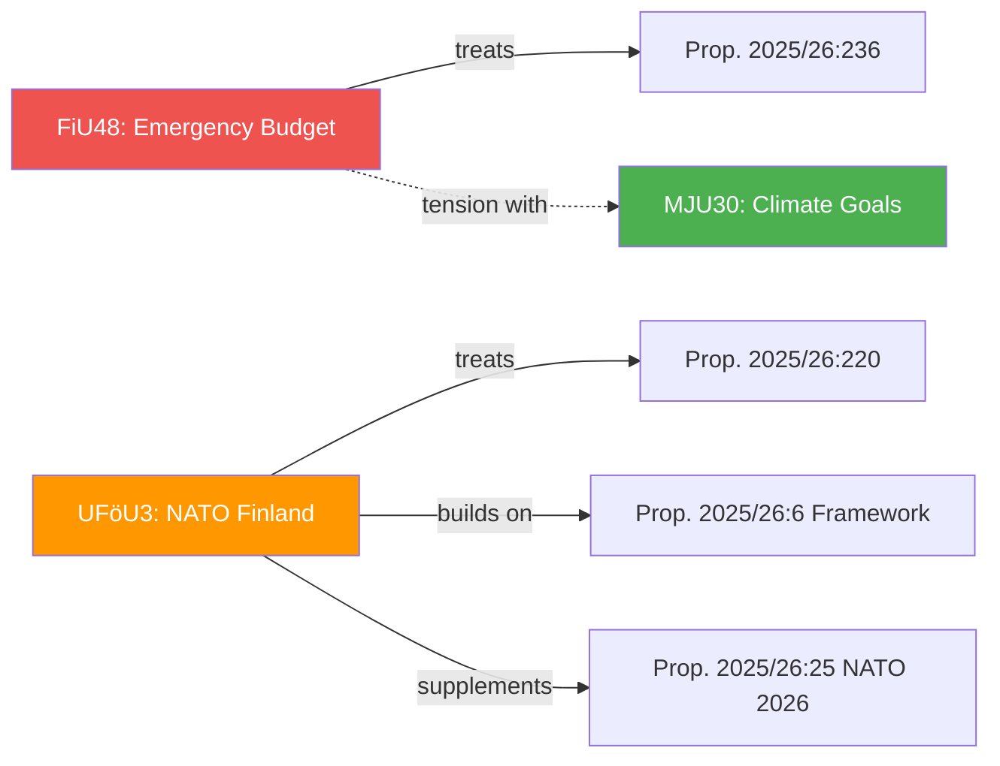

# Cross-Reference Map — 2026-04-14

**Generated**: 2026-04-14 04:40 UTC (AI-enhanced)
**Data Sources**: get_betankanden, get_dokument_innehall, proposition text
**Documents Analyzed**: 3
**Confidence**: HIGH
**Produced By**: AI-enhanced cross-reference analysis

## Summary

Detected **4** cross-document relationships across 3 committee reports and their source propositions.

## Cross-Reference Network

## Detailed Cross-References

| Source | Target | Relationship | Confidence |
|--------|--------|-------------|------------|
| HD01FiU48 | Prop. 2025/26:236 | Treats (source proposition) | HIGH |
| HD01UFöU3 | Prop. 2025/26:220 | Treats (source proposition) | HIGH |
| HD01UFöU3 | Prop. 2025/26:6 | Legal framework reference | HIGH |
| HD01UFöU3 | Prop. 2025/26:25 | Supplements existing NATO authorization | HIGH |
| HD01FiU48 | HD01MJU30 | Policy tension — fossil fuel tax cuts vs. EU climate goals | MEDIUM |

## Thematic Clusters

1. **Security/Defence Cluster**: UFöU3 → Prop. 220 → Prop. 6 → Prop. 25 (chain of NATO decisions)
2. **Fiscal/Energy Cluster**: FiU48 → Prop. 236 (standalone emergency measure)
3. **Cross-Cluster Tension**: FiU48 (fossil fuel support) ↔ MJU30 (climate targets)

## Data Quality Notes

Cross-reference confidence: **HIGH**. Relationships confirmed via proposition text and committee referral data.
