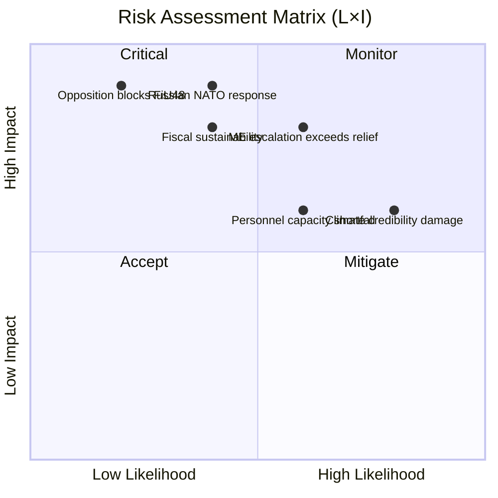

# Political Risk Assessment — 2026-04-14

**Generated**: 2026-04-14 04:40 UTC (AI-enhanced)
**Data Sources**: get_betankanden, get_dokument_innehall, Prop. 2025/26:236, Prop. 2025/26:220, CIA coalition metrics
**Documents Analyzed**: 3
**Confidence**: HIGH
**Produced By**: AI-enhanced analysis following political-risk-methodology.md

## Summary

Risk assessment covering 3 committee reports. Primary risk cluster centers on the emergency supplementary budget (FiU48) — geopolitical fuel price volatility and climate policy contradiction create a dual HIGH-risk profile. NATO deployment (UFöU3) carries moderate escalation risk. Coalition stability remains strong (risk score 4/100).

## Risk Matrix

## Detailed Risk Analysis

| # | Risk | Source | Likelihood (1-5) | Impact (1-5) | L×I Score | Level | Mitigation |
|---|------|--------|-------------------|--------------|-----------|-------|------------|
| R1 | Middle East escalation exceeds FiU48 fuel relief | FiU48/Prop. 236 | 3 | 4 | 12 | 🟠 HIGH | Additional emergency budget (Prop. 237+) prepared |
| R2 | Climate credibility damaged by fossil fuel tax cuts | FiU48 vs. MJU30 | 4 | 3 | 12 | 🟠 HIGH | Frame as temporary crisis measure; commit to reversal timeline |
| R3 | Russian escalation to Nordic NATO eFP presence | UFöU3/Prop. 220 | 2 | 5 | 10 | 🟡 MEDIUM | NATO Article 5 collective deterrence |
| R4 | Defence personnel capacity shortfall | UFöU3 + FöU8 (98 rejected motions) | 3 | 3 | 9 | 🟡 MEDIUM | Accelerate recruitment; extend conscription |
| R5 | Fiscal sustainability of emergency measures | FiU48 budget impact | 2 | 4 | 8 | 🟡 MEDIUM | Time-bound measures; automatic sunset clauses |
| R6 | Opposition blocks FiU48 in committee | FiU48 committee April 16 | 1 | 5 | 5 | 🟢 LOW | Emergency budgets typically attract consensus |

## Coalition Risk Profile

**Coalition Risk Score**: 4/100 (LOW)
**Government**: M, KD, L (with SD parliamentary support)
**Margin**: Adequate for passage on both FiU48 and UFöU3
**Key vulnerability**: SD support on fiscal measures — if SD demands additional conditions, timeline slips

## Forward Risk Indicators

1. **FiU committee deliberation April 16** — SD reservations would signal coalition strain [HIGH]
2. **International oil price >$100/barrel sustained** — FiU48 relief becomes insufficient [MEDIUM]
3. **NATO eFP incident in Finland** — Escalation trigger for UFöU3 deployment [LOW]
4. **Environmental group legal challenge** — Climate policy contradiction exposed [MEDIUM]

## Data Quality Notes

Risk assessment confidence: **HIGH**. Based on proposition full text, CIA coalition metrics (stability 83/100), and MCP document data. L×I matrix follows political-risk-methodology.md 5×5 framework.
