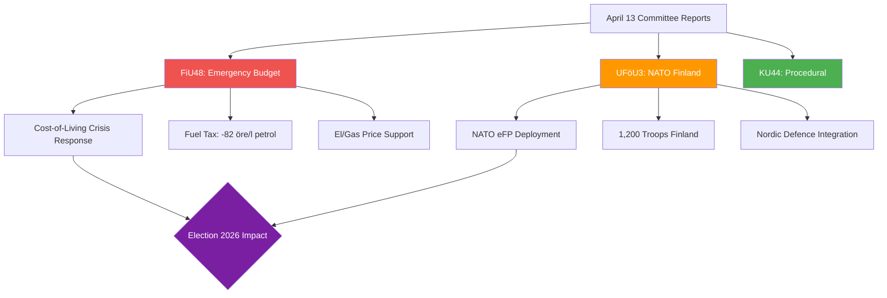

# Analysis Synthesis Summary — 2026-04-14

**Generated**: 2026-04-14 04:40 UTC (AI-enhanced)
**Data Sources**: get_betankanden, get_dokument_innehall, World Bank economic data
**Documents Analyzed**: 3
**Confidence**: HIGH
**Riksmöte**: 2025/26
**Produced By**: AI-enhanced analysis (pre-article-analysis pipeline + deep AI analysis)

## Summary

Three committee reports filed on April 13: an **emergency supplementary budget** cutting fuel taxes to EU minimum levels with electricity/gas price support (FiU48, decision April 22), Sweden's **NATO forward presence deployment** of up to 1,200 troops in Finland (UFöU3, decision June 4), and a **procedural postponement** at the Constitutional Committee (KU44). The emergency budget dominates in urgency and public impact, reflecting the government's crisis response to Middle East-driven fuel prices and severe winter heating costs just 5 months before the September 2026 election.

## Key Findings

1. **FiU48** (8/10 significance): Emergency budget reduces petrol tax by 82 öre/l and diesel by 319 kr/m³ to EU minimum levels. New el/gas price support for Jan-Feb 2026. Decision fast-tracked for **April 22**. [HIGH]
2. **UFöU3** (7/10 significance): 1,200 troops authorized for NATO eFP in Finland through Dec 2026. Builds on established framework (Prop. 2025/26:6, 2025/26:25). Total Swedish NATO force commitment reaches ~4,200. [HIGH]
3. **KU44** (2/10 significance): Procedural postponement — routine parliamentary scheduling. [HIGH]
4. **Election 2026 lens**: FiU48 is the most electorally potent — direct consumer relief ahead of September vote. NATO commitment unlikely to be campaign divider due to cross-party consensus. [HIGH]
5. **Economic context**: Sweden's GDP growth recovered to 0.82% (2024) after -0.2% contraction (2023). Inflation dropped to 2.8% (2024) from 8.5% (2023). Emergency budget addresses residual cost-of-living pressure. [HIGH]

## Top Documents by Significance

| Score | Type | dok_id | Title | Committee | Decision Date |
|-------|------|--------|-------|-----------|---------------|
| 8/10 | bet | HD01FiU48 | Extra ändringsbudget för 2026 – Sänkt skatt på drivmedel samt el- och gasprisstöd | FiU | April 22 |
| 7/10 | bet | HD01UFöU3 | Svenskt bidrag till Natos framskjutna närvaro i Finland | UFöU | June 4 |
| 2/10 | bet | HD01KU44 | Uppskov med behandlingen av vissa ärenden | KU | June 9+ |

## Cross-Document Themes

## AI-Recommended Article Metadata

- **Recommended Title (EN)**: "Parliament Fast-Tracks Emergency Fuel Tax Cuts as Sweden Deepens NATO Commitment in Finland"
- **Recommended Title (SV)**: "Riksdagen snabbbehandlar sänkta drivmedelsskatter medan Sverige fördjupar NATO-engagemanget i Finland"
- **Meta Description (EN)**: "Finance Committee fast-tracks emergency budget cutting fuel taxes to EU minimums. Defence committee processes 1,200-troop NATO deployment to Finland. Analysis of April 13 committee reports."
- **Meta Description (SV)**: "Finansutskottet snabbbehandlar krisbudget med sänkta drivmedelsskatter till EU:s miniminivåer. Försvarsutskottet hanterar 1 200 soldater till NATO i Finland."
- **Key Highlights**: Emergency fuel tax cuts (FiU48), NATO Finland deployment (UFöU3), 8-day fast-track decision
- **Article Decision**: PUBLISH — High-significance emergency budget with direct consumer impact
- **Article Priority**: HIGH

## Election 2026 Implications

- **Electoral Impact**: 🟩 HIGH — FiU48 provides tangible consumer relief 5 months before September election [HIGH]
- **Coalition Scenarios**: Emergency budget strengthens government position if fuel prices stabilize; NATO commitment is bipartisan [HIGH]
- **Voter Salience**: 🟦 VERY HIGH for energy costs; 🟧 MEDIUM for NATO [HIGH]
- **Campaign Vulnerability**: Opposition can frame FiU48 as "election-year bribe" vs. structural reform [MEDIUM]
- **Policy Legacy**: FiU48 sets precedent for emergency fiscal intervention; UFöU3 normalizes NATO force deployment [HIGH]

## Risk Assessment Summary

| Risk | L×I Score | Level |
|------|-----------|-------|
| Middle East escalation exceeds FiU48 relief | 3×4=12 | 🟠 HIGH |
| Climate credibility damage from fossil fuel tax cuts | 4×3=12 | 🟠 HIGH |
| Fiscal sustainability of emergency measures | 2×4=8 | 🟡 MEDIUM |
| Russian escalation to Nordic NATO presence | 2×5=10 | 🟡 MEDIUM |
| Personnel capacity shortfall for NATO deployment | 3×3=9 | 🟡 MEDIUM |

## Data Quality Notes

Overall confidence: **HIGH**. Analysis based on full proposition text (Prop. 2025/26:220, 2025/26:236), MCP betänkande data, World Bank economic indicators, and CIA coalition metrics.
**Data Freshness**: Documents from **2026-04-13** (1 day fresh).
