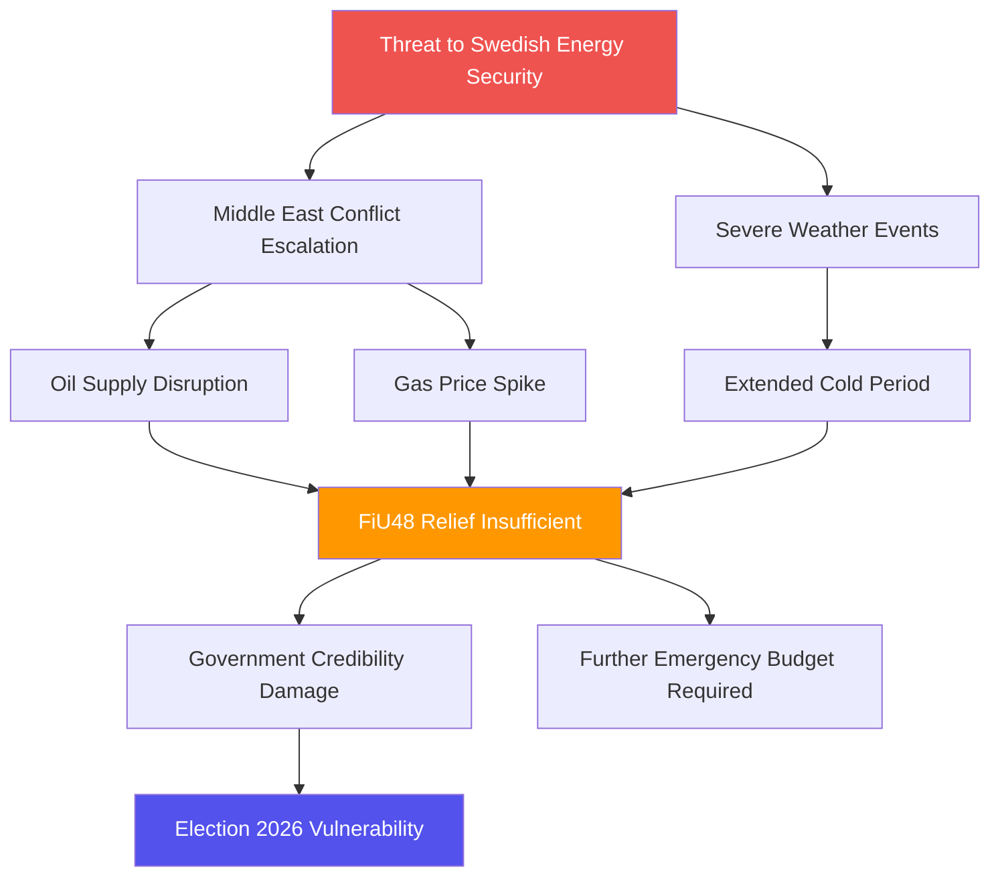

# Political Threat Analysis — 2026-04-14

**Generated**: 2026-04-14 04:40 UTC (AI-enhanced)
**Data Sources**: get_betankanden, get_dokument_innehall, political-threat-framework.md
**Documents Analyzed**: 3
**Confidence**: HIGH
**Produced By**: AI-enhanced analysis following political-threat-framework.md

## Summary

Threat analysis identifies two primary threat vectors: (1) geopolitical energy supply disruption threatening the effectiveness of FiU48 emergency measures, and (2) climate policy regression threatening Sweden's international environmental commitments. The NATO deployment (UFöU3) carries standard escalation threat inherent to forward military positioning.

## Threat Taxonomy Classification

| # | Threat Category | Source Document | Severity | Confidence |
|---|----------------|-----------------|----------|------------|
| TH1 | Economic Sovereignty — Energy dependence | FiU48/Prop. 236 | 🟠 Moderate | HIGH |
| TH2 | Democratic Legitimacy — Emergency bypass | FiU48 fast-track (9 days) | 🟢 Low | HIGH |
| TH3 | Security — Military escalation | UFöU3/Prop. 220 | 🟡 Moderate | MEDIUM |
| TH4 | Environmental — Climate policy regression | FiU48 vs. MJU30 | 🟠 Moderate | HIGH |
| TH5 | Institutional — KU workload pressure | KU44 postponement | 🟢 Low | HIGH |

## Attack Tree Analysis

## Detailed Threat Assessment

### TH1: Energy Supply Chain Vulnerability
- **Trigger**: Continued Middle East conflict, extended severe weather
- **Impact**: Emergency budget relief eroded; household costs remain elevated
- **Indicator**: Brent crude >$100/barrel sustained; Swedish energy agency warnings
- **Mitigation**: Additional emergency measures prepared; strategic reserves activated

### TH2: Democratic Process Fast-Track Risk
- **Trigger**: 9-day legislative turnaround (FiU48)
- **Impact**: Reduced scrutiny time; opposition input limited
- **Indicator**: Opposition formal protests about shortened motionstid
- **Mitigation**: Emergency budget precedent well-established; transparent public process

### TH3: NATO Forward Presence Escalation
- **Trigger**: Russian military response to Nordic eFP expansion
- **Impact**: Security escalation; potential Article 5 scenario
- **Indicator**: Russian military exercises near Finnish border; diplomatic protests
- **Mitigation**: NATO collective deterrence framework; gradual force buildup

### TH4: Climate Policy Credibility Erosion
- **Trigger**: Fossil fuel tax cuts contradict EU-aligned climate goals (MJU30)
- **Impact**: International credibility damage; domestic environmental opposition
- **Indicator**: EU Commission inquiry; environmental NGO campaigns
- **Mitigation**: Time-bound measures with explicit sunset; parallel green investment

## Data Quality Notes

Threat analysis confidence: **HIGH**. Based on proposition text, geopolitical context, and political-threat-framework.md methodology.
