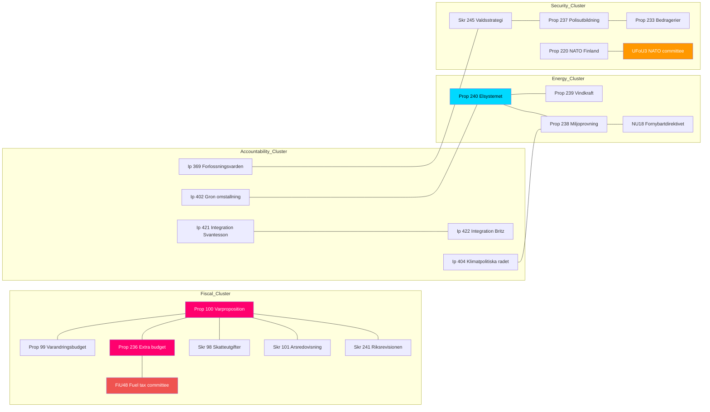

# Cross-Reference Map — 2026-04-14 (Evening Update)

**Generated**: 2026-04-14 18:37 UTC (AI-enriched, iteration 2)
**Total Documents Cross-Referenced**: 100

## Document Relationship Network

## Key Cross-References

| Source Document | Related Documents | Relationship |
|----------------|-------------------|-------------|
| Prop 100 (Varproposition) | Prop 99, Prop 236, Skr 98, Skr 101, Skr 241, FiU48 | Fiscal package cluster — central anchor |
| Prop 240 (Elsystemet) | Prop 239, Prop 238, NU18, Ip 404 | Energy transition cluster |
| Prop 237 (Polisutbildning) | Prop 233, Skr 245 | Security/justice cluster |
| Ip 421-422 (Integration) | Prop 100 (economic context) | Opposition accountability vs fiscal narrative |
| UFoU3 (NATO) | Prop 220, FoU8, FoU12, FoU22 | Defense/security pipeline |
| Ip 369 (Healthcare) | Skr 245 | KD ministerial vulnerability cross-link |

## Temporal Map

| Date | Key Events |
|------|-----------|
| Apr 13 | Props 100, 99, 236, 241 published; FiU48, UFoU3, KU44 committee reports |
| Apr 14 AM | Props 237-240, 243, 234, Skr 245 published; 6 new committee reports |
| Apr 14 PM | 4 interpellation debates: Ip 369, 421, 422, 404, 402; Ip 431 filed |
| Apr 22 | FiU48 Riksdag decision (fuel tax emergency) |
| Jun 4 | UFoU3 Riksdag decision (NATO deployment) |
