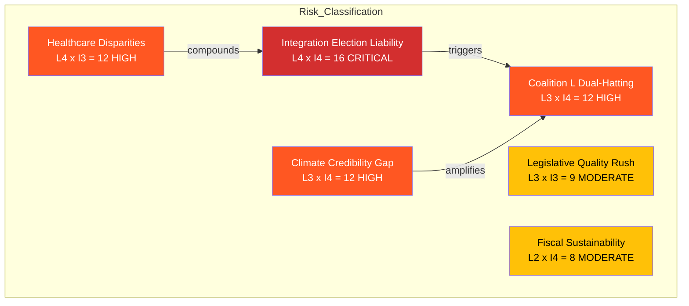

# Risk Assessment — 2026-04-14 (Evening Update)

**Generated**: 2026-04-14 18:36 UTC (AI-enriched, iteration 2)
**Risk Framework**: Political risk matrix (Likelihood x Impact)
**Assessment Period**: April 14, 2026 + forward 30 days

## Risk Heat Map

## Detailed Risk Analysis

### R1: Integration Failure as Election Liability (CRITICAL — Score 16)
- **Evidence**: Redar (S) cited 500K unemployed foreign-born in Ip 421 and 422. Britz (L) response under dual-ministry pressure.
- **Trigger**: S campaign launch using interpellation data as foundation
- **Timeline**: April-May 2026
- **Mitigation**: Government has no new integration policy in today package
- **Election Impact**: Potentially decisive in metropolitan constituencies

### R2: Coalition Strain from L Dual-Hatting (HIGH — Score 12)
- **Evidence**: Britz answered 4 interpellations in single afternoon as both Arbetsmarknadsminister and vik. klimat/miljominister
- **Trigger**: Ministerial burnout, policy inconsistency, or reshuffle demand
- **Timeline**: Weeks ahead
- **Mitigation**: Ministerial reassignment possible but politically costly

### R3: Healthcare Quality Regional Disparities (HIGH — Score 12)
- **Evidence**: Ip 369 on maternity care Skane; structural issue across regions
- **Trigger**: Regional healthcare data release or patient safety incident
- **Timeline**: May 2026
- **Mitigation**: Skr 245 violence strategy addresses one dimension only

### R4: Climate Target Credibility Gap (HIGH — Score 12)
- **Evidence**: Luhr (MP) challenged Britz on Klimatpolitiska radet findings (Ip 404)
- **Trigger**: Government response to Climate Policy Council recommendations
- **Timeline**: Spring session 2026
- **Mitigation**: Energy triptych (Props 238-240) partially addresses but targets remain contested

### R5: Pre-Election Legislative Quality (MODERATE — Score 9)
- **Evidence**: 8 propositions in one day — normal is 1-2 per week
- **Trigger**: Constitutional review critique or implementation problems
- **Timeline**: Post-enactment
- **Mitigation**: Committee scrutiny process provides quality check

### R6: Emergency Fiscal Sustainability (MODERATE — Score 8)
- **Evidence**: FiU48 fuel tax cuts to EU minimums; Prop 236 extra budget
- **Trigger**: Post-election budget constraints if measures extended
- **Timeline**: Post-September 2026
- **Mitigation**: EU minimum floor provides anchor; measures explicitly temporary
