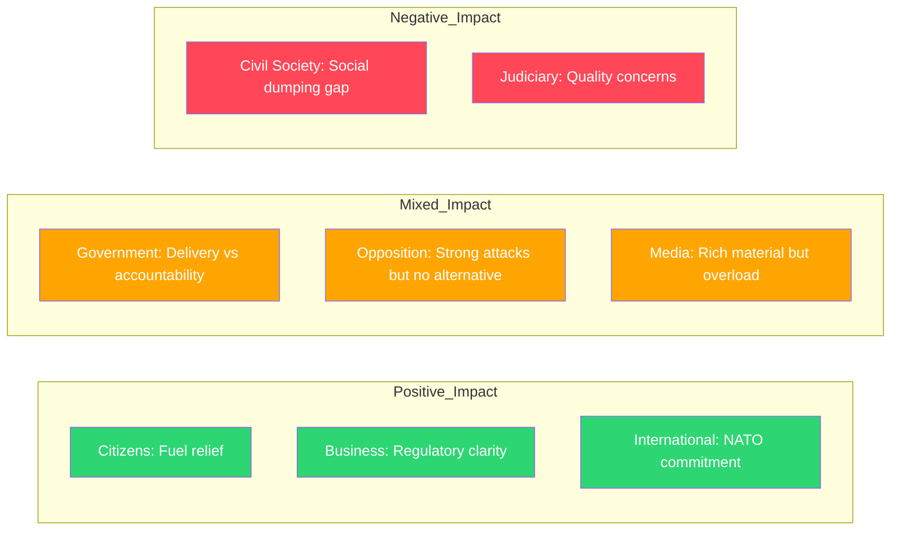

# Stakeholder Perspectives — 2026-04-14 (Evening Update)

**Generated**: 2026-04-14 18:36 UTC (AI-enriched, iteration 2)
**Groups Analyzed**: 8/8 mandatory groups
**Evidence**: 100 cross-referenced documents, 4 live interpellation debates

## Stakeholder Impact Assessment

## Detailed Perspectives

### 1. Citizens
**Net Assessment**: POSITIVE with caveats
- Direct benefits: Fuel tax cuts (-82 ore/l), anti-fraud protections, violence strategy, digital ID
- Concerns: 500K unemployed foreign-born indicates integration policy failure; regional healthcare gaps in Skane
- Key quote context: Redar pressed Britz on one-third of foreign-born without employment (Ip 422)

### 2. Government Coalition (M+KD+L with SD support)
**Net Assessment**: MIXED — delivery offset by accountability exposure
- Achievements: Record 8-proposition day, coherent energy triptych, fiscal package
- Vulnerabilities: Britz 4-Ip exposure reveals L capacity limits; healthcare critique hits KD minister
- Strategic concern: SD silent on energy/climate package — potential friction point

### 3. Opposition Bloc (S+V+MP+C)
**Net Assessment**: MIXED — strong attacks but fragmented
- S dominance: 10 interpellations, twin integration push by Redar — data-backed
- MP climate role: Luhr effective on Klimatpolitiska radet challenge (Ip 404)
- V disability: Awad raises functional rights (Ip 416)
- C center: Lasses LGBTQI interpellation (Ip 431) carves distinct profile

### 4. Business/Industry
**Net Assessment**: POSITIVE — regulatory clarity dominates
- Winners: Maritime (tonnage tax Prop 243), ports (Prop 234), energy sector (Prop 240)
- Concerns: Environmental permitting restructuring (Prop 238) transition uncertainty
- Key issue: Guteland (S) Ip 402 on green transition business confidence flags investor uncertainty

### 5. Civil Society
**Net Assessment**: MIXED to NEGATIVE
- Positive: Violence strategy Skr 245, disability advocacy visibility
- Negative: Social dumping investigation cancelled (Ip 423 reveals); LGBTQI international advocacy questioned
- Healthcare: Maternity care crisis directly impacts women and families

### 6. International/EU
**Net Assessment**: POSITIVE — alliance and compliance signals
- NATO: 1,200 troops Finland (UFoU3) demonstrates operational commitment
- EU: Electricity directive compliance (Prop 240), renewable energy permitting (NU18)
- Tensions: Israel death penalty interpellation (Ip 426), LGBTQI advocacy debate (Ip 431)

### 7. Judiciary/Constitutional
**Net Assessment**: CAUTIOUS
- Positive: Anti-fraud modernization (Prop 233), environmental permitting streamlining (Prop 238)
- Concerns: 8-proposition rush raises quality questions; migration inhibition (SfU22) due process
- Structural: KU44 parliamentary postponement suggests scheduling pressure

### 8. Media/Public Opinion
**Net Assessment**: MIXED — rich material but voter fatigue risk
- Content: 4 interpellation debates provide clear narrative material
- Challenge: 8 propositions + emergency budget + NATO = information overload
- Risk: Pre-election legislative spectacle may be perceived as posturing
