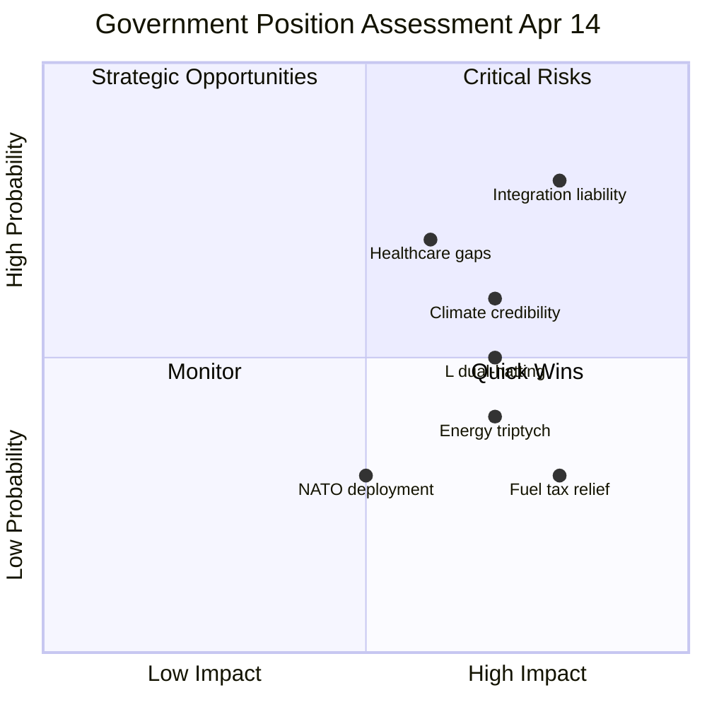

# SWOT Analysis — 2026-04-14 (Evening Update)

**Generated**: 2026-04-14 18:36 UTC (AI-enriched, iteration 2)
**Analysis Depth**: deep | **Stakeholder Groups**: 8/8
**Evidence Base**: 100 documents cross-referenced, 4 interpellation debates

## Political Landscape SWOT

## Strengths
1. **Legislative Productivity Record**: 8 propositions + 1 skrivelse in single day demonstrates governing capacity [HIGH] — dok_ids: HD03237-HD03245
2. **Fiscal Credibility**: Spring budget package (Props 99, 100, 236) with emergency fuel relief shows crisis response capability [HIGH]
3. **Energy Policy Coherence**: Triptych (Props 238-240) addresses EU compliance, local acceptance, and regulatory efficiency simultaneously [HIGH]
4. **NATO Commitment**: UFoU3 1,200 troops Finland strengthens alliance credibility [HIGH]
5. **Anti-Crime Package**: Paid police education (Prop 237) + anti-fraud (Prop 233) addresses voter concern [MEDIUM]

## Weaknesses
1. **Ministerial Capacity Strain**: Britz (L) answered 4 interpellations — dual-hatting Arbetsmarknads + Klimat creates single point of failure [HIGH]
2. **Integration Policy Gap**: 500K unemployed foreign-born (Ip 422 evidence) — no new policy response in today package [HIGH]
3. **Healthcare Vulnerability**: Regional maternity care crisis in Skane (Ip 369) reflects structural shortcoming [MEDIUM]
4. **Legislative Rush Risk**: 8 proposals in one day raises constitutional quality concerns [MEDIUM]
5. **Temporary Measures**: Emergency fuel tax (FiU48) expires — sustainability uncertain [MEDIUM]

## Opportunities
1. **Campaign Delivery Narrative**: Today 8-proposition record creates strong we govern message for Election 2026 [HIGH]
2. **Green Transition Leadership**: Energy triptych positions Sweden as EU energy policy leader [MEDIUM]
3. **Cross-Party Security**: NATO deployment likely gains S support — bipartisan security credential [HIGH]
4. **Digital Modernization**: E-legitimation TU21 + anti-fraud Prop 233 = digital governance upgrade [MEDIUM]

## Threats
1. **Integration as Election Weapon**: S data-backed narrative (500K unemployed, twin interpellations) is most dangerous opposition asset [HIGH]
2. **Climate Credibility Gap**: MP pressure via Klimatpolitiska radet creates environmental flank [HIGH]
3. **Coalition Fatigue**: SD patience on energy/climate may thin if green framing dominates [MEDIUM]
4. **Pre-Election Cynicism**: Voter perception of legislative package as electoral posturing [MEDIUM]
5. **Healthcare Localization**: Regional disparities create constituency-level vulnerabilities [MEDIUM]
