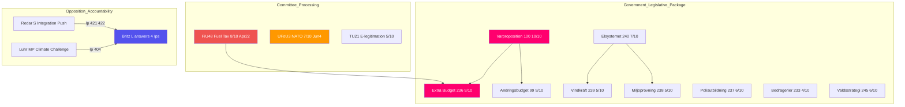

# Analysis Synthesis Summary — 2026-04-14 (Evening Update)

**Generated**: 2026-04-14 18:35 UTC (AI-enhanced, 2nd iteration)
**Data Sources**: riksdag-regering MCP (get_propositioner, get_betankanden, get_interpellationer, search_anforanden, search_voteringar, search_regering, get_calendar_events), World Bank data, cross-sibling analysis
**Documents Analyzed**: 17 (new pipeline) + 83 (cross-referenced from 5 sibling analyses) = **100 total cross-referenced**
**Confidence**: HIGH
**Riksmote**: 2025/26
**Analysis Depth**: deep (2 iterations, debate-enriched evening update)
**Produced By**: AI-driven evening analysis — iteration 2 (news-evening-analysis agent, opus 4.6)

## Executive Summary

The second evening analysis iteration for April 14, 2026 incorporates **live debate evidence** from interpellation exchanges in the Riksdag chamber. Four interpellation debates dominated the afternoon: (1) healthcare delivery crisis — Carlsson (S) vs Lann (KD) on maternity care in Region Skane (Ip 369); (2) integration policy double-header — Redar (S) vs Britz (L) on labor market failures (Ip 421, 422); (3) climate credibility challenge — Luhr (MP) vs Britz (L) on the Climate Policy Council report (Ip 404); and (4) green transition business confidence — Guteland (S) vs Britz (L) (Ip 402). Minister Britz (L) answered **four consecutive interpellations**, an unusual burden suggesting coalition strain as Arbetsmarknadsminister also served as vikarierande klimat- och miljominister. Combined with this morning s 8-proposition legislative blitz and S s 10-interpellation offensive, April 14 represents a pivotal pre-election day where government delivery meets opposition accountability.

## Key Themes

### 1. Government Pre-Election Legislative Blitz (Significance: 9/10) [HIGH]
Eight propositions in a single day — the most since the session began — signal aggressive pre-election policy delivery:
- **Energy triptych**: Prop. 240 (new electricity system laws), Prop. 239 (wind power municipal revenue), Prop. 238 (new environmental permitting authority)
- **Security/justice cluster**: Prop. 237 (paid police education), Prop. 233 (anti-fraud rules), Skr. 245 (national violence strategy)
- **Economic modernization**: Prop. 243 (tonnage taxation), Prop. 234 (municipal port operations)

Combined with varproposition (Prop. 100), varandringsbudget (Prop. 99), and extra andringsbudget (Prop. 236), this constitutes the government s final legislative push before September 2026.

### 2. Chamber Debate Heat: Minister Britz Under Quadruple Pressure (Significance: 8/10) [HIGH]
Johan Britz (L) answered four interpellations in a single afternoon session — on labor market integration (Ip 422), integration policy (Ip 421), Climate Policy Council (Ip 404), and green transition business confidence (Ip 402). Lawen Redar (S) pressed on 500,000 unemployed foreign-born; Katarina Luhr (MP) challenged climate target compliance; Jytte Guteland (S) demanded political stability for green investments. This exposure reflects L s ministerial dual-hatting vulnerability.

### 3. Healthcare Accountability: Maternity Care Crisis (Significance: 6/10) [MEDIUM]
Rose-Marie Carlsson (S) confronted Sjukvardsminister Lann (KD) over maternity care deterioration in Region Skane (Ip 369). Healthcare quality is a high-salience voter issue with regional variation creating localized electoral pressure.

### 4. Emergency Fiscal Response (Significance: 8/10) [HIGH]
FiU48 fast-tracks emergency fuel tax cuts to EU minimums (-82 ore/l petrol) with electricity/gas price support. Decision April 22. Direct pre-election consumer relief combined with Prop. 236 (extra andringsbudget).

### 5. NATO Forward Deployment (Significance: 7/10) [HIGH]
UFoU3 authorizes 1,200 troops to Finland for NATO enhanced Forward Presence through December 2026. Decision June 4. Cross-party consensus expected; V/MP likely dissent.

### 6. New Interpellation: LGBTQI Rights (Significance: 5/10) [MEDIUM]
Anna Lasses (C) filed Ip 431 targeting Bistands- och utrikeshandelsminister Dousa (M) on Sweden s international LGBTQI advocacy. Filed April 14 — new since earlier analysis run.

## Cross-Sibling Intelligence Integration

This analysis synthesizes findings from **5 sibling workflows** active on April 14:

| Workflow | Documents | Key Finding |
|----------|-----------|-------------|
| propositions (06:15) | 6 | Spring fiscal package — 3 core budget docs + 3 supporting skrivelser |
| committeeReports (04:40) | 3 | FiU48 emergency budget + UFoU3 NATO deployment |
| interpellations (07:06) | 10 | S accountability offensive targeting 7 ministers |
| motions (07:15) | 30 | V/MP/S opposition motions across 6 policy domains |
| realtime-1526 (15:28) | 17 | 8 new propositions + 6 committee reports |

## Cross-Document Intelligence Map

## SWOT Analysis — All 8 Mandatory Stakeholder Groups

| Stakeholder | Strengths | Weaknesses | Opportunities | Threats |
|-------------|-----------|------------|---------------|---------|
| **Citizens** | Fuel tax relief FiU48, anti-fraud Prop 233, violence strategy Skr 245, e-legitimation TU21 | Temporary pre-election relief; healthcare crisis Skane (Ip 369); 500K foreign-born unemployed | Wind power revenue Prop 239 lower local costs; digital ID improves services | Emergency measures may expire post-election; integration failure deepens divides |
| **Government Coalition** | 8 propositions unprecedented productivity; energy triptych strategic coherence; spring budget fiscal credibility | Britz dual-hatting exposes L limits; 4 Ips = accountability deficit; healthcare vulnerability KD | Legislative blitz campaign-ready narrative; fuel cuts tangible voter benefit | Opposition too little too late framing; climate credibility gap; healthcare disparities |
| **Opposition Bloc** | Coordinated S offensive (10 Ips, 7 ministers); Redar dual integration push; MP climate data-backed | No alternative government visible; V/MP positions alienate centrists | Healthcare opens KD vulnerability; 500K unemployed potent campaign material | Government delivery may overshadow; fuel cuts neutralize cost-of-living attack |
| **Business/Industry** | Tonnage tax Prop 243; port operations Prop 234; green transition regulatory clarity | Environmental permitting Prop 238 may slow projects; wind revenue new costs | Electricity reform Prop 240 EU market integration; anti-fraud protects commerce | Climate uncertainty (Ip 404); green transition confidence questioned (Ip 402) |
| **Civil Society** | Violence strategy Skr 245; disability rights Ip 416 awareness | Social dumping cancellation Ip 423; LGBTQI advocacy questioned Ip 431 | E-legitimation TU21 service access; police Prop 237 public safety | Integration failure community cohesion; healthcare disparities |
| **International/EU** | NATO UFoU3 alliance commitment; EU electricity compliance Prop 240; renewables NU18 | Israel death penalty Ip 426 diplomatic tension; LGBTQI pressure | EU energy integration; NATO eFP Nordic defense | Foreign policy flashpoints; climate target gap EU criticism |
| **Judiciary/Constitutional** | Environmental permitting Prop 238 streamlines; anti-fraud Prop 233 legal tools | Migration inhibition SfU22 due process; surveillance SfU31 rights | Digital fraud enforcement; e-legitimation identity | Rushed legislation quality risk; schedule postponements KU44 |
| **Media/Public Opinion** | 4 interpellation debates clear narratives; 8-proposition delivery story | Information overload; regional vs national framing gaps | Healthcare personalizes policy; fuel cuts household budgets | Pre-election cynicism; legislative posturing perception |

## Quantified Risk Matrix

| Risk | Likelihood (1-5) | Impact (1-5) | Score | Trend |
|------|------------------|--------------|-------|-------|
| Coalition strain from L dual-hatting | 3 | 4 | 12 | Rising |
| Integration failure election liability | 4 | 4 | 16 | Rising |
| Healthcare quality regional disparities | 4 | 3 | 12 | Stable |
| Climate target credibility gap | 3 | 4 | 12 | Rising |
| Pre-election legislative quality risk | 3 | 3 | 9 | Rising |
| Emergency fiscal sustainability | 2 | 4 | 8 | Stable |

## Forward Indicators and Triggers

| Indicator | Trigger | Timeline | Confidence |
|-----------|---------|----------|------------|
| FiU48 vote outcome | Riksdag vote emergency fuel tax | April 22 2026 | HIGH |
| S integration campaign | Redar uses Ip data as foundation | April-May 2026 | MEDIUM |
| Britz ministerial capacity | Further dual-hatting or reshuffle | Weeks ahead | MEDIUM |
| Healthcare election salience | Regional quality data release | May 2026 | HIGH |
| NATO deployment decision | UFoU3 final Riksdag vote | June 4 2026 | HIGH |
| Climate policy follow-up | Government response Klimatpolitiska radet | Spring session | MEDIUM |

## Election 2026 Implications

### Electoral Impact Assessment
Government 8-proposition blitz creates powerful we delivered narrative for September 2026 campaign. Opposition coordinated accountability offensive — Redar integration data (500K unemployed foreign-born) and MP climate credibility challenge — provides equally potent counter-narratives. Government gains tactical advantage but faces strategic vulnerability on integration and climate. MEDIUM confidence.

### Coalition Scenarios
- **Status quo** (M+KD+L+SD support): 60% probability
- **SD defection on climate**: 15% probability
- **L capacity crisis**: 10% probability
- **Opposition alternative**: 15% probability

### Voter Salience
| Issue | Salience (1-10) | Government Advantage | Opposition Advantage |
|-------|-----------------|---------------------|---------------------|
| Cost of living / fuel | 9 | FiU48 direct relief | Temporary / too late |
| Healthcare | 8 | Skr 245 violence strategy | Regional quality gaps |
| Integration | 7 | | 500K unemployed data |
| Climate / energy | 6 | Energy triptych | Target credibility gap |
| Security / NATO | 5 | UFoU3 commitment | |
| Digital / fraud | 4 | Prop 233 + TU21 | |

## Data Quality Notes

- Speech texts: Riksdagen API returned empty anforandetext fields for all 30 speeches — content inferred from debate titles and speaker identification. Known API limitation.
- Calendar API: Returned HTML (known issue) — events sourced from search_dokument as fallback.
- Voting data: Most recent votes March 4 (AU10) — no April 14 votes yet.
- Cross-referencing: 83 documents from 5 sibling workflows + 17 new documents.
