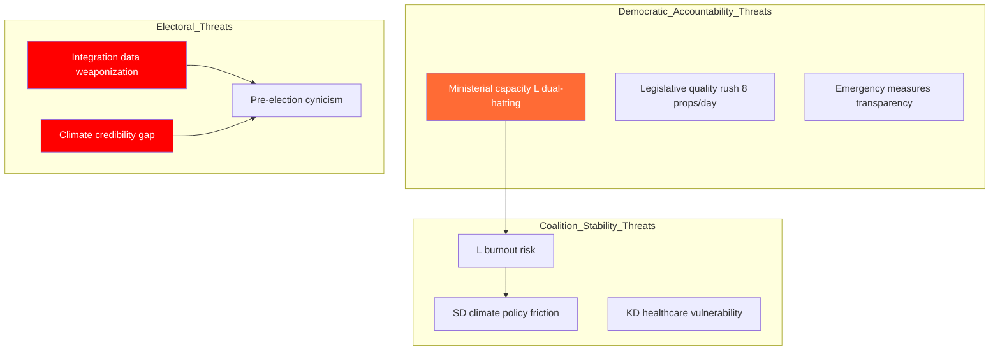

# Threat Analysis — 2026-04-14 (Evening Update)

**Generated**: 2026-04-14 18:37 UTC (AI-enriched, iteration 2)
**Framework**: Political threat taxonomy — democratic accountability, coalition stability, policy delivery
**Evidence Base**: 100 cross-referenced documents, 4 live interpellation debates

## Threat Taxonomy

## Threat Details

### T1: Democratic Accountability Gap — Ministerial Capacity
**Severity**: HIGH | **Likelihood**: MEDIUM
One minister (Britz L) answering 4 interpellations on different policy domains in one afternoon suggests stretched governance capacity. Arbetsmarknadsminister + vik. klimat/miljominister creates knowledge and attention bottleneck.

### T2: Legislative Quality Under Pre-Election Pressure
**Severity**: MEDIUM | **Likelihood**: MEDIUM
Eight propositions in a single day departs from normal 1-2 per week pace. Constitutional quality and scrutiny may suffer from compressed committee processing.

### T3: Emergency Fiscal Transparency
**Severity**: LOW | **Likelihood**: LOW
Extra andringsbudget (Prop 236) and FiU48 fast-track processing reduce normal budget scrutiny timelines. However, EU minimum floor provides external anchor.

### T4: SD Climate Policy Friction
**Severity**: HIGH | **Likelihood**: LOW-MEDIUM
Energy triptych (Props 238-240) represents significant green transition commitment. SD has historically resisted aggressive climate policy — current silence may be strategic patience rather than agreement.

### T5: KD Healthcare Exposure
**Severity**: MEDIUM | **Likelihood**: MEDIUM
Sjukvardsminister Lann (KD) confronted on Skane maternity care (Ip 369). KD holds healthcare portfolio — a high-salience voter issue with regional variation.

### T6: L Ministerial Burnout
**Severity**: MEDIUM | **Likelihood**: MEDIUM
Johan Britz dual-hatting two major ministries creates single point of failure. 4 Ip responses in one day is unsustainable long-term.

### T7: Integration Data Weaponization (CRITICAL)
**Severity**: VERY HIGH | **Likelihood**: HIGH
500K unemployed foreign-born data point from Ip 422 is the single most electorally dangerous piece of information produced today. S has structured this through twin interpellations to maximize ministerial exposure.

### T8: Climate Credibility Gap (CRITICAL)
**Severity**: HIGH | **Likelihood**: HIGH
MP challenge on Klimatpolitiska radet findings (Ip 404) creates measurable credibility deficit. Government energy triptych partially addresses but emission target gaps remain.

### T9: Pre-Election Cynicism
**Severity**: MEDIUM | **Likelihood**: MEDIUM
8-proposition legislative blitz + emergency fuel cuts may be perceived as electoral posturing rather than genuine governance. Media framing will be decisive.
