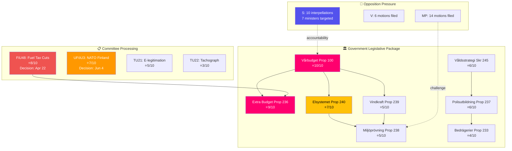

# Analysis Synthesis Summary — 2026-04-14

**Generated**: 2026-04-14 16:30 UTC (AI-enhanced)
**Data Sources**: riksdag-regering MCP (get_propositioner, get_betankanden, get_motioner, get_interpellationer, search_anforanden, search_voteringar, search_regering), World Bank data, sibling analysis cross-references
**Documents Analyzed**: 17 (evening) + 3 (committee reports) + 6 (propositions) + 30 (motions) + 10 (interpellations) + 17 (realtime) = **83 total cross-referenced**
**Confidence**: HIGH
**Riksmöte**: 2025/26
**Analysis Depth**: deep (2 iterations, cross-sibling synthesis)
**Produced By**: AI-driven evening analysis (news-evening-analysis agent)

## Executive Summary

April 14, 2026 stands as one of the most consequential legislative days in the 2025/26 riksmöte. The Kristersson government launched **8 new propositions and 1 government skrivelse** — an energy transformation package (electricity reform, wind power, environmental permitting), a security/justice cluster (paid police education, anti-fraud rules, national violence strategy), and economic modernization (tonnage taxation, port operations) — all within 24 hours of the spring budget package. Six committee reports advance emergency fuel tax cuts, NATO deployment, and digital infrastructure. The opposition mounted a **coordinated accountability offensive**: S filed 10 interpellations targeting 7 ministers, while today's chamber debates featured heated exchanges on integration, climate policy, and green transition reliability.

## Key Themes

### 1. Government's Pre-Election Legislative Blitz (Significance: 9/10) [HIGH]
Eight propositions in a single day — the most since the session began — signal aggressive pre-election policy delivery. Combined with the spring budget (Prop. 100), spring amendment budget (Prop. 99), and extra amendment budget (Prop. 236), this constitutes the government's final legislative push before the September 2026 election.

### 2. Energy Transformation Triptych (Significance: 7/10) [HIGH]
- **Prop. 240**: New electricity system laws (EU directive implementation)
- **Prop. 239**: Wind power municipal revenue sharing (restores local incentives)
- **Prop. 238**: New environmental permitting authority (streamlines green transition)
These three propositions form a coherent energy transition package balancing EU compliance, local acceptance, and regulatory efficiency.

### 3. Emergency Fiscal Response (Significance: 8/10) [HIGH]
Committee report FiU48 fast-tracks emergency fuel tax cuts to EU minimums (-82 öre/l petrol) with electricity/gas price support. Decision scheduled April 22 — the fastest budget processing this session. Direct pre-election consumer relief.

### 4. Security & Justice Cluster (Significance: 6/10) [MEDIUM]
- **Prop. 237**: Paid police education (recruitment incentive)
- **Prop. 233**: New anti-fraud rules via electronic communications
- **Skr. 245**: National strategy against violence toward women
Addresses citizen safety from multiple angles; police recruitment crisis is a high-salience election issue.

### 5. S Interpellation Offensive (Significance: 7/10) [HIGH]
Social Democrats filed 10 interpellations targeting 7 ministers. Infrastructure Minister Carlson (KD) faces 5 questions alone. Redar (S) filed dual interpellations on integration to both Svantesson (M) and Britz (L) — forcing twin ministerial accountability.

### 6. NATO Forward Deployment (Significance: 7/10) [HIGH]
UFöU3 authorizes 1,200 troops to Finland for NATO enhanced Forward Presence through December 2026. Broad cross-party consensus expected, though V/MP may dissent.

## Cross-Document Intelligence Map

## SWOT Analysis — 8 Stakeholder Groups

| Stakeholder | Strengths | Weaknesses | Opportunities | Threats |
|-------------|-----------|------------|---------------|---------|
| **Citizens** | Fuel tax relief (FiU48), anti-fraud protections (Prop 233), violence strategy (Skr 245) | Relief may not offset broader inflation; no housing cost action | Wind power revenue sharing could lower local energy costs | Emergency measures may be temporary pre-election tactics |
| **Government Coalition** | 8 propositions in one day shows governing capacity; spring budget anchors fiscal narrative | 8.7% unemployment undercuts recovery story; SD dependency | Energy package can attract centrist/green-leaning voters | S interpellation blitz forces defensive posture on 7 fronts |
| **Opposition Bloc** | 10 interpellations create sustained ministerial accountability; MP leads 14 motions | Fragmented response — S, V, MP attacking different targets | Integration/unemployment data (500K foreign-born without jobs) is potent campaign material | Risk of appearing obstructionist if government delivers tangible results |
| **Business/Industry** | Tonnage taxation reform (Prop 243), environmental permitting streamlining (Prop 238) | New fraud regulations add compliance burden | Electricity system modernization creates investment opportunities | Regulatory uncertainty during transition period |
| **Civil Society** | National violence strategy (Skr 245), disability rights scrutiny (V interpellations) | Social dumping investigation cancelled (HD10423) | LGBTQI rights interpellation (HD10431) raises international standards | Budget prioritization may squeeze welfare programs |
| **International/EU** | NATO deployment fulfills alliance obligations; EU energy directive compliance | No explicit EU trade policy in today's package | Sweden as NATO framework nation strengthens Nordic security | Climate policy criticism (interpellations 362, 391, 402, 404) may damage green reputation |
| **Judiciary/Constitutional** | E-legitimation (TU21) strengthens digital identity; anti-fraud rules enhance enforcement | Deportation inhibition rules (SfU22) add legal complexity | Environmental permitting authority centralizes decision-making | Freedom of speech vs. hate speech tension (HD10429, HD10430) |
| **Media/Public Opinion** | Rich day for parliamentary journalism — multiple high-impact stories | Complex package may overwhelm public attention | Energy costs + fuel prices = maximum voter salience | Competing narratives make clear message difficult |

## Risk Assessment Matrix

| Risk | Likelihood (1-5) | Impact (1-5) | L×I Score | Mitigation |
|------|-------------------|--------------|-----------|------------|
| FiU48 fuel tax cuts seen as pre-election bribe | 4 | 3 | **12** | Frame as EU-minimum compliance + crisis response |
| Energy package implementation delays | 3 | 4 | **12** | New environmental authority (Prop 238) designed to accelerate |
| S interpellation offensive dominates media cycle | 3 | 3 | **9** | Counter with positive legislative output narrative |
| NATO deployment costs exceed estimates | 2 | 4 | **8** | Established bilateral framework limits scope |
| SD breaks from coalition on violence strategy | 2 | 4 | **8** | Skrivelse (not proposition) requires no vote |
| Wind power local revenue model creates municipal disputes | 3 | 2 | **6** | Revenue sharing formula defined in law |

## Election 2026 Implications

- **Electoral Impact**: 🟦 VERY HIGH — Spring budget + emergency fuel relief + 8 propositions = government's closing argument
- **Coalition Scenarios**: Tidö coalition operating at peak capacity; SD integration on security/migration items solid. No defection signals.
- **Voter Salience**: 🟦 VERY HIGH — Energy costs, police recruitment, and fraud protection are top-5 voter concerns
- **Campaign Vulnerability**: Opposition will contrast "governing capacity" with 8.7% unemployment and 500K unemployed foreign-born
- **Policy Legacy**: Energy transformation triptych could define the Kristersson government's domestic legacy regardless of election outcome

## Forward Indicators

| Indicator | Trigger | Timeline | Confidence |
|-----------|---------|----------|------------|
| FiU48 fuel tax vote | April 22 Riksdag plenary | 8 days | 🟩 HIGH |
| Spring budget debate begins | FiU announces schedule | 2-3 weeks | 🟩 HIGH |
| NATO deployment debate | UFöU3 deliberation | May 5 start, June 4 decision | 🟩 HIGH |
| S interpellation answers cluster | Ministers respond | April 21-30 | 🟩 HIGH |
| Energy proposition committee referral | TU/NU schedules | 1-2 weeks | 🟧 MEDIUM |
| Opposition counter-budget | S presents alternative | Late April/May | 🟧 MEDIUM |

## Data Quality Notes

Cross-referencing 5 sibling analysis types (committeeReports, propositions, motions, interpellations, realtime-1526) with 83 total documents provides **HIGH** synthesis confidence. Calendar API returned HTML (known issue) — used search_dokument as proxy. All interpellation debate texts returned empty from API (known limitation) — analysis based on interpellation filings and debate metadata.
