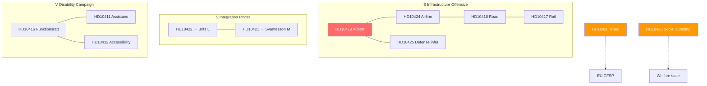

# Cross-Reference Map — Interpellations 2026-04-14

**Generated**: 2026-04-14 07:08 UTC

## Document Relationships

### Cluster 1: Infrastructure Accountability (5 documents)
- **HD10428** ↔ **HD10424** — Both target Carlson (KD) on aviation infrastructure
- **HD10428** ↔ **HD10425** — Defense infrastructure intersection (airport + military bases)
- **HD10424** ↔ **HD10418** ↔ **HD10417** — Regional transport cluster (air, road, rail)

### Cluster 2: Integration/Labor Market (2 documents)
- **HD10422** ↔ **HD10421** — Identical theme, different ministers (Britz L + Svantesson M). Redar (S) coordinated dual filing.

### Cluster 3: Disability Rights (V campaign)
- **HD10416** ↔ **HD10411** ↔ **HD10412** — Awad (V) systematic disability policy campaign

### Cluster 4: Foreign Policy
- **HD10426** — Standalone but links to EU foreign policy framework

### Cross-Party Pattern
- **HD10420** (withdrawn) → reveals same opposition accountability strategy from S

## Mermaid Cross-Reference Diagram

