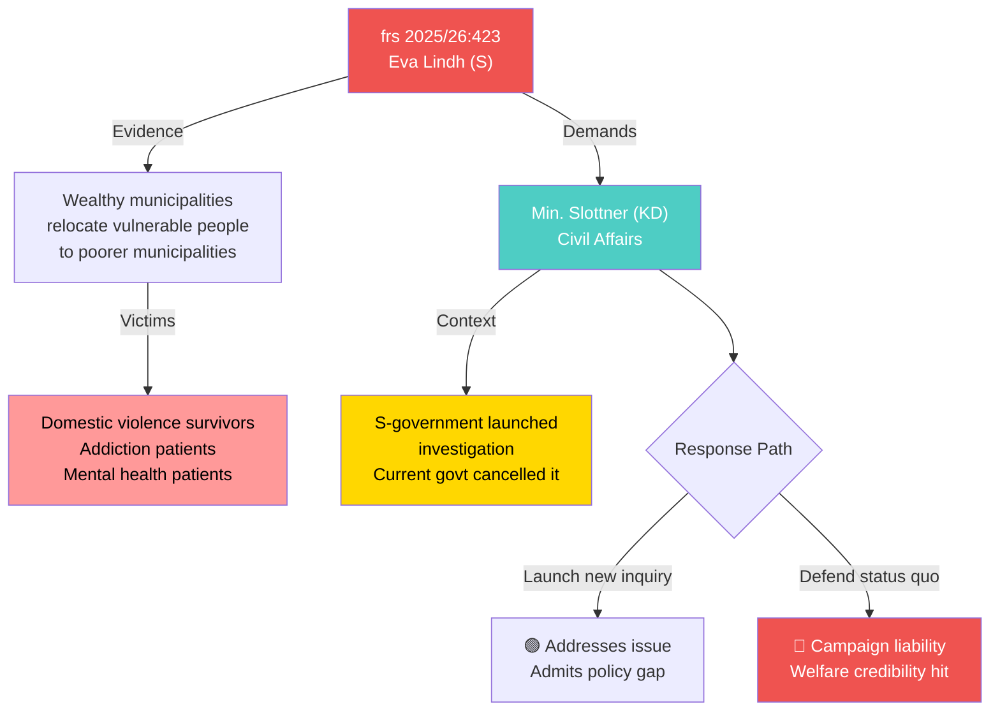

# Per-File Political Intelligence Analysis — HD10423

**dok_id**: HD10423 | **Date**: 2026-03-30 | **Riksmöte**: 2025/26
**Title**: Åtgärder mot social dumpning
**Filed by**: Eva Lindh (S) → Civil Affairs Minister Erik Slottner (KD)
**Status**: Inlämnad | **Response Deadline**: 2026-04-21 | **Expected Response**: 2026-05-05
**Significance**: 8/10 | **Confidence**: [HIGH]

## Classification
- **Domain**: Social Policy/Municipal Affairs | **Sensitivity**: HIGH
- **Urgency**: HIGH — vulnerable populations affected, pre-election welfare debate
- **Policy Areas**: Municipal welfare, housing policy, social services

## SWOT Analysis

### Strengths (Government Coalition)
| # | Statement | Evidence | Confidence | Impact |
|---|-----------|----------|------------|--------|
| 1 | Can reference existing municipal cooperation frameworks | Current legislation on inter-municipal cooperation | [MEDIUM] | Low |

### Weaknesses (Government Coalition)
| # | Statement | Evidence | Confidence | Impact |
|---|-----------|----------|------------|--------|
| 1 | Government cancelled S-government's social dumping investigation — now lacks policy response | Investigation terminated after 2022 power shift | [HIGH] | Very High |
| 2 | Cannot defend inaction when vulnerable women and people with addiction/mental health issues are affected | frs 2025/26:423, specific vulnerable groups named | [HIGH] | High |
| 3 | Growing evidence of inter-municipal inequality directly undermines welfare state promises | Municipal fiscal data, IVO reports | [HIGH] | High |

### Opportunities (Opposition)
| # | Statement | Evidence | Confidence | Impact |
|---|-----------|----------|------------|--------|
| 1 | S can claim policy ownership — they initiated the investigation government cancelled | Previous government action vs current inaction | [HIGH] | Very High |
| 2 | Issue cuts across left-right divide — affects both urban and rural municipalities | Geographic breadth of problem | [HIGH] | High |
| 3 | Tangible human stories make powerful campaign material pre-election | Individual case narratives in interpellation | [HIGH] | High |

### Threats
| # | Statement | Evidence | Confidence | Impact |
|---|-----------|----------|------------|--------|
| 1 | If government fails to act, becomes campaign liability on welfare state protection | Election 2026 proximity | [HIGH] | Very High |

## Risk Assessment
- **Likelihood**: 4/5 — Government must respond; cancelled investigation is indefensible
- **Impact**: 4/5 — Directly affects vulnerable populations, welfare state credibility
- **L×I Score**: 16/25

## Mermaid Diagram

## Election 2026 Implications
- **Electoral Impact**: [HIGH] — Welfare policy central to 2026 campaign
- **Coalition Scenarios**: KD's welfare credentials tested; S can reclaim social policy ownership
- **Voter Salience**: 🟩HIGH — Protecting vulnerable people resonates across voter base
- **Campaign Vulnerability**: 🟥 Cancelled investigation is ready-made opposition attack point
- **Policy Legacy**: Failure to address may lead to post-election priority legislation

## Forward Indicators
1. **Minister response by April 21** — watch for new investigation commitment [TRIGGER: deadline]
2. **Municipal association (SKR) position** — any public statement on social dumping [TRIGGER: SKR reports]
3. **IVO investigations** — any new reports on inter-municipal transfers [TRIGGER: agency publication]
