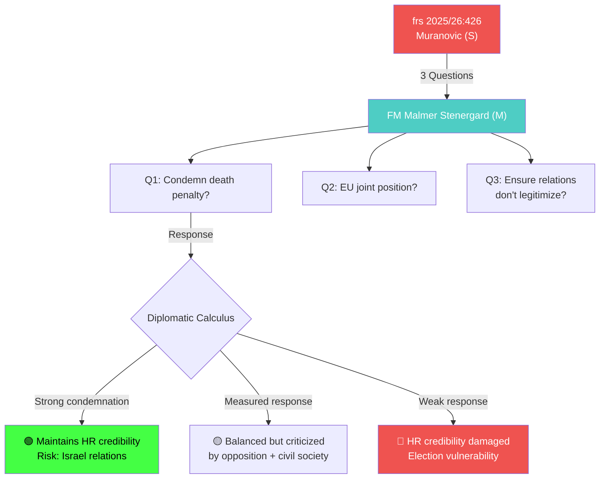

# Per-File Political Intelligence Analysis — HD10426

**dok_id**: HD10426 | **Date**: 2026-04-01 | **Riksmöte**: 2025/26
**Title**: Israels nyligen antagna lagar om dödsstraff
**Filed by**: Azra Muranovic (S) → Foreign Minister Maria Malmer Stenergard (M)
**Status**: Inlämnad | **Response Deadline**: 2026-04-22 | **Expected Response**: 2026-04-24
**Significance**: 8/10 | **Confidence**: [HIGH]

## Classification
- **Domain**: Foreign Policy/Human Rights | **Sensitivity**: HIGH
- **Urgency**: HIGH — Israeli legislation active, international attention
- **Policy Areas**: International humanitarian law, EU foreign policy, Children's Convention

## SWOT Analysis

### Strengths (Government Coalition)
| # | Statement | Evidence | Confidence | Impact |
|---|-----------|----------|------------|--------|
| 1 | Sweden's strong tradition of international law advocacy provides diplomatic framework | Historical foreign policy position | [HIGH] | High |
| 2 | EU coordination mechanism allows shared responsibility for response | EU Common Foreign and Security Policy | [HIGH] | Medium |

### Weaknesses (Government Coalition)
| # | Statement | Evidence | Confidence | Impact |
|---|-----------|----------|------------|--------|
| 1 | Government perceived as insufficiently critical of Israeli policies compared to previous S-led government | Shift in foreign policy tone since 2022 | [HIGH] | High |
| 2 | Three-part question structure forces specific commitments on condemnation, EU action, and relationship review | frs 2025/26:426, three explicit sub-questions | [HIGH] | High |

### Opportunities (Opposition)
| # | Statement | Evidence | Confidence | Impact |
|---|-----------|----------|------------|--------|
| 1 | Issue mobilizes broad civil society support and media attention | High international media coverage | [HIGH] | High |
| 2 | Forces explicit positioning on death penalty — Sweden traditionally opposes globally | frs 2025/26:426, Barnkonventionen reference | [HIGH] | High |

### Threats
| # | Statement | Evidence | Confidence | Impact |
|---|-----------|----------|------------|--------|
| 1 | Any perceived evasion damages Sweden's international humanitarian law credibility | International monitoring | [HIGH] | Very High |
| 2 | Coalition division risk — SD's Israel position may diverge from M's diplomatic approach | Coalition dynamics on foreign policy | [MEDIUM] | High |

## Risk Assessment
- **Likelihood**: 4/5 — Government must respond; diplomatic balancing act inevitable
- **Impact**: 4/5 — International visibility, humanitarian law credibility at stake
- **L×I Score**: 16/25

## Mermaid Diagram

## Election 2026 Implications
- **Electoral Impact**: [HIGH] — Foreign policy positions mobilize activist base
- **Coalition Scenarios**: SD-M tensions on Israel policy could surface publicly
- **Voter Salience**: 🟩HIGH — Death penalty and children's rights resonate broadly
- **Campaign Vulnerability**: 🟥 Government must define clear position before election
- **Policy Legacy**: Sweden's international humanitarian law reputation at stake

## Forward Indicators
1. **Minister response by April 22** — watch for specificity of condemnation [TRIGGER: deadline]
2. **EU Council statements** — any joint EU position on Israeli legislation [TRIGGER: EU meetings]
3. **UN Human Rights Council** — Swedish voting pattern on related resolutions [TRIGGER: UNHRC session]
