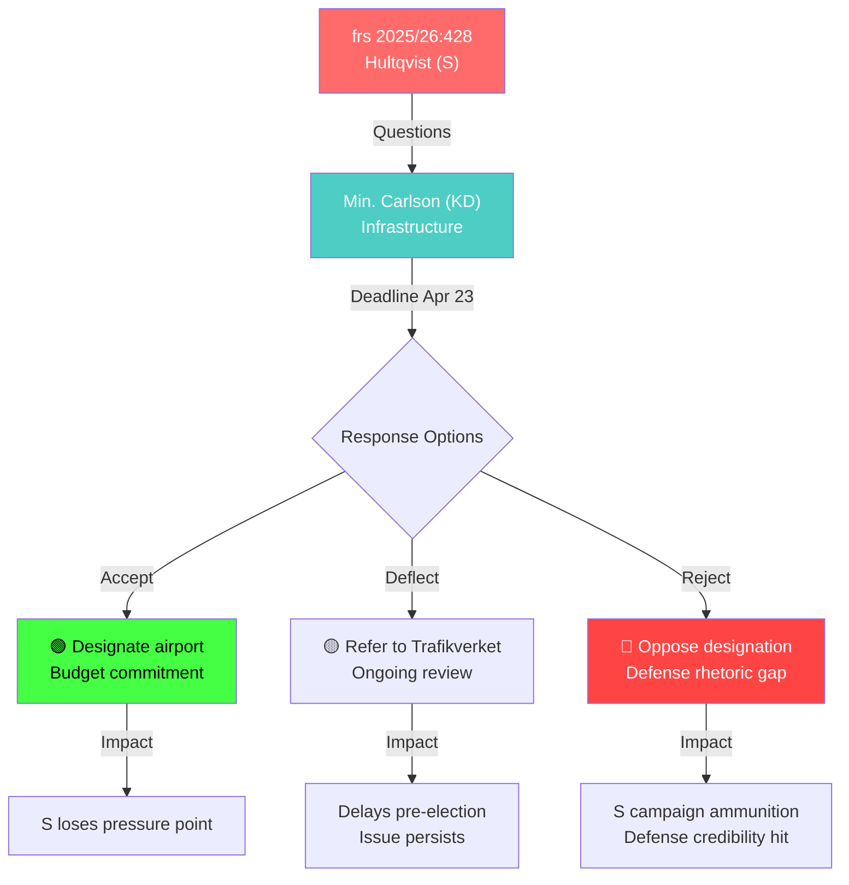

# Per-File Political Intelligence Analysis — HD10428

**dok_id**: HD10428 | **Date**: 2026-04-02 | **Riksmöte**: 2025/26
**Title**: Beredskapsflygplats Scandinavian Mountain Airport
**Filed by**: Peter Hultqvist (S) → Infrastructure Minister Andreas Carlson (KD)
**Status**: Inlämnad | **Response Deadline**: 2026-04-23 | **Expected Response**: 2026-04-30
**Significance**: 7/10 | **Confidence**: [HIGH]

## Classification
- **Domain**: Defense/Infrastructure | **Sensitivity**: MODERATE
- **Urgency**: MEDIUM — statutory response deadline approaching (April 23)
- **Policy Areas**: Total defense, regional infrastructure, emergency services

## SWOT Analysis

### Strengths (Government Coalition)
| # | Statement | Evidence | Confidence | Impact |
|---|-----------|----------|------------|--------|
| 1 | Government can point to ongoing defense infrastructure investment program | Prop 2025/26 defense budget | [HIGH] | Medium |
| 2 | Trafikverket's technical assessment supports current position | Official agency recommendation against designation | [HIGH] | High |

### Weaknesses (Government Coalition)
| # | Statement | Evidence | Confidence | Impact |
|---|-----------|----------|------------|--------|
| 1 | Rejecting emergency airport designation despite defense expansion narrative contradicts own security rhetoric | frs 2025/26:428, Trafikverket assessment | [HIGH] | High |
| 2 | KD minister responsible for infrastructure must reconcile with total defense commitments | Cross-ministerial policy tension | [MEDIUM] | Medium |

### Opportunities (Opposition)
| # | Statement | Evidence | Confidence | Impact |
|---|-----------|----------|------------|--------|
| 1 | Hultqvist's defense credentials (former Defense Minister) lend authority to question | Personal credibility as former DefMin | [HIGH] | High |
| 2 | Exposes gap between government's defense expansion rhetoric and actual infrastructure investment | frs 2025/26:428, 2500m runway capacity | [HIGH] | Medium |

### Threats
| # | Statement | Evidence | Confidence | Impact |
|---|-----------|----------|------------|--------|
| 1 | Could force government to commit resources or appear weak on defense readiness pre-election | Election 2026 proximity | [MEDIUM] | High |

## Risk Assessment
- **Likelihood**: 3/5 — Government likely to delay with reference to ongoing review
- **Impact**: 3/5 — Regional significance, defense relevance
- **L×I Score**: 9/25

## Mermaid Diagram

## Election 2026 Implications
- **Electoral Impact**: [MEDIUM] — Regional issue but defense angle gives national relevance
- **Coalition Scenarios**: Hultqvist targeting KD minister creates coalition pressure on M-KD-L-SD axis
- **Voter Salience**: 🟧MEDIUM — Defense readiness resonates post-NATO accession
- **Campaign Vulnerability**: Government must reconcile defense spending rhetoric with infrastructure reality
- **Policy Legacy**: Total defense infrastructure commitments need concrete delivery

## Forward Indicators
1. **Minister response by April 23** — watch for deflection vs. commitment [TRIGGER: response date]
2. **Trafikverket review timeline** — any updated assessment before election [TRIGGER: agency publication]
3. **Defense committee scheduling** — if picked up by FöU [TRIGGER: committee calendar]
