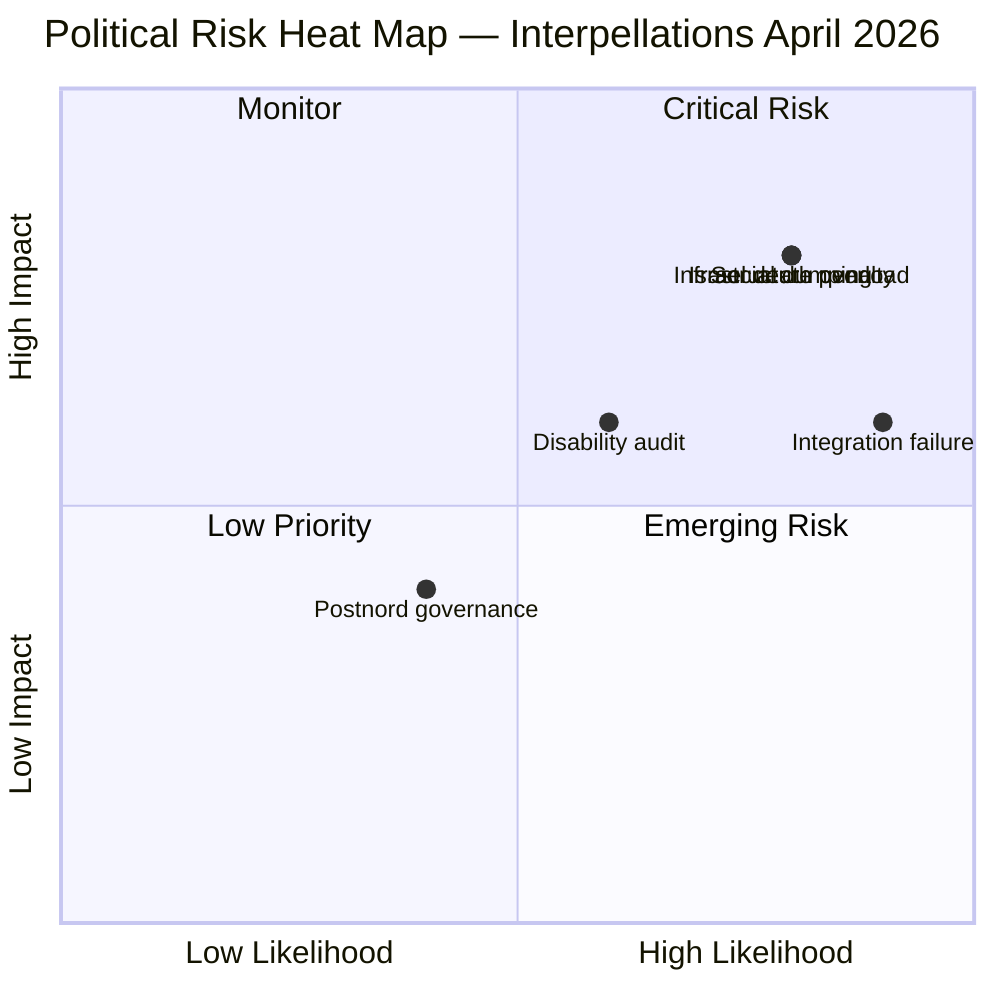

# Political Risk Assessment — Interpellations 2026-04-14

**Generated**: 2026-04-14 07:07 UTC | **Riksmöte**: 2025/26
**Risk Level**: MEDIUM-HIGH | **Confidence**: HIGH

## Risk Matrix (Likelihood × Impact)

| Risk | Likelihood (1-5) | Impact (1-5) | L×I | Level |
|------|------------------|--------------|-----|-------|
| Infrastructure minister overload (Carlson 5 IPs) | 4 | 4 | 16 | 🔴 HIGH |
| Foreign policy credibility (Israel death penalty) | 4 | 4 | 16 | 🔴 HIGH |
| Social dumping campaign liability (cancelled inquiry) | 4 | 4 | 16 | 🔴 HIGH |
| Integration outcome failure (500K unemployed) | 5 | 3 | 15 | 🔴 HIGH |
| Disability rights pre-election audit exposure | 3 | 3 | 9 | 🟡 MEDIUM |
| Postnord governance accountability | 2 | 2 | 4 | 🟢 LOW |

## Mermaid Risk Heat Map

## Coalition Stability Assessment
- **Overall Coalition Risk**: MEDIUM — S targeting KD ministers (Carlson, Slottner) more than M ministers, potentially exploiting junior partner weakness
- **SD Support Risk**: LOW — No new SD interpellations this period (previous week's SD→M/KD interpellations remain unresolved)
- **Ministerial Resilience**: Carlson (KD) faces highest individual pressure with 5 pending interpellations
