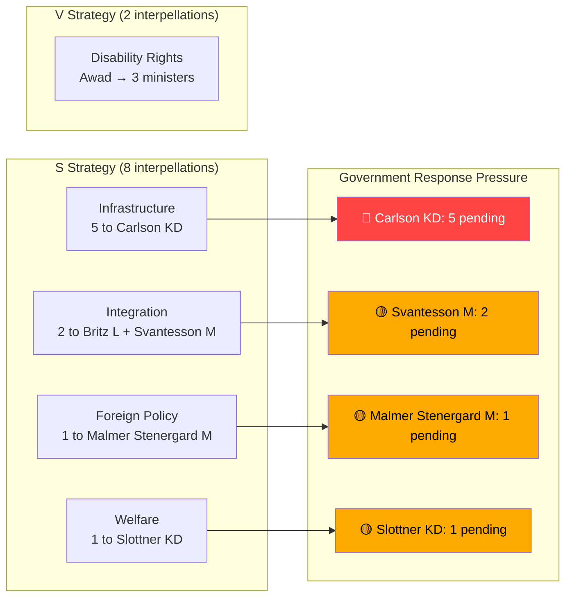

# SWOT Analysis — Interpellations 2026-04-14

**Generated**: 2026-04-14 07:07 UTC | **Riksmöte**: 2025/26
**Documents**: 10 interpellations (frs 2025/26:411–430)
**Confidence**: HIGH | **Analysis Depth**: deep

## Multi-Stakeholder SWOT Matrix

### 1. Citizens
| Type | Statement | Evidence | Confidence |
|------|-----------|----------|------------|
| **Opportunity** | Social dumping interpellation (HD10423) directly protects vulnerable citizens from forced relocation | frs 2025/26:423, named victim groups: DV survivors, addiction patients | [HIGH] |
| **Opportunity** | Regional infrastructure interpellations protect rural connectivity and emergency services | HD10428 (airport), HD10424 (airline), HD10418 (road) | [HIGH] |
| **Threat** | 500,000+ foreign-born unemployed represents integration policy failure affecting public services | HD10422, HD10421, labor statistics | [HIGH] |

### 2. Government Coalition (M-KD-L, SD support)
| Type | Statement | Evidence | Confidence |
|------|-----------|----------|------------|
| **Strength** | Can reference ongoing defense infrastructure program for military base questions | Defense budget prop 2025/26 | [MEDIUM] |
| **Weakness** | Carlson (KD) facing 5 interpellations — single minister overload signals infrastructure policy gap | HD10428, HD10424, HD10425, HD10418, HD10417 | [HIGH] |
| **Weakness** | Cancelled social dumping investigation leaves no policy response ready | HD10423, government decision 2022 | [HIGH] |
| **Weakness** | Integration outcomes unchanged despite rhetoric — 500K unemployed foreign-born | HD10422, HD10421, employment data | [HIGH] |
| **Threat** | Pre-election interpellation deadlines (April 21-30) create sustained negative news cycle | Multiple deadline clustering | [HIGH] |

### 3. Opposition Bloc (S, V, MP)
| Type | Statement | Evidence | Confidence |
|------|-----------|----------|------------|
| **Strength** | S demonstrates coordinated strategy — 8 interpellations to 6 ministers in 1 week | Filing pattern analysis | [HIGH] |
| **Strength** | V runs focused disability rights campaign through Awad (3 interpellations on related themes) | HD10411, HD10412, HD10416 | [HIGH] |
| **Opportunity** | Each interpellation creates individual accountability moment pre-election | Parliamentary calendar April-May 2026 | [HIGH] |
| **Opportunity** | Hultqvist's defense credentials strengthen airport/defense infrastructure arguments | Former Defense Minister credibility | [HIGH] |

### 4. Business/Industry
| Type | Statement | Evidence | Confidence |
|------|-----------|----------|------------|
| **Opportunity** | Datacenter interpellation (HD10414) highlights energy policy gap for tech industry | frs 2025/26:414, Isak From (S) | [MEDIUM] |
| **Threat** | Postnord governance questions (HD10427) may affect state-owned enterprise investment climate | frs 2025/26:427 | [MEDIUM] |

### 5. Civil Society
| Type | Statement | Evidence | Confidence |
|------|-----------|----------|------------|
| **Strength** | Funktionsrätt Sverige audit provides independent NGO accountability data | HD10416, 21-question audit framework | [HIGH] |
| **Opportunity** | Social dumping issue mobilizes housing and welfare organizations | HD10423, municipal welfare networks | [HIGH] |

### 6. International/EU
| Type | Statement | Evidence | Confidence |
|------|-----------|----------|------------|
| **Threat** | Israel death penalty interpellation forces Sweden to define position in EU context | HD10426, EU CFSP coordination | [HIGH] |
| **Opportunity** | Sweden can demonstrate international humanitarian law leadership if response is strong | Barnkonventionen, international law references | [HIGH] |

### 7. Judiciary/Constitutional
| Type | Statement | Evidence | Confidence |
|------|-----------|----------|------------|
| **Weakness** | Withdrawn police discrimination interpellation (HD10420) highlights incomplete discrimination law coverage | DO vs Polismyndigheten case, discrim. law gaps | [HIGH] |

### 8. Media/Public Opinion
| Type | Statement | Evidence | Confidence |
|------|-----------|----------|------------|
| **Opportunity** | Social dumping and Israel death penalty stories have high media impact potential | Human interest + international policy angles | [HIGH] |
| **Threat** | Integration statistics (500K) may reinforce negative public discourse on immigration policy | HD10422, HD10421, polling data | [MEDIUM] |

## Mermaid Diagram — Opposition Targeting Strategy

