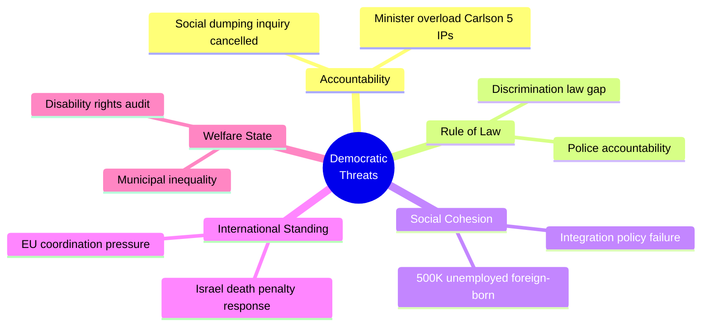

# Threat Analysis — Interpellations 2026-04-14

**Generated**: 2026-04-14 07:08 UTC | **Riksmöte**: 2025/26
**Threat Level**: MEDIUM | **Confidence**: HIGH

## Democratic Function Threat Assessment

### 1. Accountability Erosion
- **Threat**: Cancelled social dumping investigation (HD10423) represents withdrawal of government accountability mechanisms
- **Evidence**: S-government launched investigation; current government terminated it without replacement [HIGH confidence]
- **Severity**: 🟧 MEDIUM-HIGH — Directly affects vulnerable populations

### 2. Discrimination Law Gap
- **Threat**: Police not fully covered by discrimination law despite DO finding discrimination (HD10420)
- **Evidence**: DO vs Polismyndigheten case, Somali-background woman's murdered son, interpreter failures [HIGH confidence]
- **Severity**: 🟧 MEDIUM — Interpellation withdrawn but underlying gap persists

### 3. Integration Policy Failure
- **Threat**: 500,000+ foreign-born without employment represents systemic integration breakdown
- **Evidence**: HD10422, HD10421, employment statistics cited by Redar (S) [HIGH confidence]
- **Severity**: 🟥 HIGH — Affects social cohesion, public finances, election dynamics

### 4. International Law Credibility
- **Threat**: Failure to clearly condemn Israeli death penalty legislation risks Sweden's humanitarian law standing
- **Evidence**: HD10426, Barnkonventionen obligations, EU CFSP coordination requirements [HIGH confidence]
- **Severity**: 🟧 MEDIUM-HIGH — International reputation implications

## Mermaid Threat Taxonomy

